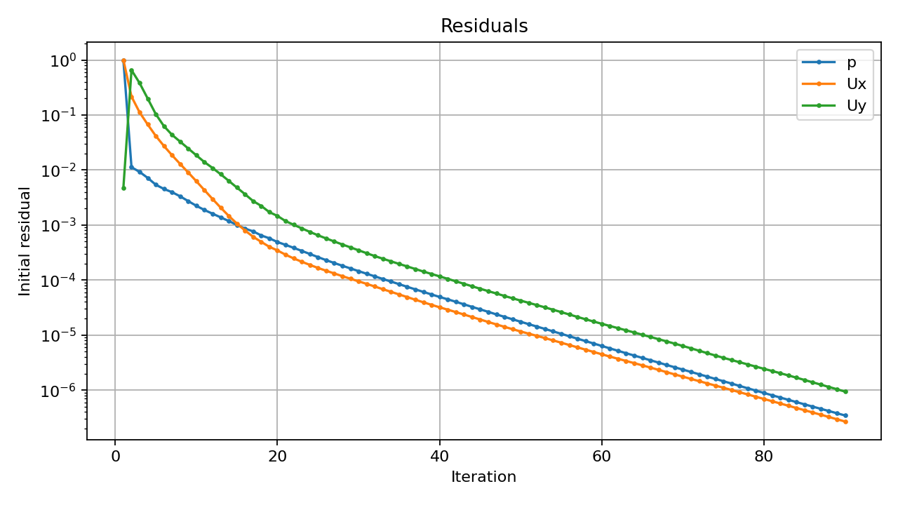
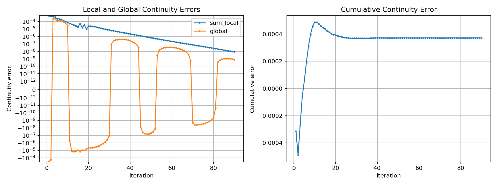
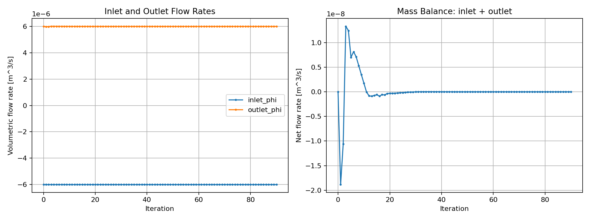
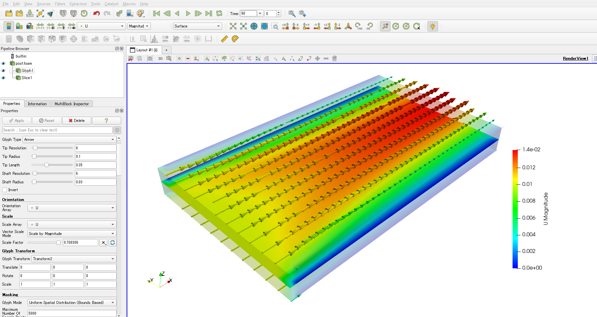

# OpenFOAM 13 setup memo for run001_of13

対象ケース:

```bash
# このリポジトリ/作業フォルダのルート
PROJECT_ROOT=/mnt/f/work/002_CAE/openfoam/summerSchool/20260830_summerSchool2026
CASE_DIR=$PROJECT_ROOT/data/001_box/run001_of13
cd "$CASE_DIR"
```

このメモでは、現在の作業フォルダのルートを `PROJECT_ROOT` として扱う。

```text
/mnt/f/work/002_CAE/openfoam/summerSchool/20260830_summerSchool2026
```

ケースディレクトリだけを変えたい場合は `CASE_DIR` を変更する。

```bash
CASE_DIR=$PROJECT_ROOT/data/001_box/run001_of13
cd "$CASE_DIR"
```

以降のコマンドは、基本的にこのケースディレクトリで実行する。

入力メッシュ:

```bash
Mesh_4.unv
```

Salomeでメッシュ作成した元データは、`PROJECT_ROOT`基準で以下にある。

```bash
$PROJECT_ROOT/data/001_box/sample/model
```

OpenFOAM 13環境:

```bash
. /opt/openfoam13/etc/bashrc
```

## 1. チュートリアルのコピー

定常・非圧縮解析のベースとして、OpenFOAM 13の `incompressibleFluid/pitzDailySteady` をコピーした。

```bash
cp -r /opt/openfoam13/tutorials/incompressibleFluid/pitzDailySteady/{0,constant,system} .
rm -f system/blockMeshDict
```

`pitzDailySteady` は以下のように定常・非圧縮用の設定になっている。

```text
system/controlDict:
solver incompressibleFluid;

system/fvSchemes:
ddtSchemes
{
    default steadyState;
}

system/fvSolution:
SIMPLE
{
    ...
}
```

`blockMeshDict` はSalome/UNVメッシュを使うため削除した。

## 2. OpenFOAMメッシュ変換

OpenFOAM 13環境で `ideasUnvToFoam` を実行した。

```bash
. /opt/openfoam13/etc/bashrc
ideasUnvToFoam Mesh_4.unv > log.ideasUnvToFoam.of13 2>&1
```

結果は成功。

成功判定は、ログ末尾に `End` が出ることと、`constant/polyMesh` が作成されることで確認する。標準出力をログへリダイレクトしているため、画面に何も出ないこと自体は成功/失敗の判定にならない。

ログ上の読み込み状況:

```text
Read 1066 points.
Read 480 cells and 1064 boundary faces.

For group 7 named inlet trying to read 12 patch face indices.
For group 8 named side trying to read 80 patch face indices.
For group 9 named topAndbottom trying to read 960 patch face indices.
For group 10 named outlet trying to read 12 patch face indices.

Sorting boundary faces according to group (patch)
0: inlet is patch
1: side is patch
2: topAndbottom is patch
3: outlet is patch

Constructing mesh with non-default patches of size:
    inlet          12
    side           80
    topAndbottom   960
    outlet         12

End
```

作成された境界:

```text
inlet
outlet
side
topAndbottom
```

作成されたOpenFOAMメッシュ:

```text
constant/polyMesh/boundary
constant/polyMesh/faces
constant/polyMesh/neighbour
constant/polyMesh/owner
constant/polyMesh/points
```

## 3. スケール変換

OpenFOAM 13でmmからmへ変換するコマンドは以下。

```bash
transformPoints "scale=(0.001 0.001 0.001)" > log.transformPoints.of13 2>&1
```

今回は `ideasUnvToFoam` 成功後に実行した。

結果:

```text
Writing points into directory ".../constant/polyMesh"
End
```

## 4. メッシュ確認

`checkMesh` を実行した。

```bash
checkMesh > log.checkMesh.of13 2>&1
```

結果:

```text
Mesh stats
    points:           1066
    faces:            1972
    cells:            480
    boundary patches: 4

Overall domain bounding box (0 0 0) (0.1 0.06 0.01)
Mesh has 2 geometric (non-empty/wedge) directions (1 1 0)
Mesh has 2 solution (non-empty) directions (1 1 0)
Mesh OK.
```

注意:

`topAndbottom` を `empty` に変更したため、OpenFOAM上は2D解析用メッシュとして認識されている。

## 5. 境界条件と計算監視設定

以下の指定に合わせて境界条件を修正した。

| パッチ | OpenFOAM境界タイプ | 条件 |
| --- | --- | --- |
| `inlet` | `patch` | `U = (0.01 0 0)`, `p zeroGradient` |
| `outlet` | `patch` | 自然流出相当: `U zeroGradient`, `p fixedValue 0` |
| `side` | `wall` | `U noSlip`, `p zeroGradient` |
| `topAndbottom` | `empty` | 2D解析用 |

`constant/polyMesh/boundary`:

```text
side
{
    type wall;
}

topAndbottom
{
    type empty;
}
```

`0/U`:

```text
internalField uniform (0.01 0 0);

inlet
{
    type  fixedValue;
    value uniform (0.01 0 0);
}

outlet
{
    type zeroGradient;
}

side
{
    type noSlip;
}

topAndbottom
{
    type empty;
}
```

`0/p`:

```text
inlet
{
    type zeroGradient;
}

outlet
{
    type  fixedValue;
    value uniform 0;
}

side
{
    type zeroGradient;
}

topAndbottom
{
    type empty;
}
```

流速が小さいため、今回の設定は層流にした。

`constant/momentumTransport`:

```text
simulationType laminar;
```

残差の停止条件は `system/fvSolution` の `SIMPLE/residualControl` に設定した。

```text
residualControl
{
    p 1e-4;
    U 1e-6;
}
```

残差、連続式の誤差、流量は以下で確認する。

| 項目 | 出力 |
| --- | --- |
| 残差 | `postProcessing/residuals/0/residuals.dat` |
| 連続式の誤差 | `log.foamRun.of13` の `time step continuity errors` |
| inlet流量 | `postProcessing/inletFlowRate/0/surfaceFieldValue.dat` |
| outlet流量 | `postProcessing/outletFlowRate/0/surfaceFieldValue.dat` |

OpenFOAM 13では `system/functions` が自動で読まれるため、`system/controlDict` 側に重複して `functions` を書かない。

`system/functions`:

```text
#includeFunc residuals(name=residuals, fields=(p U))

inletFlowRate
{
    type      surfaceFieldValue;
    patch     inlet;
    operation sum;
    fields    (phi);
}

outletFlowRate
{
    type      surfaceFieldValue;
    patch     outlet;
    operation sum;
    fields    (phi);
}
```

連続式の誤差はOpenFOAMのソルバログに標準で出力される。

## 6. 計算実行

実行コマンド:

```bash
. /opt/openfoam13/etc/bashrc
PROJECT_ROOT=${PROJECT_ROOT:-/mnt/f/work/002_CAE/openfoam/summerSchool/20260830_summerSchool2026}
CASE_DIR=${CASE_DIR:-$PROJECT_ROOT/data/001_box/run001_of13}
cd "$CASE_DIR"
ideasUnvToFoam Mesh_4.unv > log.ideasUnvToFoam.of13 2>&1
transformPoints "scale=(0.001 0.001 0.001)" > log.transformPoints.of13 2>&1
checkMesh > log.checkMesh.of13 2>&1
foamRun -solver incompressibleFluid > log.foamRun.of13 2>&1
```

結果:

```text
SIMPLE solution converged in 90 iterations
```

最終値:

```text
residuals:
Time 90
p  = 3.455592e-07
Ux = 2.683682e-07
Uy = 9.396691e-07

continuity errors:
sum local  = 8.738110e-09
global     = 7.625470e-10
cumulative = 3.72284e-04

flow rates:
inlet  sum(phi) = -6.0e-06 m3/s
outlet sum(phi) =  6.0e-06 m3/s
net flow        =  0.0
```

## 7. グラフ

グラフ作成用ノートブック:

```text
../graph.ipynb
```

ケースディレクトリ `run001_of13` で開くと、このノートブックは以下を読み込んでグラフ化する。

```text
postProcessing/residuals/0/residuals.dat
postProcessing/inletFlowRate/0/surfaceFieldValue.dat
postProcessing/outletFlowRate/0/surfaceFieldValue.dat
log.foamRun.of13
```

同じ内容をPNGとして `docs/figures/` に出力した。

### Residuals



### Continuity Errors



### Flow Rates



## 8. ParaViewでの可視化

OpenFOAMケースをParaViewで読み込むため、ケースディレクトリに空の `post.foam` を作成した。

```bash
PROJECT_ROOT=${PROJECT_ROOT:-/mnt/f/work/002_CAE/openfoam/summerSchool/20260830_summerSchool2026}
CASE_DIR=${CASE_DIR:-$PROJECT_ROOT/data/001_box/run001_of13}
cd "$CASE_DIR"
touch post.foam
```

ParaViewでは `post.foam` を開き、最終時刻 `90` の速度場 `U` を表示した。画像では `U` の `Magnitude` をカラーマップで表示し、Glyphで速度ベクトルを重ねている。

出力画像:

```text
img/paraview_result_001.png
```


