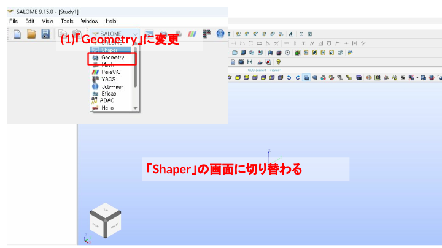

# 002 Stirrer: SALOMEで撹拌機のヘキサメッシュを作る


## この演習で目指すこと

撹拌機形状を題材に、Shaperで断面形状を作成し、Geometryで回転・押し出し・分割を行い、Meshでヘキサメッシュを作成する。

ヘキサメッシュを作成するには、形状を六面体として扱えるブロックに分割し、各ブロックで対向する辺同士の分割数を一致させる必要がある。複雑な形状も、回転・押し出し・Partitionを使って適切なブロックへ分けることで、すべての領域をヘキサメッシュで作成できる。この演習では、撹拌槽と羽根まわりの形状をブロックに分け、方向別の分割数を設定する考え方を扱う。

- Shaperでスケッチを作成する
- 寸法拘束と幾何拘束で形状を確定する
- ShellをGeometryへエクスポートする
- 回転、押し出し、Partitionでヘキサメッシュ用のブロックに分割する
- 対向する辺同士の分割数を一致させる
- グループを整理してOpenFOAMへ渡す境界名を作る
- ヘキサメッシュとサブメッシュを作成する

### 2020年サマースクール Track3

この撹拌槽モデルは、オープンCAEサマースクール2020 Track3で扱った題材でもある。2020年の演習では、`blockMesh` で扇形の6ブロックを作成し、`stitchMesh` で貼り合わせ、`mergeMesh` で組み合わせることで、羽根付きの撹拌槽形状をヘキサメッシュとして作り上げていた。


この2020年の手法（blockMesh・stitchMesh・mergeMesh）は、技術書典で販売されている技術書「OpenFOAMでメッシュ作成」にも解説されている。


- 技術書典: <https://techbookfest.org/product/5752199185432576>

今回の演習では、同じ撹拌槽形状を題材にしつつ、`blockMesh` 手組みではなく **SALOME** でジオメトリとメッシュを作成する方法を扱う。

### この演習のゴール

今回の演習のゴールは、下図のように、羽根形状を含む1/4セクター分の撹拌槽形状に対して、SALOMEでヘキサメッシュを作成することである。実際のOpenFOAM計算では、このセクターメッシュを回転コピー・結合して、全周の撹拌槽形状を組み立てる。


### 使用データの場所

この演習で使うファイル・計算結果は、リポジトリの以下のフォルダにある。

| フォルダ | 内容 |
|----------|------|
| `data/002_Stirrer/sample/mesh/mesh_of13` | SALOMEから出力した `Mesh_1.unv` と、UNV変換・topoSet・createBaffles を行うOpenFOAMケース（OpenFOAM 13） |
| `data/002_Stirrer/sample/mesh/master_curve_of13` | 羽根の可動化テスト（moveDynamicMesh）用のOpenFOAMケース（OpenFOAM 13） |

---

## モデルの作り方

この撹拌槽の形状は、**向きの違う2つの平面にスケッチを描き、それぞれ別の方法で立体化する**ことで作る。下図がその全体像である。


- ① **X-Z平面**にスケッチした断面を、**Z軸まわりに回転**させて、撹拌槽の壁（円筒状の外周）を作る。
- ② **X-Y平面**にスケッチした断面を、**Z軸方向に押し出し**て、槽の底や羽根まわりのブロックを作る。

このように「回転で作る部分」と「押し出しで作る部分」を組み合わせ、最後にPartitionで分割してヘキサメッシュ用のブロック形状に仕上げていく。以降の手順では、この2つのスケッチを順に作成していく。

---

## モデル作成

### 1. Shaperで断面スケッチを開始する

まず1つ目のスケッチとして、下図のような撹拌槽の壁の断面（X-Z平面）を描く。高さ110mm・幅40mmを基準に、内側の仕切り（幅3mm）や段（高さ15mm・35mm）を寸法拘束で決めていく。これをZ軸まわりに回転させると、槽の外周壁になる。




- (1) `Geometry` に変更し、`Shaper` の画面へ切り替える。


- (2) `Sketch` をクリックする。
- (3) `Z-X` 平面を選択する。


- (4) `FRONT` をクリックし、スケッチしやすい向きにする。

### 2. 最初のスケッチを描く


- (5) `線` を使い、まずは大まかな形状を描く。
- 最初は正確な寸法よりも、必要な線分を作ることを優先する。


- (6) 寸法拘束を行う。
- 必要な線は平行拘束で向きをそろえる。


- 寸法拘束を入力し、チェックをクリックして確定する。


- すべての拘束が完了すると、スケッチ線が緑色になる。
- 緑色になっていない場合は、寸法拘束または幾何拘束が不足している。


- (7) `線` をクリックして、追加のスケッチと寸法拘束を行う。


- (8) スケッチが完了したら、チェックをクリックしてスケッチを終了する。

---

## 追加断面のスケッチ

2つ目のスケッチは、上から見た（X-Y平面）扇形の断面である。下図のように、中心から半径 `10 / 15 / 25 / 35 / 40` mm の円弧で領域を分け、全体を `60°` の扇形とする。`30°` の二等分線が羽根の位置になる。中心付近は羽根の根本にあたるため、拡大図のように `1.2` / `1.5` / `3` mm の細かい寸法で形を整える。


この扇形をZ軸方向に押し出すことで、槽の底や羽根まわりのブロックを作る。円弧で分けた半径方向の区切りは、後でヘキサメッシュのブロック境界（サブメッシュの `r1`〜`r6` など）として使う。

### 1. 2つ目のスケッチを開始する


- (1) `Sketch` をクリックする。
- (2) `X-Y` 平面を選択する。


- (3) `TOP` をクリックして、上面からスケッチする。


- (4) `線` をクリックし、原点から右方向へ線を描く。


- (5) 原点から斜め方向へ線を描く。


- (6) 端点どうしが拘束されていない場合は、`Coincident` で端点を一致拘束する。


- (7) 2点を選択し、角度拘束を入れる。


- (8) 3点を選択して円弧を描く。
- 原点、端点、線上の点を使い、円弧の位置を決める。


- (9) 必要な点に一致拘束を入れ、線と円弧を接続する。


- (10) 円弧に半径拘束を入れる。


- (11) スケッチを終了する。


- (12) `File > Save As...` で名前を付けて保存する。
- (13) `Save` をクリックする。

---

## 羽根形状のスケッチ

ここで描いているのは、先ほどのX-Y平面スケッチ（[追加断面のスケッチ](#追加断面のスケッチ) の図）の**中心付近の拡大部分**にあたる。拡大図の `1.2` / `1.5` / `3` mm の寸法で示された、羽根の根本まわりの細かい円弧と補助線を作り込んでいく作業である。

### 1. 円弧と補助線を作成する


- (1) 円弧を描く。
- (2) 半径拘束を入れる。


- (3) さらに円弧を描く。
- (4) 半径拘束を入れる。


- (5) 半径 `1.5` の線をクリックし、`Auxiliary` にチェックを入れる。
- 線が補助線になる。


- (6) `線` をクリックして追加スケッチを描く。


- (7) 2点の水平方向寸法拘束を入れる。


- (8) 拡大し、`線` で細部をスケッチする。


- (9) 2本ずつ線を選択し、平行拘束を入れる。


- (10) 寸法拘束を入れ、形状を確定する。


- (11) 直線をクリックし、`Auxiliary` にチェックを入れる。
- 線が補助線になる。


- 拡大表示で、拘束と接続が意図通りになっていることを確認する。

### 2. Shellを作成する


- (12) `Shell` をクリックし、`Sketch_1` を選択する。
- (13) チェックをクリックし、スケッチからShellを作成する。


- (14) `Shell` をクリックし、`Sketch_2` を選択する。
- (15) チェックをクリックし、スケッチから `Shell_2` を作成する。


- (16) `Export to GEOM` をクリックし、Geometryへエクスポートする。


- (17) `File > Save As...` で名前を付けて保存する。
- (18) `Save` をクリックする。

---

## Geometryで形状を作る

### 1. Geometryへ切り替える


- (1) `Geometry` に変更し、Geometry画面へ切り替える。


- (2) 背景上で右クリックし、`Hide All` をクリックする。
- (3) `Shell_1` と `Shell_2` を表示する。


- (4) `Create an origin and base Vector` をクリックし、軸を表示する。

### 2. 回転と押し出しを行う


- (5) `Revolution` をクリックする。
- (6) `Apply and Close` をクリックする。


- (6) `Extrusion` をクリックする。
- (7) `Apply and Close` をクリックする。


- 回転押し出しと押し出しで、撹拌機の基本形状を作る。

### 3. Partitionで分割する


- (8) `Partition` をクリックする。
- (9) `Apply and Close` をクリックする。


- Partition後の形状を確認する。

ここで、Shaperのスケッチに入れ忘れていた分割線を追加する。

本来は **Shaper側でスケッチを修正する方が、パラメトリックに（寸法や履歴をたどって）変更でき便利**である。ただしここでは、**Geometry側で直接修正することもできる**ということを体験するために、あえてGeometry上で分割線（分割面）を入れてみる。以下の手順で、後からブロック分割を足していく。


- (10) 分割面を作成する。
- (12) `Apply and Close` をクリックする。


- (13) 作成した `Face_1` を平行移動する。
- (14) `Dz = 10` として `Apply` をクリックする。
- (16) `Dz = 20`、(18) `Dz = 30`、(20) `Dz = 40` として分割面を複製する。
- (21) `Apply and Close` をクリックする。


- (21) `Partition` をクリックし、Objectsに `Partition_1`、Tool Objectsに平行移動で作った4枚の分割面（`Translation_1`〜`Translation_4`）を指定する（画像内の説明文は `Extrusion` になっているが、実際に開いているのはPartitionのダイアログ）。
- (22) `Apply and Close` をクリックする。`Partition_2` が作成される。


- `Partition_2` により、z=10〜40mmの4枚の面の位置で形状が水平方向に分割されたことを確認する。


- (23) `Operations > Blocks > Propagate` をクリックする。
- (24) `Apply and Close` をクリックする。


- (25) `File > Save As...` で名前を付けて保存する。
- (26) `Save` をクリックする。

---

## グループを整理する

OpenFOAMへ渡す面や線を整理するため、Geometry側でグループを作成する。境界条件に使う面、メッシュ分割に使う線を分かりやすい名前にしておく。

ここでは、Propagateで作られた `Compound_1`〜`Compound_15`（方向ごとの辺の集まり）を `Union Groups` でまとめ、後のサブメッシュ設定で使う線グループを作成する。作成する線グループは以下の11個。

| 線グループ | 方向 |
|-----------|------|
| `z1` / `z2` / `z3` | 軸（z）方向。高さ位置ごとの辺 |
| `z_rotor` | 軸（z）方向のうち回転領域まわりの辺 |
| `theta1` | 周方向の辺 |
| `r1`〜`r6` | 半径方向の辺 |


- (1) `New Entity > Group > Union Groups` をクリックする。
- (2) Nameを `z1` とし、対象のCompoundを選んで `Apply` をクリックする。


- (3) 同様にNameを `z2` として `Apply` をクリックする。


- (4) Nameを `z3` として `Apply` をクリックする。


- (5) Nameを `z_rotor` とし、回転領域まわりの4つのCompoundを選んで `Apply` をクリックする。


- (6) Nameを `theta1` とし、周方向の2つのCompoundを選んで `Apply` をクリックする。


- (8) Nameを `r1` として `Apply` をクリックする。


- (9) Nameを `r2` として `Apply` をクリックする。


- (10) Nameを `r3` として `Apply` をクリックする。


- (11) Nameを `r4` として `Apply` をクリックする。


- (12) Nameを `r5` として `Apply` をクリックする。


- (13) Nameを `r6` として `Apply` をクリックする。


- ツリーに `z1` / `z2` / `z3` / `z_rotor` / `theta1` / `r1`〜`r6` の11個の線グループが並んでいることを確認する。


- (14) 不要な線グループは削除する。
- OpenFOAM変換に不要なグループを減らし、境界名の混乱を避ける。


- (15) `File > Save As...` で名前を付けて保存する。
- (16) `Save` をクリックする。

---

## ヘキサメッシュ作成

### 1. Meshモジュールへ切り替える


- (1) `Mesh` に変更し、Mesh画面へ切り替える。


- (2) `Partition_2` を表示する。
- (3) 拡大し、メッシュ対象の形状を確認する。


- (4) `Mesh > Create Mesh` をクリックする。


- (5) `Partition_2` が選択されていることを確認する。
- (6) 3Dヘキサメッシュを設定する。
- (7) 分割数を `15` とする。
- (8) `Apply and Close` をクリックする。


- (9) `Mesh_1` を選択した状態で `Compute` をクリックし、メッシュを作成する。
- メッシュ情報を確認する。


- 作成されたヘキサメッシュを確認する。


- 細部のメッシュ品質を確認する。


- (10) `File > Save As...` で名前を付けて保存する。
- (11) `Save` をクリックする。

### 2. サブメッシュで部分的に分割数を変える


- (12) `Mesh_1` を選択した状態で `Create Sub-mesh` をクリックする。


- (12) `Mesh_1` が選択されていることを確認する。
- (13) 線グループ `r1` を選択する。
- (14) `Wire Discretisation` を選択する。
- (15) `Number of Segments` を選択する。
- (16) 分割数を `12` とする。


- サブメッシュ条件が対象線グループに設定されていることを確認する。


- (17) `Mesh_1` を選択した状態で `Compute` をクリックし、メッシュを再計算する。
- メッシュ情報を確認する。


- サブメッシュ指定により、対象部分の分割数が変わったことを確認する。


- ここでは `r1` 方向の分割数変更のみ確認したが、実際には他の方向（`r2`〜`r6`、`theta1`、`z3`）の線グループにも同様の手順でサブメッシュを設定する。

### 3. 全方向のサブメッシュを設定してメッシュを完成させる


- `r1`〜`r6`、`theta1`、`z3` すべての線グループに対して、同様にサブメッシュ（`Number of Segments`）を設定する。各グループの分割数は以下の通り。
    - `r1` / `r2` / `r3` / `r6`　の`Number of Segments`を `12`
    - `r4` / `r5` … `18`（羽根まわりを細かくするため他のr方向より多くする）
    - `theta1`（周方向） の`Number of Segments`を `12`
    - `z3`（軸方向） の`Number of Segments`を`32`
- `SubMeshes on Compound` の下に、設定した数だけ（`Sub-mesh_r1`〜`r6`・`Sub-mesh_theta1`・`Sub-mesh_z3`）サブメッシュが並んでいることを確認する。


- (17) `Mesh_1` を選択した状態で `Compute` をクリックし、全方向のサブメッシュを反映してメッシュを再計算する。
- メッシュ情報を確認する（例: ノード数 238239、ヘキサヘドロン数 223776）。


- 羽根の根本や角部を拡大し、メッシュが歪みなく生成されていることを確認する。


- (18) `File` > `Save As...` で名前を付けて保存する。
- (19) `Save` をクリックする。

### 4. OpenFOAM用にUNV出力する


- (1) `Groups of Edges` を削除する。
- 補足: 線グループ（サブメッシュ分割用）はOpenFOAM変換に不要なため、削除して境界名の混乱を避ける。`Groups of Faces` はOpenFOAMの境界パッチ名として引き継がれるため残す。


- (2) `Mesh_1` 上で右クリックし、`Export` > `UNV file` を選ぶ。
- (3) `Save` をクリックし、`Mesh_1.unv` として保存する。

---

## （余裕がある人向け）OpenFOAM側での計算

SALOMEから出力した `Mesh_1.unv` は、そのままではOpenFOAMで使えない。UNV形式からOpenFOAM形式へ変換し、スケール変換（mm→m）を行った上で、羽根（wing）と仕切り板（circ）の位置に `topoSet` + `createBaffles` でバッフル（厚みゼロの内部壁）を作成する。

SALOME で作成したメッシュを OpenFOAM 形式に変換して利用する。全体の流れは以下の通り。


- 作業フォルダ: `data/002_Stirrer/sample/mesh/mesh_of13`

### メッシュ変換とバッフル作成

```bash
cd data/002_Stirrer/sample/mesh/mesh_of13
. /opt/openfoam13/etc/bashrc

ideasUnvToFoam Mesh_1.unv > log.ideasUnvToFoam 2>&1
transformPoints "scale=(0.001 0.001 0.001)" > log.transformPoints 2>&1
checkMesh > log.checkMesh.initial 2>&1

topoSet > log.topoSet 2>&1
createBaffles -overwrite > log.createBaffles 2>&1
checkMesh > log.checkMesh.final 2>&1
```

なお、同フォルダには上記一連の処理をまとめた `Allrun` スクリプトがあり、`./Allclean && ./Allrun` で最初から一括再実行できる。

各コマンドの役割は以下の通り。

- `ideasUnvToFoam Mesh_1.unv`: SALOMEから出力したUNVメッシュを、OpenFOAMの `constant/polyMesh` 形式へ変換する。
- `transformPoints "scale=(0.001 0.001 0.001)"`: 全座標を1/1000倍する。SALOMEはmm単位で形状を作っているため、OpenFOAMが使うm単位へスケール変換する。
- `checkMesh`（1回目）: 変換直後のメッシュ品質・セル数・境界面を確認する。
- `topoSet`: `system/topoSetDict`（`topoSetDict.wing` / `topoSetDict.circ` / `topoSetDict.rotor` をinclude）に従い、羽根・仕切り板・回転領域の3種類のゾーンを作成する（内容は次節）。
- `createBaffles -overwrite`: `system/createBafflesDict` に従い、topoSetで作った羽根・仕切り板の面ゾーンを厚みゼロの `wall` バッフルへ変換する。`owner`/`neighbour` それぞれに `_master` / `_slave` のパッチ名を与え、羽根・仕切り板の両面を表現する。
- `checkMesh`（2回目）: バッフル作成後のメッシュ品質を再確認し、`Mesh OK` になっていることを確認する。

### topoSetで作成する3種類のゾーン

`topoSet` では、後工程で使う次の3種類のゾーンをメッシュ上に定義する。wing / circ は `createBaffles` でバッフル化するための**面ゾーン（faceZone）**、rotor は回転計算用の**セルゾーン（cellZone）**である。

**1. 羽根（wing）の面ゾーン**

`wingFaceZone` / `wingFaceZone2` は、羽根の位置にある面のゾーン（上下2枚分）。羽根のパーティション面はセクターの二等分線（30°）上にあるため、`rotatedBoxToFace` で30°回転させた薄い直方体を使って面を選び出す。

- 補足: 選択ボックスの境界がメッシュの面中心の座標とちょうど一致すると、端の面が拾われたり拾われなかったりして羽根のエッジがガタつく。これを避けるため、ボックスのz範囲は羽根より半セル分広げ、`normalToFace` で羽根の垂直面だけに絞っている。


**2. 仕切り板（circ）の面ゾーン**

`circularFaceZone_z015` / `circularFaceZone_z035` は、仕切り板の位置にある面のゾーン。`cylinderToFace` で薄いz範囲を直接指定して選び出す。

- 補足: シャフト（軸）がz=15mmまで刺さっているため、仕切り板はシャフト周りの環状の板になる。z=15mm平面にはシャフト底面（境界面）も含まれてしまうため、`boundaryToFace` の `action delete` で境界面を取り除き、内部面だけを残している。


**3. 回転領域（rotor）のセルゾーン**

`rotor1` / `rotor2` は、羽根の周囲を囲む円柱状の回転領域のセルゾーン（MRFなど回転計算用）。`cylinderToCell` で円柱範囲を指定して作成する。


### 羽根の可動化テスト（master_curve_of13）

羽根（`wall_wing.*` パッチ）に、コード化された点変位（`codedFixedValue`）でx位置に応じた曲線状の変位を与え、`displacementSBRStress` モーションソルバでメッシュ全体を滑らかに追従変形できるかを確認する。

- 作業フォルダ: `data/002_Stirrer/sample/mesh/master_curve_of13`（`mesh_of13` で作成したバッフル済みメッシュを引き継ぐ）

```bash
cd data/002_Stirrer/sample/mesh/master_curve_of13
. /opt/openfoam13/etc/bashrc

rm -rf 0
cp -r 0.orig 0

moveDynamicMesh > log.moveDynamicMesh 2>&1
checkMesh -latestTime > log.checkMesh 2>&1
```

- `constant/dynamicMeshDict` で `displacementSBRStress` モーションソルバを指定する。
- `0.orig/pointDisplacement` の `wall_wing.*` 境界に `codedFixedValue` を設定し、時刻 `t` に応じて羽根表面の点をy方向へ滑らかに変位させる。
- `system/controlDict` で `application moveDynamicMesh`、`endTime 1`、`deltaT 0.1` として、10ステップに分けてメッシュを追従変形させる。
- 各時刻（`0.1`〜`1`）でメッシュが破綻せず追従できているかを、最終時刻の `checkMesh` で確認する（`Mesh OK`）。

`0.orig/pointDisplacement`（実行時に `0/` へコピーされる）の中身は次の通り。各点の変位（`pointVectorField`）を定義するファイルである。

```cpp
dimensions      [0 1 0 0 0 0 0];      // 変位なので単位は [m]

internalField   uniform (0 0 0);      // 内部の初期変位は0

boundaryField
{
    ".*"                              // 既定: すべての境界を変位0で固定
    {
        type            fixedValue;
        value           uniform (0 0 0);
    }

    "wall_wing.*"                     // 羽根パッチだけ上書き（コードで変位を計算）
    {
        type            codedFixedValue;
        name            makecurve;
        value           uniform (0 0 0);

        code
        #{
            const scalar& t = this->db().time().value();       // 現在時刻
            const vectorField& pos = patch().localPoints();    // 羽根表面の点座標
            vectorField f(pos.size(), vector(0,0,0));

            forAll(f, i)
            {
                const scalar x = pos[i][0];        // 各点のx座標(半径方向)
                const scalar height = 4e-3;        // 曲げの最大たわみ 4mm
                const scalar x0 = 15.0e-3;         // 曲げ始める半径 15mm
                const scalar x1 = 25.0e-3;         // 羽根先端の半径 25mm

                scalar y = 0.0;
                if(x > x0) {
                    // x0〜x1 を円弧状にたわませる（半径rの円の一部）
                    const scalar r = (pow((x1 - x0), 2) + pow(height, 2)) / 2.0 / height;
                    y = r - sqrt(pow(r, 2) - pow((x - x0), 2));
                }
                f[i] = vector(0.0, y*t, 0.0);      // y方向に y*t だけ変位（時刻に比例）
            }
            operator==(f);                          // この変位を境界に課す
        #};
    }
}
```

ポイントは以下の通り。

- **`".*"` → `fixedValue (0 0 0)`** … すべての境界を「動かない」に既定する。前述の `rotorPin`（rotor境界）や外周壁も、個別記述が無いのでこの既定にマッチして自動的に変位0で固定される。
- **`"wall_wing.*"` → `codedFixedValue`** … 羽根パッチだけを上書きし、C++コードで変位を計算する（正規表現は後に書いた方が優先されるため、羽根は固定ではなく変形する）。
- **コードの中身** … 羽根の半径15mm（`x0`）より外側を、先端25mm（`x1`）で最大たわみ4mm（`height`）になる円弧状にy方向へ曲げる。`y*t` としているので、時刻 `t`（0〜1）に比例して少しずつ曲がる。


- 羽根表面の変位に合わせて、周囲のメッシュも破綻せず滑らかに追従変形していることを確認する。

### 回転領域メッシュが動いてしまう問題と対処

このまま羽根を`moveDynamicMesh`で曲げると、**羽根だけでなく回転領域（rotor）のメッシュまで一緒に動いてしまう**（下のアニメーションで、羽根の変形が周囲へ広がり rotor 界面 r=35mm が円からずれる様子が確認できる）。


回転領域に使用する rotor は円柱状のきれいな領域であってほしいので、これは望ましくない。

対処法は、メッシュの作り方によって2通りある。

**（1）別部品で作って後で貼り合わせる方法（サマースクール2020・技術書の方法）**

羽根を含む部品を**別メッシュ**として作り、`createBaffles`＋`moveDynamicMesh`で羽根だけを曲げてから、`mergeMeshes`／`stitchMesh`で rotor のメッシュに貼り合わせる。こうすると変形を羽根の部品内に閉じ込められる。この手順は技術書「[OpenFOAMでメッシュ作成](https://techbookfest.org/product/5752199185432576)」（技術書典）に詳しく解説されているので、そちらを参照。


**（2）一体もの（1つの連続メッシュ）の場合の対処法（今回の方法）**

今回のようにメッシュが一体で作られている場合は、貼り合わせができないので、**rotor の境界（r=35mm の円筒面）を一時的に固定壁にして変形させ、あとで元に戻す**方法をとる。手順は次の4ステップ。

1. **`topoSet`** … rotor1 / rotor2 セルゾーンの境界面を faceZone（`rotorBoundary`）にする。
2. **`createBaffles`** … その面を**一時的な固定壁パッチ `rotorPin`** に変換する。`pointDisplacement` の `.*`（既定）が `fixedValue (0 0 0)` なので、`rotorPin` は自動的に変位0で固定される。
3. **`moveDynamicMesh`** … 羽根を変形させる。このとき rotor 境界（`rotorPin`）は変位0で固定されているので、変形は rotor 内側だけに閉じ込められる。
4. **`stitchMesh`** … 変形後、`rotorPin`（壁）を**内部面に戻す**。これで r=35 の壁が消え、**元の一体もの（壁のない連続メッシュ）に戻る**。ただし形状は変形済み。

実際のコマンドは次の通り（`master_curve_of13` の `Allrun` に記載）。

```bash
# 1. 半径3 mmのシャフト面をdefaultFacesからshaftへ分離
topoSet -dict system/topoSetDict.shaft
createPatch -dict system/createPatchDict.shaft

# 2-3. rotor境界(r=35)を一時的に固定壁(rotorPin)化
topoSet -dict system/topoSetDict.rotorpin
createBaffles -overwrite

# 4. 羽根を変形(rotorPinは変位0で固定)
rm -rf 0 && cp -r 0.orig 0
moveDynamicMesh

# 5. 固定壁を内部面へ戻す(壁を消し、元の一体ものメッシュに戻す)
stitchMesh -latestTime "((rotorPin_master rotorPin_slave))"
```

`system/topoSetDict.shaft` は `defaultFaces` のうち半径3 mmの円筒面を選択し、`system/createPatchDict.shaft` は選択した面を `type wall` の `shaft` パッチへ変更する。形状やセルは変更せず、境界名だけを分離している。1/6セクターでは `shaft` が4,512面になり、変形・結合後もこの境界名が保持される。

`createBaffles` で作る `rotorPin_master` / `rotorPin_slave` は `type wall`（両面とも壁）なので、そのままでは r=35 で流れが遮られてしまう。そこで変形が終わったら `stitchMesh` で両パッチを内部面へ結合し、**壁を消して元の状態に戻す**のがポイントである。

固定した面（`rotorPin`）は、下図でピンク色に示した rotor1 / rotor2 セルゾーンの**外周表面全体**である。具体的には、

- **外周の円筒壁（半径 r=35mm、高さ z=10〜20mm と z=30〜40mm）** … これを固定することで rotor が半径方向へ広がらず、円形を保つ。
- **上下のフタ（z=10 / 20 / 30 / 40mm の水平な扇形面。下図のピンクの扇形4枚）** … これを固定することで rotor が軸方向へも動かない。


この閉じた表面を変位0で固定するため、rotor の内側（羽根と境界の間）だけが変形を吸収し、rotor の外側は一切動かない。

これにより、変形は rotor 内部（羽根と境界の間）だけに閉じ込められ、**rotor 界面は円形を保ち、外側のメッシュは完全に静止する**（実測で外側の変位0.000mm・界面の半径ずれ0.05mm、`checkMesh` も `Mesh OK`）。

対処後（rotor境界を固定した場合）の変形過程は以下のようになる。羽根（ピンク色）は変形するが、回転領域（水色）とその外側のメッシュは動かず、rotor は円形を保っている（「対処前」アニメーションと見比べると違いが分かる）。


このアニメーションは `rotorPin`（固定用の壁）が入ったままの状態である。変形が終わったら、前述の手順4のとおり **`stitchMesh` で `rotorPin` の壁を内部面に戻し、壁のない一体もの（変形済み）のメッシュにする**。

```bash
stitchMesh -latestTime "((rotorPin_master rotorPin_slave))"
```

こうしてできた「壁のない・羽根が曲がった変形済みメッシュ」（`master_curve_of13` の最終時刻 `1/`）が、次のフルモデル組み立ての**基準セクター**になる。以上のpin→変形→壁戻しの一連の処理は `master_curve_of13/Allrun` にまとめてある。

### フルモデルの組み立て（回転コピー＋結合）

ここまでで作った変形済みの 1/6 セクター（60°）を、**60°ずつ回転コピーして6個結合**すると、全周（360°）の撹拌槽フルモデルになる。作業フォルダは `data/002_Stirrer/sample/mesh/fullmodel_of13`。

基準セクターには、`master_curve_of13` を `Allrun` で回した最終時刻（`1/`）の変形メッシュ（羽根が曲がり、rotor 境界は円形のまま、壁も無い一体もの）を使う。

#### 1. OpenFOAM 13の環境を読み込む

```bash
. /opt/openfoam13/etc/bashrc
```

#### 2. 変形済みの1/6セクターを作成する

先に `master_curve_of13` を実行する。この処理で、半径3 mmの面を `shaft` に変更し、rotor境界を固定した状態で羽根を曲げ、最後にrotor境界を内部面へ戻す。

```bash
cd data/002_Stirrer/sample/mesh/master_curve_of13
./Allrun
```

計算後は `1/polyMesh/boundary` に `shaft` があることと、メッシュ品質を確認する。

```bash
grep -A6 '^[[:space:]]*shaft$' 1/polyMesh/boundary
checkMesh -latestTime
```

今回の実行結果は、223,776セルがすべて六面体、`shaft` は4,512面で、`Mesh OK` となった。

#### 3. フルモデル用フォルダへ移動する

```bash
cd ../fullmodel_of13

SEC=../master_curve_of13/1/polyMesh
```

`SEC` は、手順2で作成した変形済み1/6セクターの `polyMesh` を指す。

#### 4. 基準となる0°セクターを配置する

```bash
rm -rf constant/polyMesh
cp -r "$SEC" constant/polyMesh
```

この時点では、フルモデル用ケースに0°の1/6セクターだけが入っている。

#### 5. セクターの両放射側面をパッチにする

回転コピーして並べただけでは、隣り合うセクターの境目（放射面）はつながらず、メッシュは6個のブロックが接触して並んでいるだけの状態になる。あとで `stitchMesh` を使ってこの境目を貼り合わせ、**セクター間が面でつながった1つの連続メッシュ**にする。

`stitchMesh` は「2つの名前付きパッチどうし」を貼り合わせる。ところが結合直後は、放射面（θ=0° と θ=60° の2枚）は外周壁・天面・底面といっしょに `defaultFaces` に混ざっていて、そのままでは指定できない。そこで先に、基準セクターの両放射面を `topoSet`＋`createPatch` で専用パッチ `side_0deg` / `side_60deg` として切り出しておく。

```bash
topoSet     -dict system/topoSetDict.sides
createPatch -dict system/createPatchDict.sides -overwrite
```

`topoSetDict.sides` は、`defaultFaces` に限定してから面の法線でθ=0°面（法線 `(0 -1 0)`）とθ=60°面（法線 `(-sin60 cos60 0)`）を選ぶ。`createPatchDict.sides` は、それを `side_0deg` / `side_60deg` という名前のパッチにする。1/6セクターでは、それぞれ8,784面が切り出される。回転コピー前に付けておくと、6個すべてが同じ側面パッチを持つ。

#### 6. 回転コピーを作ってz軸まわりに回す

60°から300°までの5個を `sec1`〜`sec5` に作り、それぞれ60°ずつ回す。通常は側面パッチ付きの `constant/polyMesh` をコピーして `transformPoints` で回せばよい。

```bash
for k in 1 2 3 4 5; do
    ang=$((k * 60))
    mkdir -p sec$k/constant sec$k/system
    cp -r constant/polyMesh sec$k/constant/polyMesh
    cp system/controlDict sec$k/system/
    transformPoints -case sec$k "Rz=$ang"
done
```

基準セクターを含め、0°・60°・120°・180°・240°・300°の6セクターがそろう。

> **補足（Windows/WSL の `/mnt/f` = drvfs で実行する場合）**: drvfs 上では、`cp` でコピーした `polyMesh/points` が読み取り専用になり、`transformPoints` による「その場上書き」が失敗する（回転が反映されず、`rm` も Permission denied になる）。このため `fullmodel_of13/Allrun` では `transformPoints` を使わず、回転で変わらないトポロジ系ファイル（`faces`・`owner` など）はコピーで流用し、**回転後の `points` だけを別ファイルとして新規書き出し**する（`system/rotatePointsTo.py`）。新規作成なら drvfs でも確実に書けるため、6セクターすべてが確実に回転する。Linux ネイティブFS上ではこの回避策は不要で、上の `transformPoints` 版でよい。

#### 7. 6セクターを結合する

```bash
mergeMeshes -addCases '("sec1" "sec2" "sec3" "sec4" "sec5")'
```

`mergeMeshes` は、0°の基準セクターへ5個の回転済みセクターを追加する。これにより、1,342,656セルの360°フルモデルが `constant/polyMesh` にできる。ただしこの時点ではまだ6個のブロックが接触して並んでいるだけで、`checkMesh` すると `Number of regions: 6`（互いに面でつながっていない6領域）になる。

#### 8. 放射面を貼り合わせて1つの連続メッシュにする

隣り合うセクターの `side_0deg` と `side_60deg` は幾何的にぴったり重なっている。`stitchMesh` で両パッチを貼り合わせて内部面に戻すと、6個の境目が全部つながって `Number of regions: 1` の一体メッシュになる。

```bash
stitchMesh -tol 1e-3 '((side_0deg side_60deg))'
```

`-tol` は一致点をマージする許容量（局所辺長に対する相対値）で、既定は `1e-4`。回転コピー時のわずかな数値誤差で接合線に微小なスリバー面ができ非直交エラーになることがあるため、ここでは少し緩めの `1e-3` を使う。実行すると `Source/target coverage = 1/1`（両側とも完全に貼り合わさった）となり、`side_0deg` / `side_60deg` は境界から消えて内部面になる。結合後、一時セクターは削除してよい（`rm -rf sec1 sec2 sec3 sec4 sec5`）。

#### 9. フルモデルのメッシュを確認する

```bash
checkMesh
```

今回の実行結果は、1,342,656セルがすべて六面体、`Number of regions: 1`、非直交 Max 49°・スキュネス 0.79 で `Mesh OK` となった。セクター間がつながった、計算にも使える1つの連続メッシュである。

以上の手順（4〜9）は `fullmodel_of13/Allrun` にまとめてあり、`./Allrun` で一括実行できる（作業はすべてこのフォルダ内で完結する）。

#### 10. フルモデルを可視化する

`post.foam` をParaViewで開き、タンクを半透明にして羽根（赤）と仕切り板（緑）を表示する。曲がった羽根が全周に12枚並んでいることを確認する。


- 上記の一連の手順は、`fullmodel_of13/Allrun` にまとめてある（`./Allrun` で再生成できる）。
- この方法（セクターをOpenFOAM側で回転コピー＋stitch）は、変形済みセクターから全周モデルを組み立てる手軽な手段である。一方で、最初から整った全周メッシュが欲しいだけなら、次のようなやり方もある。
    - **SALOMEで最初から全周360°をメッシュする**（タンク＋6枚の羽根を含む全体形状を1つの連続メッシュとして生成する）。接合面がそもそも存在しないので、最初から1つにつながっている。
    - **1セクター（60°）の両側面を cyclic（周期）境界にして、回転周期性で計算する**。フルモデルを作らずに1/6だけで解ける（撹拌計算では MRF/AMI とあわせてよく使われる定石）。
