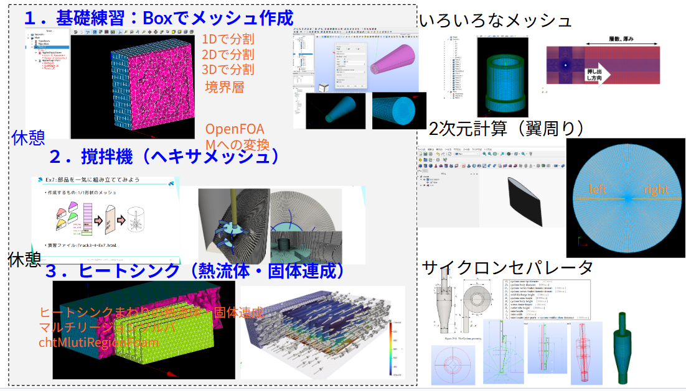

# Track3: SALOMEを使ったOpenFOAMメッシュ作成

## 概要

SALOME 9.15 を使って OpenFOAM 用のメッシュを作成する。

- ヘキサメッシュ（六面体メッシュ）の作成方法
- マルチリージョン（複数領域）に対応したメッシュ作成

---

## ダウンロード

| 配布元 | URL | 特徴 |
|--------|-----|------|
| Code_Aster 付属版 | https://www.code-aster.org/ | 構造解析ソフト Code_Aster とセット |
| Salome Platform（EDF） | https://www.salome-platform.org/ | 開発元フランス電力 EDF のサイト。最新版を入手可能 |

本講義では、Salome Platform（EDF）配布の **SALOME 9.15** を使用する。

---

## 講義の全体像

この講義では SALOME を使って OpenFOAM 用メッシュを作成するスキルを段階的に習得する。

### 使用データの場所

各演習で使うSALOMEメッシュ（UNV）・OpenFOAMケース・計算結果は、リポジトリの `data/` フォルダにある。

| 演習 | データフォルダ |
|------|----------------|
| 001 Box | `data/001_box/run001_of13` |
| 002 撹拌機 | `data/002_Stirrer/sample/mesh/mesh_of13`（メッシュ変換・バッフル作成）、`data/002_Stirrer/sample/mesh/master_curve_of13`（羽根可動化テスト） |
| 003 ヒートシンク | `data/003_heatsink/run001_of2512` |

| ステップ | 演習 | 学ぶこと | ファイル |
|----------|------|----------|----------|
| 0 | SALOME導入 | SALOME の概要・モジュール・OpenFOAM との連携 | [000_salome.md](000_salome.md) |
| 1 | 基礎練習（Box） | SALOME の基本操作・境界層・OpenFOAM 変換 | [001_box.md](001_box.md) |
| 2 | 撹拌機 | ヘキサメッシュで複雑形状を作成する方法 | [002_stirrer.md](002_stirrer.md) |
| 3 | ヒートシンク | マルチリージョンメッシュ・熱流体固体連成 | [003_heatsink.md](003_heatsink.md) |

**到達目標**

- SALOME で OpenFOAM 用メッシュを一から作れる
- ヘキサメッシュ（六面体メッシュ）を使いこなせる
- 複数領域（マルチリージョン）に対応したメッシュを作れる
