# SALOMEとは

## 概要

SALOME はフランス電力（EDF）が中心となって開発しているオープンソースの CAE プリ・ポスト処理プラットフォーム。
ジオメトリ作成からメッシュ生成・結果可視化まで一貫して行える。

- ライセンス: LGPL（無料・商用利用可）
- 開発元: EDF（Électricité de France）
- 対応OS: Linux / Windows

## SALOMEとSalome-Mecaの違い

SALOMEには2種類の配布形態があり、混同しやすいので最初に整理しておく。

| 名称 | 内容 | 配布元 |
|------|------|--------|
| **SALOME** | プリ・ポスト処理プラットフォーム本体。ソルバは付属しない | https://www.salome-platform.org/ |
| **Salome-Meca** | SALOMEに構造解析ソルバ **Code_Aster** を統合したパッケージ | https://www.code-aster.org/ |

- SALOME自体はジオメトリ作成・メッシュ生成・可視化のためのツールで、解析ソルバは含まれない。ソルバ（OpenFOAM、Code_Asterなど）は別途用意し、SALOMEで作ったメッシュを渡して使う。
- Salome-Mecaは、SALOMEと構造解析ソルバCode_Asterをセットにした配布版で、構造解析までを一体で行いたい場合に使う。
- 本講義ではソルバとしてOpenFOAMを使うため、**Salome Platform配布のSALOME 9.15**（ソルバなし版）を使用する。

---

## SALOMEのインストール

SALOME 9.15 のインストール手順は、Windows（zipを展開するだけ）とMac（Dockerで公開イメージを利用）で異なる。手順は別ドキュメント [SALOMEのインストール（Windows / Mac）](install_salome.html) にまとめている。

- Windows: 公式サイトからzipをダウンロードして展開し、`run_salome.bat` で起動する。
- Mac: Mac版の配布は無いため、Docker Desktop＋XQuartzで講義用Dockerイメージを動かす。

---

## 主なモジュール

起動するとこのような画面が立ち上がる。


---

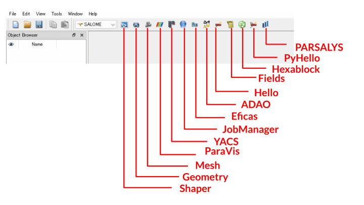

SALOMEのツールバーには、上図のように数多くのモジュールが並んでいる。主なモジュールは以下の通り。ただし本講義で実際に使うのは次の3つだけである。

- ジオメトリ作成の **Shaper**
- 直接モデリングの **Geometry（GEOM）**
- メッシュ生成の **Mesh**

| モジュール | 役割 |
|-----------|------|
| Shaper | パラメトリック CAD（スケッチ・フィーチャーベース） |
| Geometry（GEOM） | 直接モデリング・Python スクリプト対応 |
| Mesh | メッシュ生成（テトラ・ヘキサ・境界層など） |
| ParaVis | 結果の可視化（ParaView ベース） |
| YACS | ワークフロー管理 |

SALOME起動後は、画面左上のプルダウンから使用するモジュールを切り替える。


---

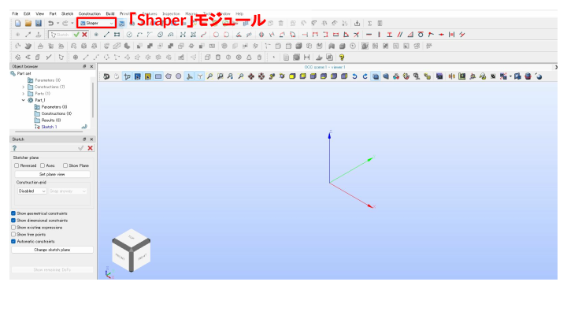

---

## 3Dビューのマウス操作

モジュールを問わず、3Dビューの視点操作は共通である。SALOMEの初期設定（Salome standard controls）では、いずれも **Ctrl キーを押しながら**マウスボタンをドラッグする。


---

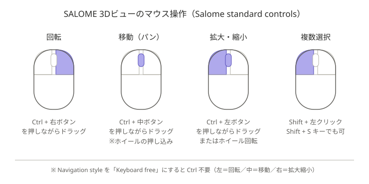

| 操作 | やり方 |
|------|--------|
| 回転 | Ctrl + 右ボタンでドラッグ |
| 移動（パン） | Ctrl + 中ボタン（ホイールの押し込み）でドラッグ |
| 拡大・縮小 | Ctrl + 左ボタンでドラッグ、またはホイール回転 |
| 複数選択 | Shift + 左クリック |

---

## Shaper モジュール

パラメトリック CAD モジュール。従来の Geometry（GEOM）の後継。


---

### できること

- スケッチベースモデリング（2D スケッチ → 押し出し・回転で 3D 化）
- フィーチャーツリーによる履歴管理（後から寸法変更が容易）
- ブーリアン演算（和・差・積）
- プリミティブ（Box・円柱・球など）
- 変換（移動・回転・ミラー・スケール）
- アセンブリ（複数パーツの組み立て）

例えば、2Dスケッチを描いて押し出すと、以下のように3D形状が作られる。


---

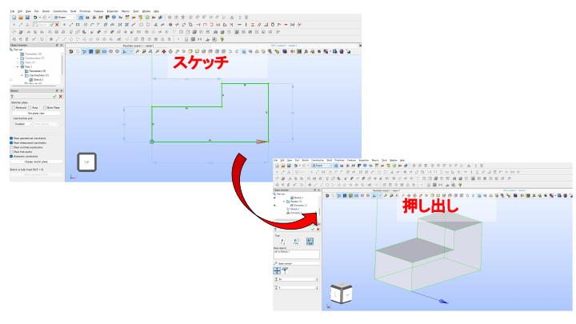


---

### GEOM（Geometry）モジュールとは

GEOM は Shaper より前からある直接モデリング（ダイレクトモデリング）方式のジオメトリモジュールで、CAD モデルの作成・編集を行う。Shaper のようなフィーチャーツリーに基づく履歴は持たないが、Box・円柱などのプリミティブ生成やブーリアン演算（Fuse・Cut・Common）、Python スクリプトによる自動化に強く、SALOME では現在も広く使われている。

例えば、2つの Box をブーリアン演算（Fuse）で結合すると、以下のように1つの形状にまとまる。


---

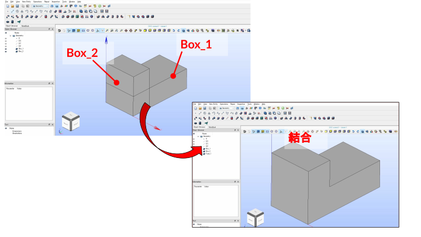


---

### GEOM モジュールとの比較

| | Shaper | Geometry（GEOM） |
|---|--------|-----------------|
| モデリング方式 | パラメトリック（履歴あり） | 直接モデリング（履歴なし） |
| 後からの変更 | 容易 | 難しい |
| 成熟度 | 新しい（機能追加中） | 枯れている |
| Python スクリプト | 対応（発展中） | 充実 |

---

## Mesh モジュール

Shaper / GEOM で作成したジオメトリからメッシュを生成するモジュール。


---

### メッシュとは

メッシュとは、解析したい空間（計算領域）を小さなセル（要素）の集まりに分割したものである。CFDでは、このセル1つ1つについて流速や圧力などを計算するため、メッシュの細かさ・形・質が計算精度と計算時間を大きく左右する。メッシュ作成は解析の前処理の中で最も重要な工程といえる。

セルの形には大きく分けて、規則正しく並ぶ**構造格子**（6面体＝ヘキサ）と、複雑な形状にも柔軟に対応できる**非構造格子**（4面体＝テトラ、プリズム、ピラミッド、ポリヘドラなど）がある。


---

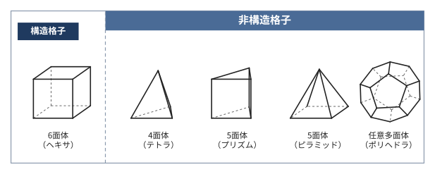


---

### メッシュの種類

| 種類 | 説明 | セルの形 |
|------|------|----------|
| テトラメッシュ | 四面体。複雑形状に自動生成しやすい | 4つの三角形の面で囲まれた最もシンプルな立体。NETGEN などのアルゴリズムで複雑な形状にも自動で敷き詰められる |
| ヘキサメッシュ | 六面体。計算精度が高く OpenFOAM と相性が良い | 直方体（サイコロ状）のセル。同じ体積ならテトラよりセル数が少なく、面が壁に沿いやすいため数値誤差が小さい |
| プリズム（境界層） | 壁面付近に層状に生成。境界層の解像度を上げる | 壁に沿って薄い層を積み重ねた三角柱／四角柱状のセル。壁に近いほど薄く、離れるほど厚くする |
| ハイブリッド | ヘキサ＋テトラの混在 | 形状が単純な部分はヘキサ、複雑な部分はテトラというように、領域ごとに異なる種類のセルを組み合わせる |

<figure style="margin:1.5rem 0; text-align:center;">
  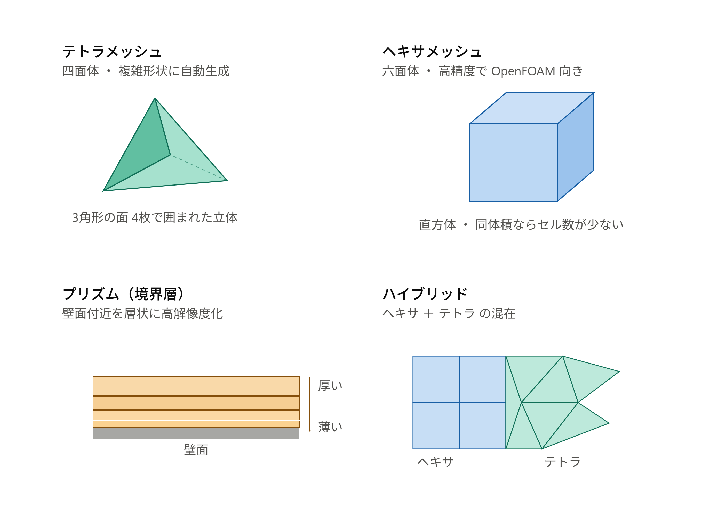
</figure>


---

### 分割の設定階層

メッシュの細かさは 1D → 2D → 3D の順に設定する。1D（辺）の分割が2D（面）のメッシュの粗さを決め、2D（面）のメッシュが3D（体積）のメッシュの粗さを決める、という積み上げの関係になっている。

| 階層 | 対象 | 設定内容 | 具体例 |
|------|------|----------|--------|
| 1D | エッジ（辺） | 分割数・分割比（グレーディング） | `Wire Discretisation` で `Number of Segments`（分割数）を指定する |
| 2D | フェイス（面） | 面メッシュのアルゴリズム | `NETGEN 2D Parameters` で `Max. Size` / `Min. Size`（面メッシュの最大・最小サイズ）を指定する |
| 3D | ソリッド（体積） | 体積メッシュのアルゴリズム | `NETGEN 3D Parameters` で `Max. Size` / `Min. Size`（セルの最大・最小サイズ）を指定する |

1D・2D・3D をすべて指定すると、辺の分割数を優先しつつ、面・体積は指定したサイズ範囲でメッシュが生成される。具体的な操作手順は [001_box.md](001_box.md) の「1D/2D/3Dを指定してメッシュを制御する」を参照。


---

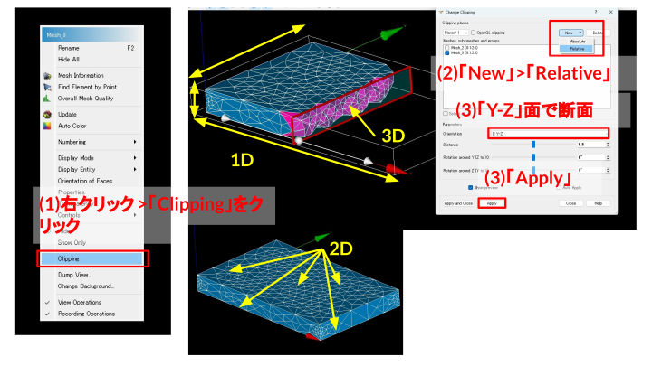


---

### 主なアルゴリズム

| アルゴリズム | 次元 | 特徴 |
|------------|------|------|
| Wire Discretization | 1D | エッジを指定分割数で均等分割 |
| Quadrangle（Mapping） | 2D | 四角形メッシュ。ヘキサ化に必須 |
| Hexahedron（i,j,k） | 3D | 構造ヘキサメッシュ。規則的な形状に使用 |
| NETGEN 1D-2D-3D | 3D | テトラ自動生成 |


---

### 同梱されているメッシャー

上の表のアルゴリズムは、SALOMEに同梱された複数のメッシャー（メッシュ生成エンジン）が提供している。SALOME 9.15には以下が入っている。

| メッシャー | 提供アルゴリズム | 備考 |
|-----------|----------------|------|
| SMESH内蔵 | Wire Discretisation、Quadrangle (Mapping)、Hexahedron (i,j,k) など | SALOME本体の基本アルゴリズム |
| NETGEN | NETGEN 1D-2D-3D（テトラ）、NETGEN 1D-2D（三角形） | オープンソースの自動メッシャー |
| Gmsh | Gmshの1D/2D/3Dアルゴリズム | オープンソースメッシャーGmshのプラグイン |
| MMG | リメッシュ（メッシュ改善） | オープンソースのリメッシャー |
| MeshGems | MG-CADSurf（BLSURF）、MG-Tetra（GHS3D）、MG-Hexa（Hexotic）、MG-Hybrid | 商用メッシャー。プラグインは同梱されているが**別途商用ライセンスが必要** |

本講義で使うのは、SMESH内蔵アルゴリズム（ヘキサ）とNETGEN（テトラ）だけである。


---

### 境界層（Viscous Layers）

壁面付近に薄い層状のプリズムメッシュを追加する機能。

- **層数**: 積層する枚数
- **厚み**: 最初の層の厚さ
- **伸長率**: 層ごとの厚みの増加比率


---

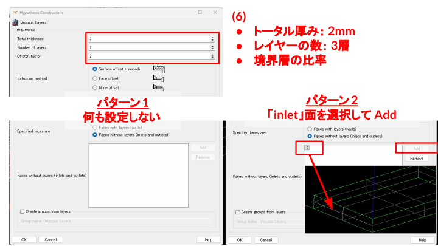

実際にヒートシンクのフィン表面へ境界層を入れると、以下のようにテトラメッシュの壁面側だけに薄い層状のメッシュが積み重なる。


---

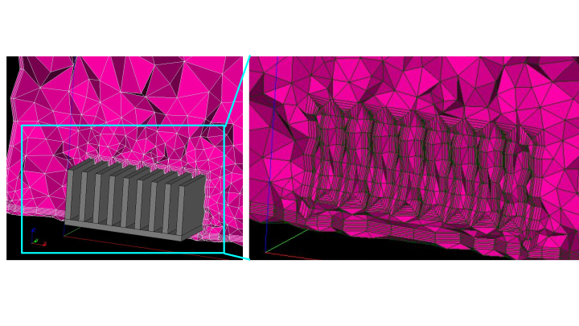


---

### サブメッシュ

特定のフェイスやエッジだけ分割設定を変えたい場合に使用。
部分的に細かくしたり、境界条件ごとに名前（グループ）をつけるのに使う。


---

### グループ

OpenFOAM のパッチ（境界条件）に対応させるため、フェイスに名前をつける機能。
メッシュ生成前にグループを設定しておくと UNV エクスポート後もパッチ名が引き継がれる。

---

## OpenFOAM への変換

SALOME で作成したメッシュを OpenFOAM 形式に変換して利用する。全体の流れは以下の通り。


---

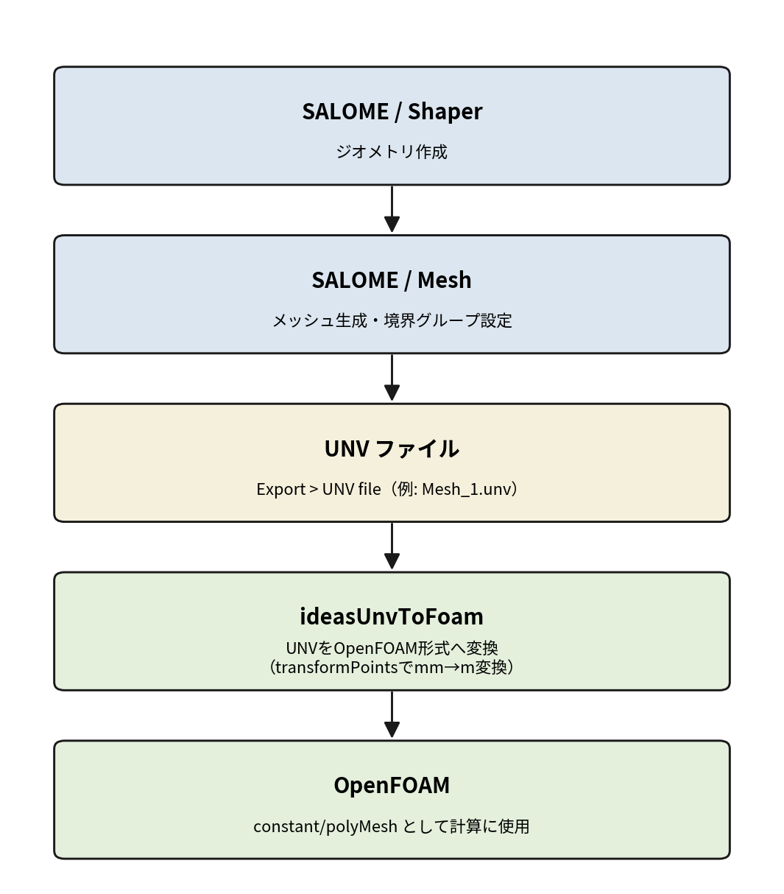

本講義では、メッシャーとしてSALOMEを使った場合のメッシュ作成の基礎およびテクニックを学ぶことを目的とし、最終的にOpenFOAMで計算できる形へ変換するところまでを扱う。

ただし、OpenFOAMでの計算の解説は行わない。OpenFOAMの設定ファイルも同封しているため、興味があれば取り組んでほしい。

各演習のデータ（SALOMEから出力したUNVメッシュ・OpenFOAMケース一式・計算結果）は、リポジトリの以下のフォルダにある。

| 演習 | データフォルダ | 内容 |
|------|----------------|------|
| 001 Box | `data/001_box/run001_of13` | `Mesh_4.unv`、OpenFOAM 13の定常流体解析ケース（結果 `90/`） |
| 001 Box | `data/001_box/run001_of2512` | 同じ解析のESI版OpenFOAM（v2512）ケース（`simpleFoam`、結果 `80/`） |
| 002 撹拌機 | `data/002_Stirrer/sample/mesh/mesh_of13` | `Mesh_1.unv`、UNV変換・topoSet・createBafflesのケース（OpenFOAM 13） |
| 002 撹拌機 | `data/002_Stirrer/sample/mesh/mesh_of2512` | 同上のESI版OpenFOAM（v2512）ケース |
| 002 撹拌機 | `data/002_Stirrer/sample/mesh/master_curve_of13` | 羽根可動化テスト（moveDynamicMesh）のケース（OpenFOAM 13） |
| 002 撹拌機 | `data/002_Stirrer/sample/mesh/master_curve_of2512` | 同上のESI版OpenFOAM（v2512）ケース |
| 002 撹拌機 | `data/002_Stirrer/sample/mesh/fullmodel_of13` | 全周（360°）フルモデル組み立てのケース（OpenFOAM 13、変形済み羽根） |
| 002 撹拌機 | `data/002_Stirrer/sample/mesh/fullmodel_of2512` | 同上のESI版OpenFOAM（v2512）ケース |
| 003 ヒートシンク | `data/003_heatsink/run001_of13` | `Mesh_1.unv`、OpenFOAM 13の熱流体・固体連成ケース（`foamMultiRun`） |
| 003 ヒートシンク | `data/003_heatsink/run001_of2512` | 同上のESI版OpenFOAM（v2512）ケース（`chtMultiRegionFoam`） |

---

# 001 Box: SALOMEでOpenFOAM用メッシュを作る

## この演習で目指すこと

SALOMEで直方体モデルを作成し、OpenFOAMで使える境界名つきメッシュとしてUNV出力する。基本形状を題材に、メッシュ作成で頻繁に使う操作を一通り確認する。

- 直方体形状を作成する
- 辺・面・境界に名前を付ける
- テトラメッシュとヘキサメッシュを作成する
- 各辺で分割数を変える
- 特定の面だけメッシュを細分化する
- 境界層メッシュを入れる
- OpenFOAM用にUNVを書き出す


---

### 使用データの場所

この演習で使うファイル・計算結果は、リポジトリの以下のフォルダにある。

| フォルダ | 内容 |
|----------|------|
| `data/001_box/run001_of13` | SALOMEから出力した `Mesh_4.unv` と、OpenFOAM 13で流体解析を行うケース一式（`0`・`constant`・`system`、収束後の結果 `90/`）。`./Allrun` で一括実行できる |
| `data/001_box/run001_of2512` | 同じ解析をESI版OpenFOAM（v2512）の `simpleFoam` で行うケース一式（`./Allrun` で一括実行、収束後の結果 `80/`） |


---

## モデル作成

---

### 1. Geometryモジュールへ切り替える

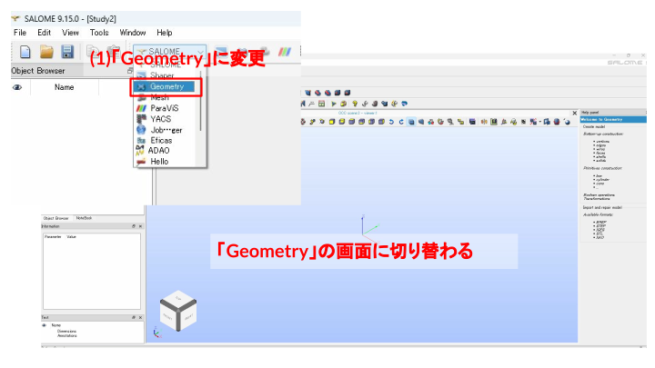

- (1) `Geometry` に変更し、Geometry画面へ切り替える。

---

### 2. Box形状を作成する

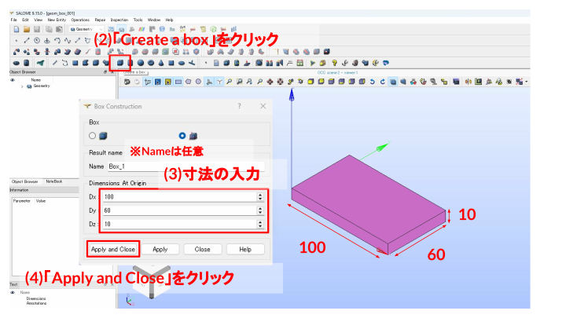

- (2) `Create a box` をクリックする。
- (3) 寸法を `100 x 60 x 10` として入力する。ここではmm単位で形状を作る。
- (4) `Apply and Close` でBoxを作成する。

---

### 3. Box作成結果を確認する

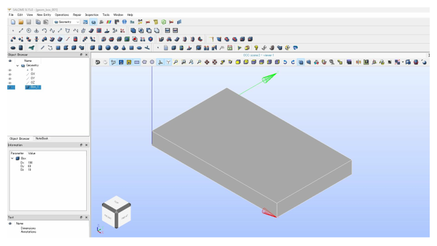

- 確認: 作成した直方体がビュー上に表示されていることを確認する。
- 確認: ツリー上にBoxオブジェクトが作成されていることを確認する。

---

### 4. 辺方向を抽出する

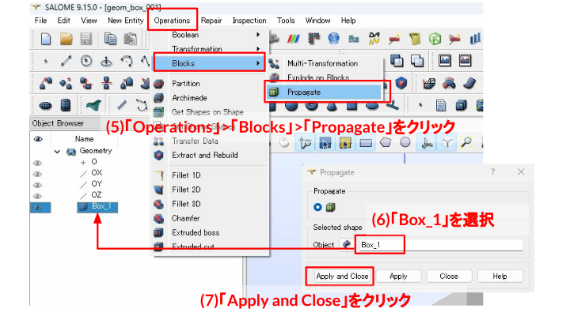

- (5) `Operations > Blocks > Propagate` をクリックする。
- (6) `Box_1` を選択する。
- (7) `Apply and Close` で確定する。

---

### 5. Propagateで作られるCompoundを確認する

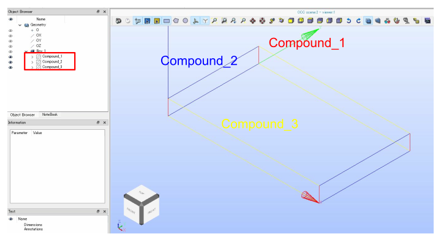

- 確認: `Compound_1`, `Compound_2`, `Compound_3` が作成される。
- 確認: これらはBoxの各方向の辺グループとして、後で方向別の分割数指定に使える。

---

### 6. Compoundを方向名に変更する

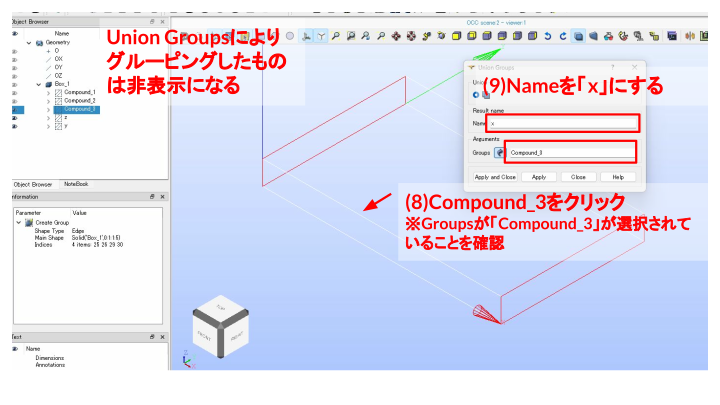

- (8) Compoundをクリックし、Groupsに選択したCompoundが入っていることを確認する。
- (9) Nameを方向名に変更する。`Compound_1` を `x`、`Compound_2` を `y`、`Compound_3` を `z` にする。

---

### 7. 線グループの考え方

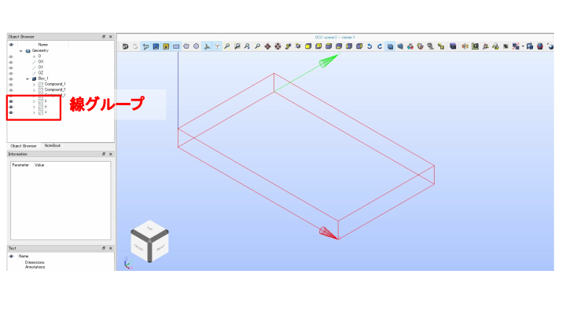

- 確認: 線グループは、方向ごとの分割数を指定するために使う。
- ※ OpenFOAMの境界条件には通常使わないが、SALOME内のメッシュ制御では重要になる。

---

### 8. 面グループを作成する準備

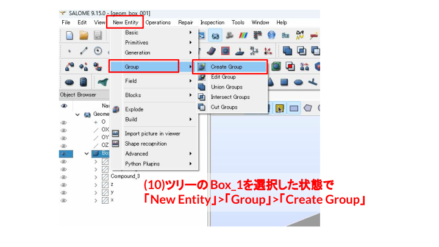

- (10) `Box_1` を選択した状態で `New Entity > Group > Create Group` を開く。
- ※ 面グループは、メッシュ作成時の2Dでのメッシュサイズ指定にも使えるし、OpenFOAMの境界名としても使用できる。

---

### 9. inlet面グループを作成する

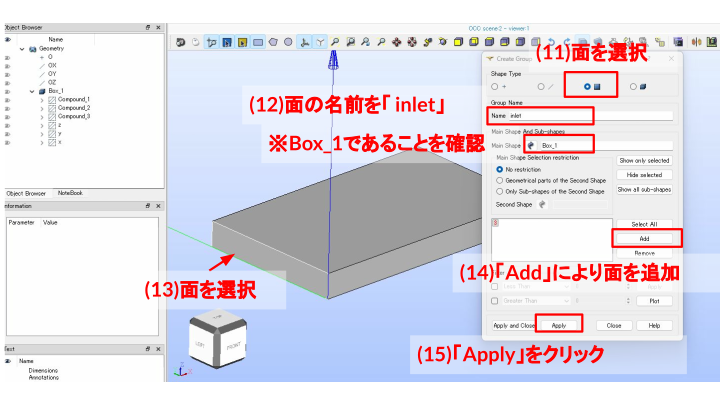

- (11) 面グループ作成画面で、対象が `Box_1` であることを確認する。
- (12) 面の名前を `inlet` にする。
- (13) inletにしたい面を選択する。
- (14) `Add` で選択面をグループに追加する。
- (15) `Apply` をクリックする。
- ※ ここで付けた名前はOpenFOAMのパッチ名になるため、面の選び間違いは解析条件のミスに直結する。

---

### 10. 他の境界面も作成する

`side` → `topAndbottom` → `outlet` の順に、`inlet` と同様に面を選択して面グループを設定していく。


---

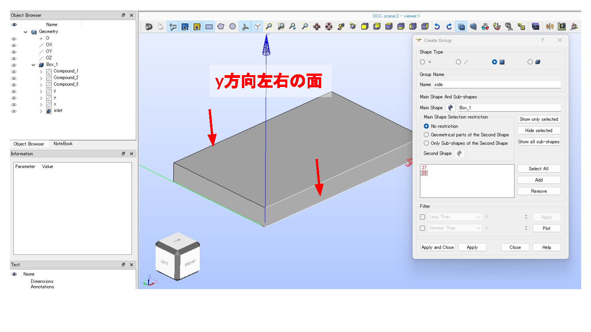

- y方向左右の面を選択し、Group Nameを `side` として `Add` → `Apply` する。


---

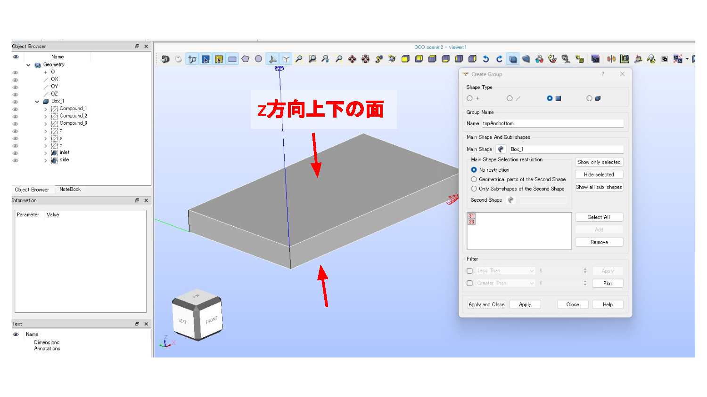

- z方向上下の面を選択し、Group Nameを `topAndbottom` として `Add` → `Apply` する。
- ※ 2D解析に使う前後面は、OpenFOAM側で `empty` にする。

---

### 11. 面グループ作成を確定する

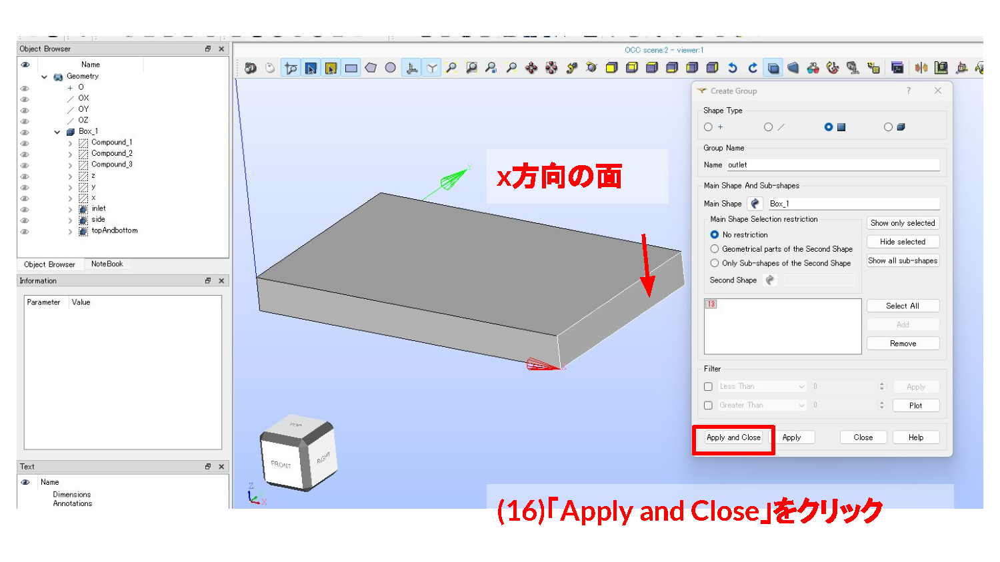

- x方向の面を選択し、Group Nameを `outlet` とする。
- (16) 必要な面グループを作成したら `Apply and Close` で閉じる。

---

### 12. Geometryファイルを保存する

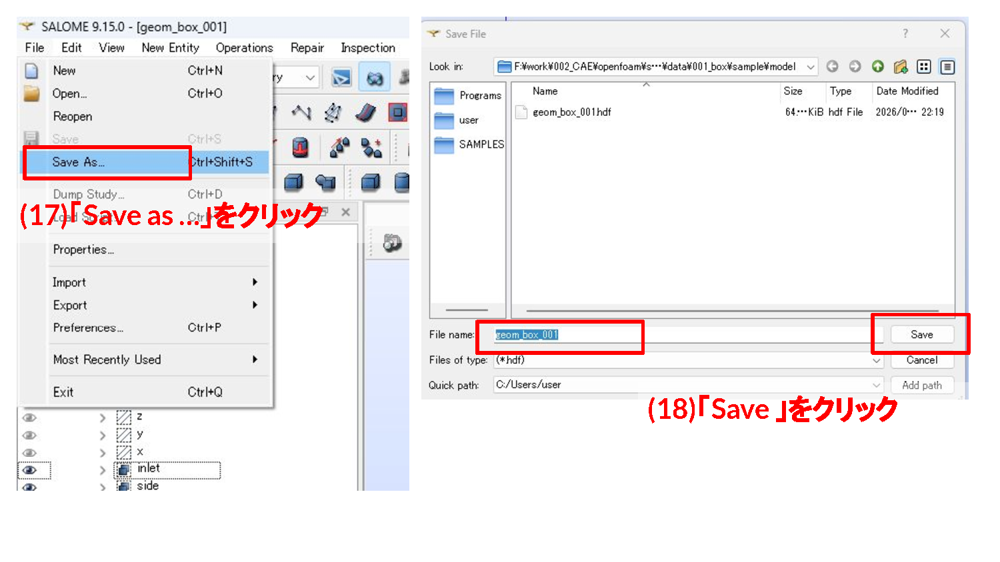

- (17) `Save as ...` をクリックする。
- (18) `Save` をクリックし、SALOMEのプロジェクトファイルとして保存する。
- ※ SALOMEはソフトが落ちやすいので、こまめに保存しておきましょう。
- ※ 本講義では逐一保存しているデータがあるため、万が一講義中にソフトが落ちてしまった場合は、保存した場所のフォルダを読み込んで再度進めてください。

---

### 13. 線グループと面グループの役割

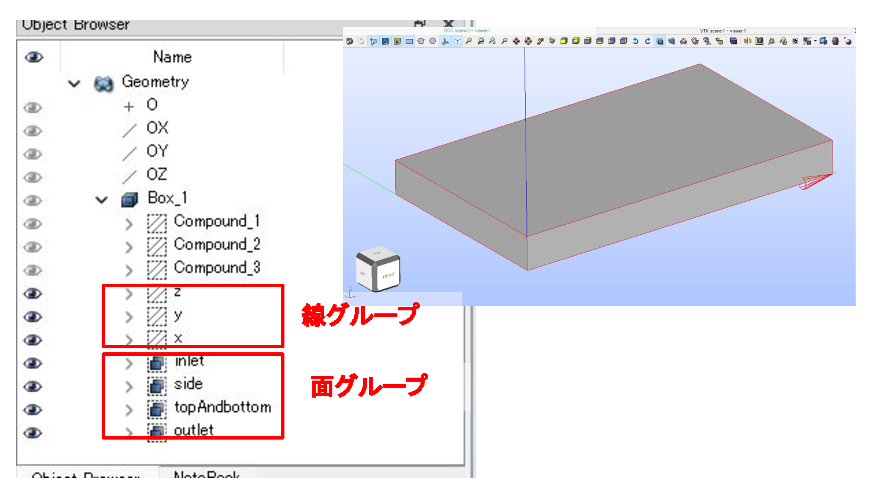

- 確認: ツリーに線グループ（`x` / `y` / `z`）と面グループ（`inlet` / `side` / `topAndbottom` / `outlet`）が揃っていることを確認する。
- 確認: 線グループはメッシュ分割数を制御するために使う。
- 確認: 面グループはOpenFOAMの境界パッチ名に対応する。
- 確認: OpenFOAMへ渡す境界は、面グループとして作成しておく。

---

## メッシュ作成

ここからは、作成したBox形状に対して、メッシュ作成でよく使う操作を一通り試していく。具体的には以下を行う。

- テトラメッシュの作成
- ヘキサメッシュの作成
- 1D/2D/3Dを指定してメッシュを制御する
- 各辺で分割数を変える（方向別分割）
- 特定の面だけメッシュを細分化する
- 境界層メッシュ（Viscous Layers）を入れる
- OpenFOAM用にUNV出力する

---

### テトラメッシュの作成

---

#### 1. Meshモジュールへ切り替える

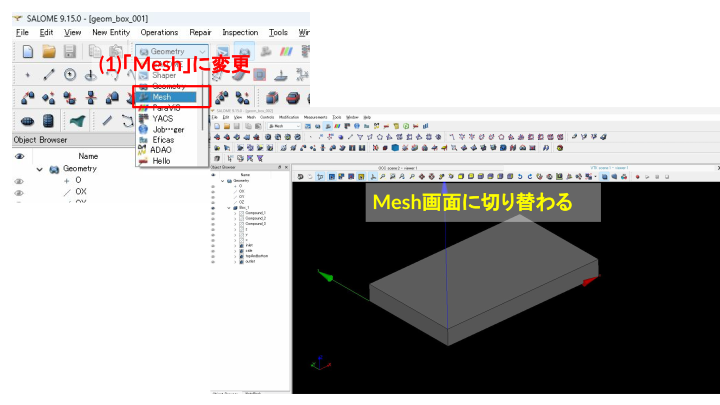

- (1) 画面左上のモジュールのプルダウンを `Mesh` に変更する。Mesh画面に切り替わり、Object Browserには先ほど作成した `Box_1` とその面グループがそのまま表示される。

---

#### 2. 新規メッシュを作成する


- (2) `Box_1` を選択した状態で `Create Mesh` をクリックする。

---

#### 3. テトラメッシュを設定する

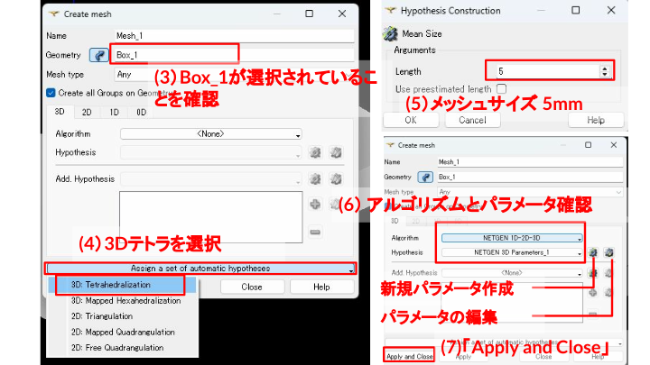

- (3) `Box_1` が選択されていることを確認する。
- (4) 3Dテトラメッシュを選択する。
- (5) メッシュサイズを `5 mm` に設定する。
- (6) アルゴリズムとパラメータを確認する。
- (7) `Apply and Close` で設定を保存する。

---

#### 4. テトラメッシュを計算して結果を確認する


- (8) `Mesh_1` を選択した状態で `Compute` をクリックし、メッシュを作成する。
- 確認: `Mesh computation succeed` のMesh Infosでセル数を把握する（ここではNodes 701、Tetrahedrons 1909）。
- 確認: ビュー上に生成されたテトラメッシュの見た目を確認する。
- 確認: 複雑形状には使いやすいが、直方体ではヘキサメッシュも比較する。

---

### ヘキサメッシュの作成

---

#### 1. 新しいメッシュを追加する

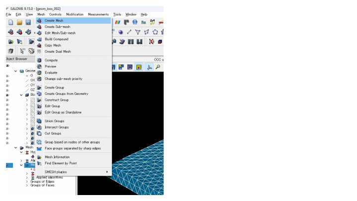

- 別のメッシュタイプを作成する場合は、メニューバーの `Mesh` から `Create Mesh` をクリックする。
- 同じ形状に対して、テトラメッシュやヘキサメッシュなど、複数のメッシュを追加しておくことができる。

---

#### 2. ヘキサメッシュを設定する

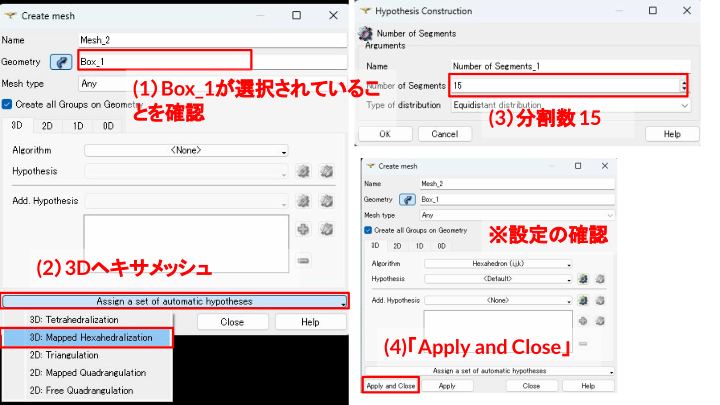

- (1) `Box_1` が選択されていることを確認する。
- (2) 3Dヘキサメッシュを選択する。
- (3) 分割数を `15` にする。
- (4) 設定内容を確認して `Apply and Close` する。

---

#### 3. ヘキサメッシュを計算する

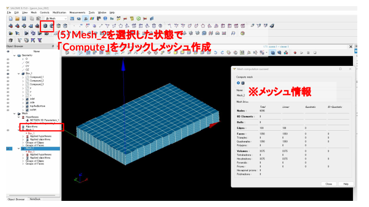

- (5) `Mesh_2` を選択した状態で `Compute` をクリックし、メッシュを作成する。
- 確認: ヘキサメッシュのセル数と分割の入り方を確認する。

---

### 1D/2D/3Dを指定してメッシュを制御する

---

#### 1. 1D分割数を指定する

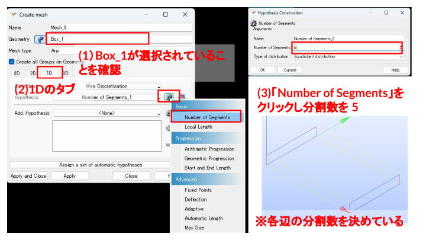

- (1) `Box_1` が選択されていることを確認する。
- (2) `1D` タブを開く。
- (3) `Number of Segments` をクリックし、分割数を `5` にする。

---

#### 2. 2D面メッシュサイズを指定する

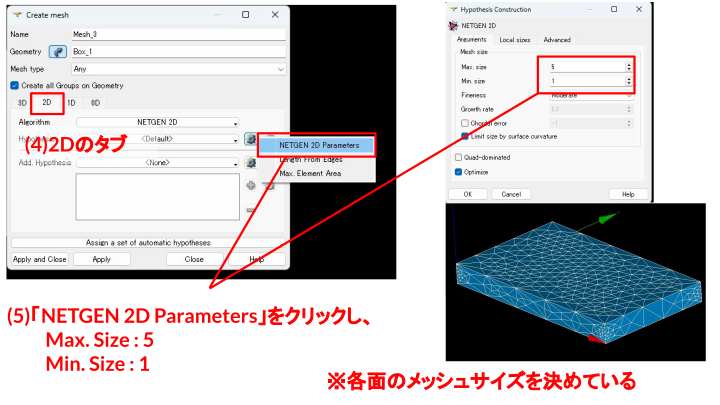

- (4) `2D` タブを開く。
- (5) `NETGEN 2D Parameters` をクリックし、`Max. Size = 5`, `Min. Size = 1` を指定する。

---

#### 3. 3D体積メッシュサイズを指定する

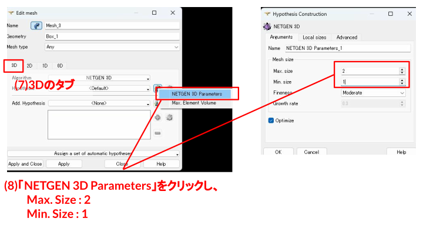

- (7) `3D` タブを開く。
- (8) `NETGEN 3D Parameters` をクリックし、`Max. Size = 2`, `Min. Size = 1` を指定する。

---

#### 4. 1D/2D/3D指定メッシュを計算する

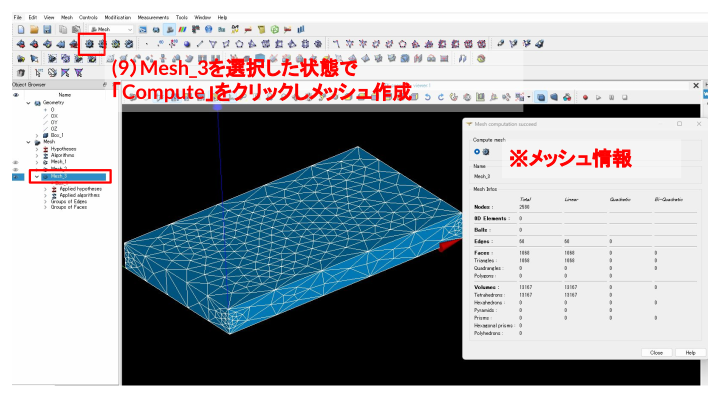

- (9) `Mesh_3` を選択した状態で `Compute` をクリックし、メッシュを作成する。
- 確認: 1D, 2D, 3D の設定がメッシュに反映されていることを確認する。

---

#### 5. 断面表示で内部メッシュを確認する


- (1) 右クリックから `Clipping` をクリックする。
- (2) `New > Relative` を選択する。
- (3) `Y-Z` 面で断面を作り、`Apply` をクリックする。
- 確認: 断面表示により、内部のセル分布を確認する。
- 確認: 表面だけでは分からないメッシュ密度の偏りを確認できる。

---

### 各辺で分割数を変える

---

#### 1. 方向別分割数の設定準備

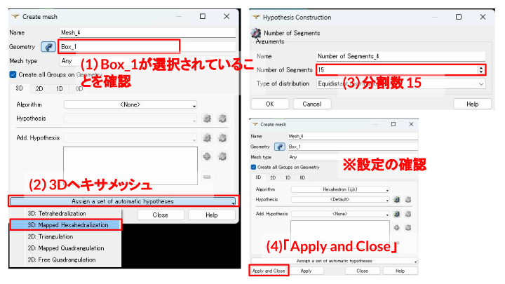

- (1) `Box_1` が選択されていることを確認する。
- (2) 3Dヘキサメッシュを選択する。
- (3) 分割数を `15` にする。
- (4) 設定内容を確認して `Apply and Close` する。

---

#### 2. サブメッシュを作成する

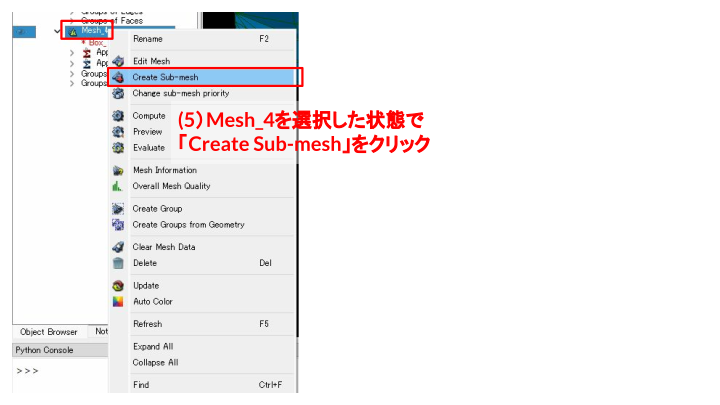

- (5) `Mesh_4` を選択した状態で `Create Sub-mesh` をクリックする。

---

#### 3. x方向の分割数を増やす

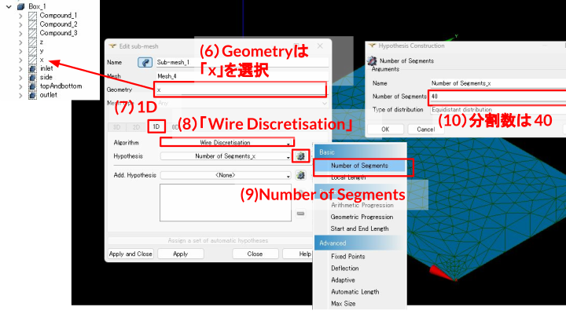

- (6) Geometryとして線グループ `x` を選択する。
- (7) `1D` を選択する。
- (8) `Wire Discretisation` を選択する。
- (9) `Number of Segments` を選択する。
- (10) 分割数を `40` にする。

---

#### 4. y方向の分割数を指定する

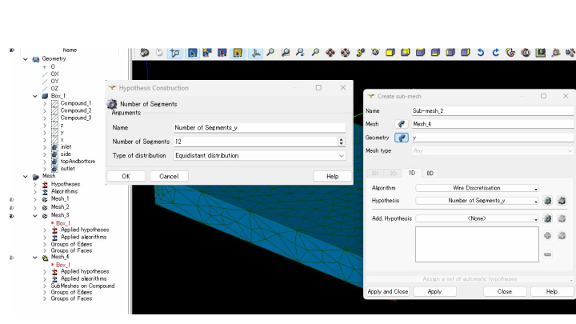

- `Geometry` に線グループ `y` を選択し、y方向の分割数を指定する。

---

#### 5. z方向の分割数を指定する

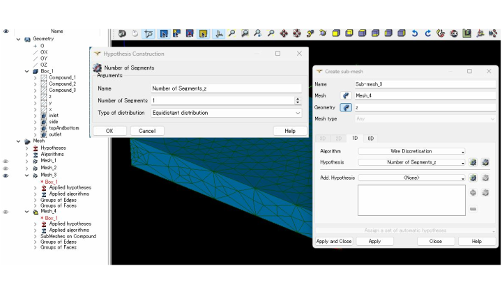

- `Geometry` に線グループ `z` を選択し、z方向の分割数を指定する。
- 確認: 全体メッシュ設定とサブメッシュ設定を組み合わせて使う。

---

#### 6. 方向別分割メッシュを計算する

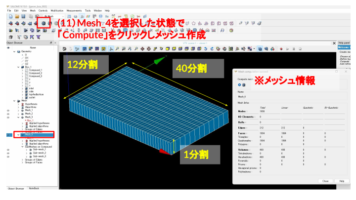

- (11) `Mesh_4` を選択した状態で `Compute` をクリックし、メッシュを作成する。
- 確認: 1分割、12分割、40分割の違いを比較し、方向別分割の効果を確認する。

---

#### 7. 保存する

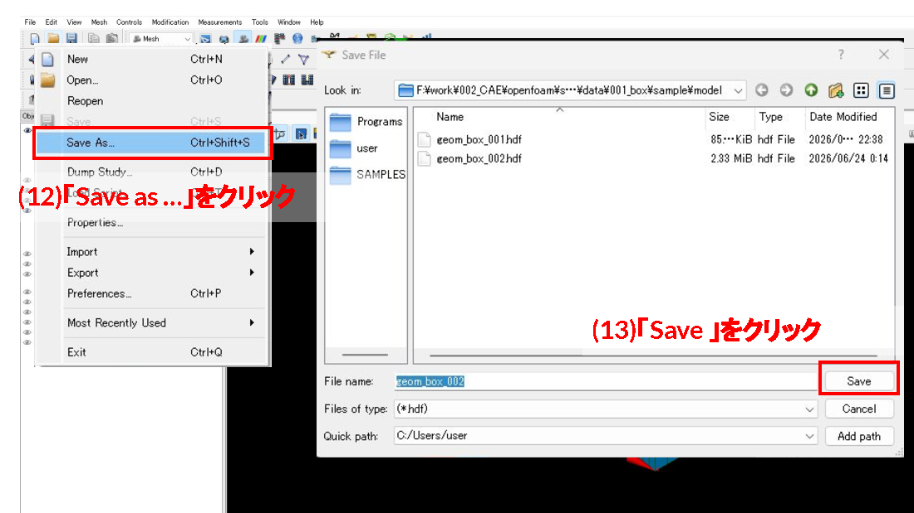

- (12) `File > Save As...` をクリックする。
- (13) ファイル名を入力し、`Save` をクリックする。

---

### 特定の面を細分化する

---

#### 1. 特定面だけ細分化する準備

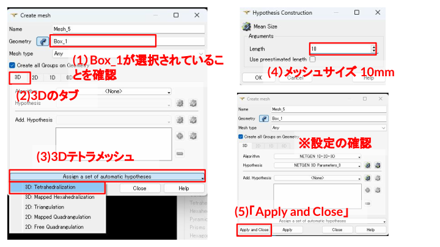

- (1) `Box_1` が選択されていることを確認する。
- (2) `3D` タブを開く。
- (3) 3Dテトラメッシュを選択する。
- (4) メッシュサイズを `10 mm` にする。
- (5) 設定内容を確認して `Apply and Close` する。

---

#### 2. 面サブメッシュを作成する

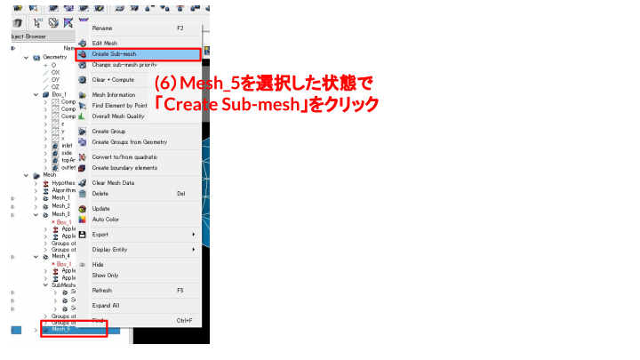

- (6) `Mesh_5` を選択した状態で `Create Sub-mesh` をクリックする。

---

#### 3. inlet面だけ細分化する

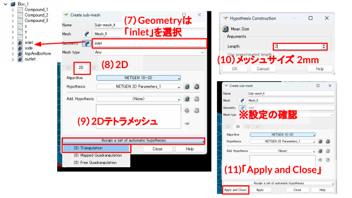

- (7) Geometryとして `inlet` を選択する。
- (8) `2D` を選択する。
- (9) 2Dテトラメッシュを選択する。
- (10) メッシュサイズを `2 mm` にする。
- (11) `Apply and Close` で確定する。

---

#### 4. 局所細分化メッシュを計算する

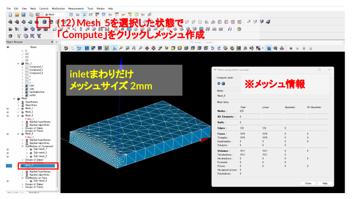

- (12) `Mesh_5` を選択した状態で `Compute` をクリックし、メッシュを作成する。
- 確認: `inlet` 周辺だけメッシュサイズが `2 mm` になっていることを確認する。

---

### 境界層メッシュを入れる

---

#### 1. 境界層メッシュを設定する

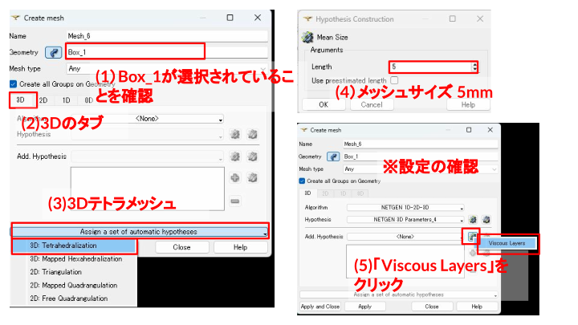

- (1) `Box_1` が選択されていることを確認する。
- (2) `3D` タブを開く。
- (3) 3Dテトラメッシュを選択する。
- (4) メッシュサイズを `5 mm` にする。
- (5) `Viscous Layers` をクリックする。

---

#### 2. 境界層パラメータを指定する


- (6) トータル厚みを `2 mm`、レイヤー数を `3層` に設定する。
- 補足: パターン1は何も設定しない例、パターン2は `inlet` 面を選択して追加する例を示している。

---

#### 3. 境界層対象面を確認する

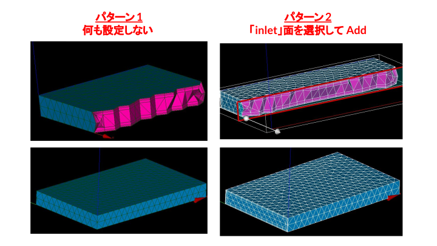

- 確認: 境界層を入れる面、または除外する面を確認する。
- 確認: 壁面近傍を解きたい場合は、壁面側に境界層を入れる。

---

#### 4. Studyを保存する

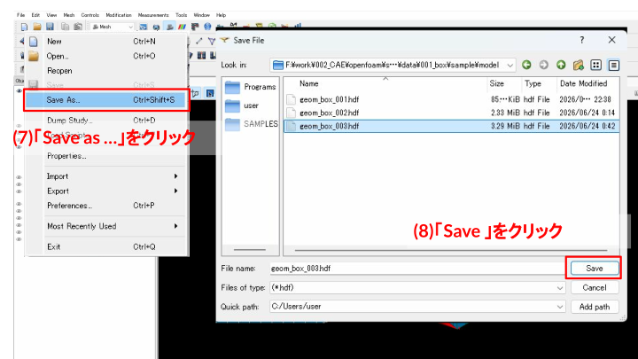

- (7) `File > Save As...` をクリックする。
- (8) ファイル名を入力し、`Save` をクリックする。
- ※ SALOMEは落ちることがあるので、メッシュ設定を進めるたびに保存しておくとよい。

---

## （余裕がある人向け）OpenFOAM側での計算

SALOMEで作成したメッシュをOpenFOAMへ渡すには、UNV形式で書き出し、OpenFOAMのケースフォルダへ変換・配置する必要がある。全体の流れは以下の通り。


---


---

### OpenFOAM用にUNV出力する

---

#### 1. Geometryからメッシュグループを作る

**この章ではこの操作は不要です。** メッシュを切ったあとにGeometryモジュールへ戻って面に名前を付けた場合、Geometryとメッシュに境界名が関連付けられていない。メッシュに境界名が反映されていない場合は、この操作を行うこと。


---

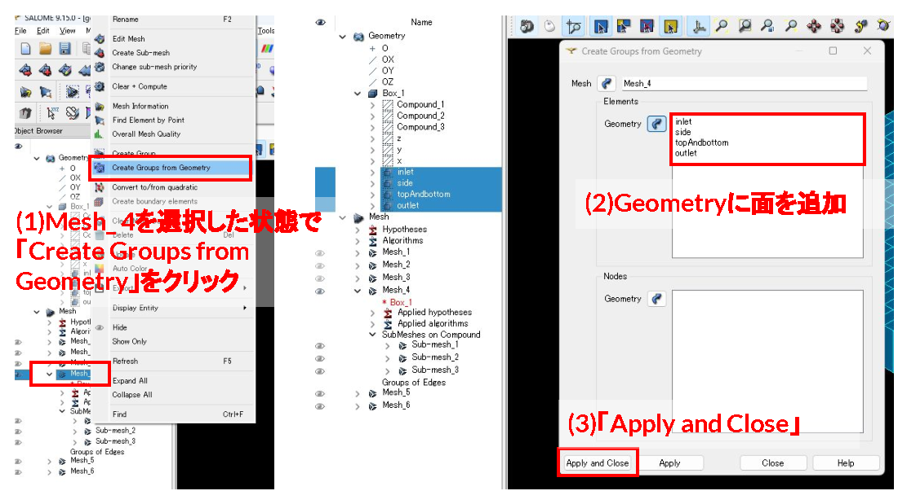

- (1) `Mesh_4` を選択した状態で `Create Groups from Geometry` をクリックする。
- (2) Geometryに `inlet`、`side`、`topAndbottom`、`outlet` を追加する。
- (3) `Apply and Close` で確定する。

---

#### 2. UNV形式でエクスポートする

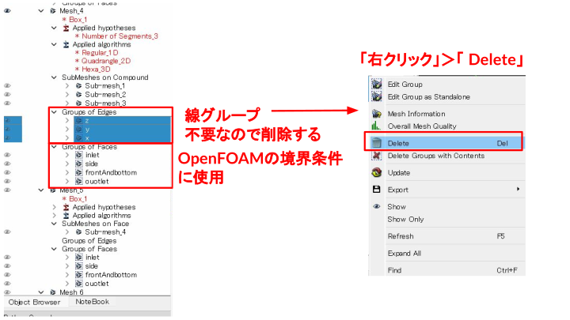

- (1) `Groups of Edges` の線グループは不要なので、右クリック > `Delete` で削除する。


---

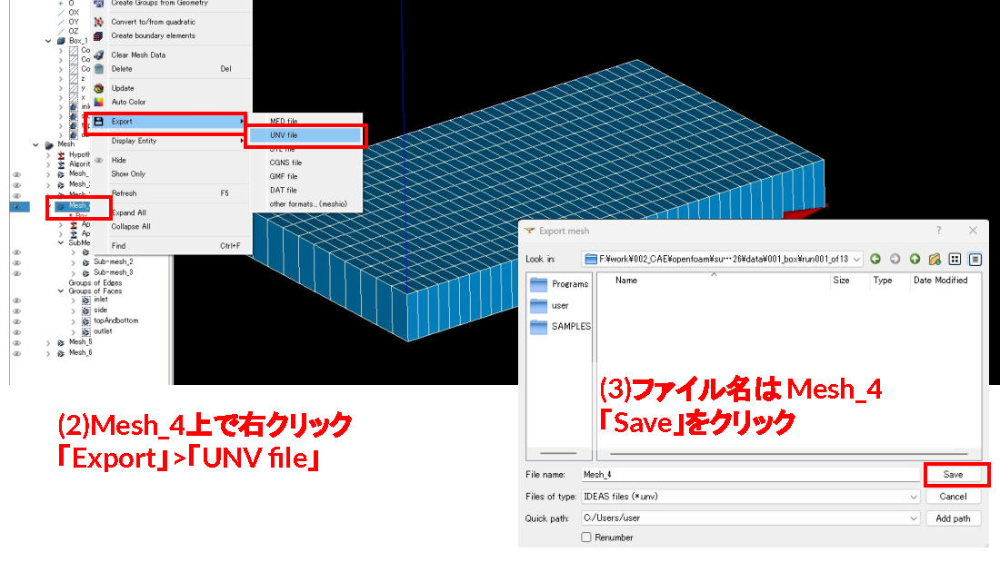

- (2) `Mesh_4` 上で右クリックし、`Export > UNV file` を選ぶ。
- (3) ファイル名を `Mesh_4` として保存する。
- 補足: `Groups of Faces` がOpenFOAMの境界面の名前になる。
- 補足: 不要な線グループやCompoundグループをUNVに含めると、`ideasUnvToFoam`でエラーになることがある。

---

### OpenFOAMを用いた流体解析

OpenFOAMでは、メッシュだけでは計算できない。計算には、初期条件を入れる `0`、物性やメッシュを入れる `constant`、計算条件を入れる `system` が必要になる。

今回は定常・非圧縮流れの計算を行うため、OpenFOAM 13のチュートリアル `incompressibleFluid/pitzDailySteady` をベースにする。

```bash
cd data/001_box/run001_of13
cp -r /opt/openfoam13/tutorials/incompressibleFluid/pitzDailySteady/{0,constant,system} .
rm -f system/blockMeshDict
```

- `pitzDailySteady` は、非圧縮流体の定常解析用チュートリアルである。
- `system/controlDict` では、`solver incompressibleFluid` を使う設定になっている。
- `system/fvSchemes` では、時間微分を `steadyState` として扱う。
- `system/fvSolution` では、定常解析で使うSIMPLE法の設定が入っている。
- `system/blockMeshDict` はチュートリアル付属のメッシュ作成用ファイルである。今回はSALOMEで作成したUNVメッシュを使うため削除する。

---

#### OpenFOAMへの変換

UNVを書き出した後は、OpenFOAM側で以下の計算フォルダへ移動して作業する。

```bash
cd data/001_box/run001_of13
```

- 計算フォルダは `data/001_box/run001_of13` とする。
- `Mesh_4.unv` は `data/001_box/run001_of13/Mesh_4.unv` に保存する。
- `0`、`constant`、`system` も、この計算フォルダ内に置く。

計算フォルダに入った後、OpenFOAM 13を読み込み、SALOMEから出力したUNVメッシュをOpenFOAM形式へ変換する。

```bash
. /opt/openfoam13/etc/bashrc
ideasUnvToFoam Mesh_4.unv > log.ideasUnvToFoam.of13 2>&1
transformPoints "scale=(0.001 0.001 0.001)" > log.transformPoints.of13 2>&1
checkMesh > log.checkMesh.of13 2>&1
```

- `. /opt/openfoam13/etc/bashrc` は、OpenFOAM 13のコマンドを使えるようにする。
- `ideasUnvToFoam Mesh_4.unv` は、SALOMEから出力したUNVメッシュをOpenFOAMの `constant/polyMesh` 形式へ変換する。
- `> log.ideasUnvToFoam.of13 2>&1` は、変換時の標準出力とエラー出力をログファイルへ保存する。
- `transformPoints "scale=(0.001 0.001 0.001)"` は、座標をx, y, zすべて `1/1000` 倍する。SALOMEでmm単位の形状を作った場合、OpenFOAMで使うm単位へ変換するために使う。
- なお、ESI版OpenFOAM（v2512など）ではオプション構文が異なり、`transformPoints -scale "(0.001 0.001 0.001)"` と書く。
- `checkMesh` は、変換後のメッシュ品質、境界面、セル数、寸法などを確認する。
- `log.checkMesh.of13` を確認し、`Mesh OK` が出ていれば、基本的なメッシュチェックは通っている。

---

#### 境界条件を設定する

チュートリアルからコピーした `0` フォルダの各ファイルと `constant/polyMesh/boundary` を、SALOMEで付けた境界名（`inlet`・`outlet`・`side`・`topAndbottom`）に合わせて編集する。

| 境界名 | `constant/polyMesh/boundary` の `type` | `0/U` | `0/p` |
|---|---|---|---|
| `inlet` | `patch` | `fixedValue`、`value uniform (0.01 0 0)` | `zeroGradient` |
| `outlet` | `patch` | `zeroGradient` | `fixedValue`、`value uniform 0` |
| `side` | `wall` | `noSlip` | `zeroGradient` |
| `topAndbottom` | `empty` | `empty` | `empty` |

- `inlet` ではx方向へ0.01 m/sの一様流入を与える。
- `outlet` の圧力を `uniform 0` とし、基準圧にする。
- `ideasUnvToFoam` 変換直後は、`constant/polyMesh/boundary` の各境界が `patch` になっている場合がある。`side` を `wall`、`topAndbottom` を `empty` に修正する。
- `topAndbottom` を2次元計算の空方向として扱うには、`constant/polyMesh/boundary`、`0/U`、`0/p` の3か所をすべて `empty` に揃える。

---

#### 計算を実行する

境界条件を設定したら、ソルバを実行する。

```bash
foamRun > log.foamRun.of13 2>&1
```

- OpenFOAM 13では、`foamRun` が `system/controlDict` の `solver incompressibleFluid;` を読み込み、非圧縮流体の定常計算（SIMPLE法）を行う。
- `controlDict` に書かれた設定を使わず、実行時にソルバ名を明示する場合は、`foamRun -solver incompressibleFluid > log.incompressibleFluid.of13 2>&1` とする。
- `simpleFoam > log.simpleFoam 2>&1` のようにソルバ名をコマンドとして直接実行する形式もあるが、これは独立したソルバ実行ファイルを提供するOpenFOAMのバージョンやディストリビューションで使用する。OpenFOAM 13の `incompressibleFluid` はソルバモジュールなので、この演習では `foamRun` を使用する。
- `system/controlDict` の `endTime` は `2000` としているが、定常解析では残差が収束判定を満たした時点で計算が終了する。今回の計算は90反復で収束し（`log.foamRun.of13` に `SIMPLE solution converged in 90 iterations` と出力される）、結果は `90/` フォルダに書き出された。
- `log.foamRun.of13` の各反復で `Ux`・`Uy`・`p` の残差（`Initial residual`）が小さくなっていく様子を確認する。

---

#### OpenFOAMの計算結果確認

OpenFOAMで計算した後は、`post.foam` を作成してParaViewで結果を確認する。

```bash
touch post.foam
```


---


- 境界条件: `inlet` は `U = (0.01 0 0) m/s` とし、x方向へ `0.01 m/s` の一様流入を与える。
- 表示内容: ParaViewでは `U Magnitude` を表示している。これは速度ベクトル `U` の大きさであり、入口付近ではおおよそ `0.01 m/s` になる。
- 境界条件: `outlet` は自然流出として扱う。速度 `U` は `zeroGradient`、圧力 `p` は基準圧として `fixedValue 0` を与える。
- 境界条件: `topAndbottom` は `empty` とし、2次元解析として厚み方向を解かない。
- 境界条件: `side` は `wall` とし、壁面では流速が0になるため、壁近傍で `U Magnitude` が小さくなる。
- 確認: 矢印表示を追加すると、流速ベクトルの向きが入口から出口方向へ向かっていることを確認しやすい。

---

## メッシュの品質について

メッシュが膨大すぎると計算時間がかかり、品質が悪いと数値拡散が起こる、収束性が悪い、計算が発散するといった問題が起きる。困ったことが起こらないように、計算前に `checkMesh` でメッシュ数と品質を確認する。


---

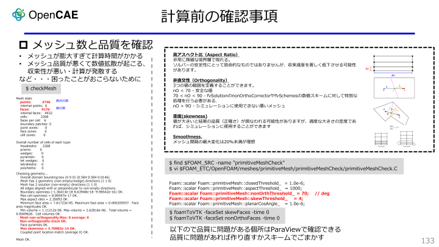

```bash
checkMesh
```

`checkMesh` の結果では、セル数（`points` は節点の数、`faces` は面の数）だけでなく次の品質指標を確認する。

| 指標 | 目安 | 内容 |
|------|------|------|
| `Max aspect ratio`（アスペクト比） | 極端に大きくしない | セルの縦横比。非常に微細な境界層で現れる。ソルバーの安定性にとって致命的ではないが、収束速度を著しく低下させる可能性がある |
| `Mesh non-orthogonality Max`（非直交性） | 70未満が安全 | セル面とセル中心間の非直交性。70〜90は `fvSolution` の `nonOrthoCorrector` や `fvSchemes` の数値スキームで特別な処理を行う必要がある。90を超えるとシミュレーションに使用できない悪いメッシュ |
| `Max skewness`（歪度） | 小さいほどよい | セルの歪み。値が大きいと結果の品質（正確さ）が損なわれる可能性があるが、適度な大きさであればシミュレーションに使用できる |
| Smoothness（隣接セルの変化） | 20%未満が理想 | 隣り合うセルのメッシュ間隔の最大変化 |
| `Mesh OK` | — | OpenFOAMの基本的な品質判定を通過したことを示す。ただし、解析内容に適した品質かどうかは各指標の値とParaView上の位置を併せて判断する |

判定に使われるしきい値は、OpenFOAMのソースに定義されている。

```bash
find $FOAM_SRC -name "primitiveMeshCheck"
vi $FOAM_ETC/OpenFOAM/meshes/primitiveMesh/primitiveMeshCheck/primitiveMeshCheck.C
```

```cpp
Foam::scalar Foam::primitiveMesh::closedThreshold_  = 1.0e-6;
Foam::scalar Foam::primitiveMesh::aspectThreshold_  = 1000;
Foam::scalar Foam::primitiveMesh::nonOrthThreshold_ = 70;    // deg
Foam::scalar Foam::primitiveMesh::skewThreshold_    = 4;
Foam::scalar Foam::primitiveMesh::planarCosAngle_   = 1.0e-6;
```

品質に問題がある面は、`checkMesh` が出力する面セットをVTKに変換してParaViewで確認する。品質に問題があれば、メッシュを作り直すかスキームでごまかす。

```bash
foamToVTK -faceSet skewFaces -time 0
foamToVTK -faceSet nonOrthoFaces -time 0
```

---

## 計算中の確認事項

理論式や実験データとの比較も大事だが、計算が異常を起こしていないか確認するのも大事である。


---

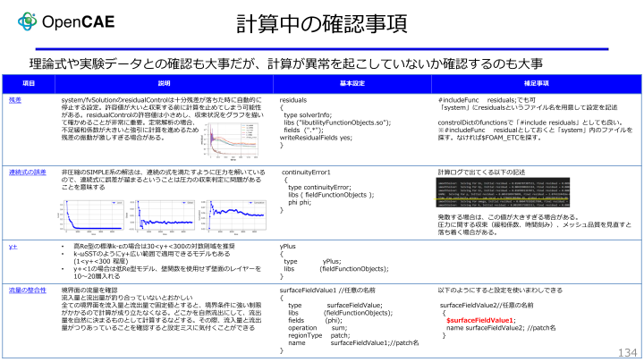

| 項目 | 説明 | 補足 |
|------|------|------|
| 残差 | `system/fvSolution` の `residualControl` は十分残差が落ちた時に自動停止させる設定。許容値が大きいと収束する前に計算を止めてしまう可能性があるため、収束状況をグラフに描いて確かめることが非常に重要 | 定常解析の場合、不足緩和係数が大きいと強引に計算を進めるため、残差の振動が激しすぎる場合がある |
| 連続式の誤差 | 非圧縮のSIMPLE系の解法は、連続の式を満たすように圧力を解いている。連続式に誤差が溜まるということは、圧力の収束判定に問題があることを意味する | 発散する場合は、この値が大きすぎる場合がある。圧力に関する収束（緩和係数、時間刻み）やメッシュ品質を見直すと落ち着く場合がある |
| y+ | 高Re型の標準k-εの場合は `30 < y+ < 300` の対数則領域を推奨。k-ωSSTのようにy+の広い範囲で適用できるモデルもある（`1 < y+ < 300` 程度） | `y+ < 1` の場合は低Re型モデル。壁関数を使用せず壁面のレイヤーを10〜20層入れる |
| 流量の整合性 | 全ての境界面を流入量と流出量で固定値とすると、境界条件に強い制限がかかるので計算が成り立たなくなる。流出量は自然に決まるものとして計算する | 流入量と流出量がつり合っていることを確認すると、設定ミスに気づくことができる |

確認用のfunction objectは `system/controlDict` の `functions` に書く。**OpenFOAM 13（openfoam.org系）とOpenFOAM v2512（ESI系）では、function objectの名前と記法が一部異なる**ので注意する。

| 確認項目 | OpenFOAM 13 | OpenFOAM v2512 |
|----------|-------------|----------------|
| 残差 | `type residuals;` | `type solverInfo;`（v2512には `residuals` という **type** が登録されていないため、`type residuals;` と書くと `Unknown function type` で停止する） |
| 連続式の誤差 | 専用のfunction objectはない。ログに出る `time step continuity errors` を見る | `continuityError` |
| y+ | `yPlus`（同じ） | `yPlus`（同じ） |
| 流量 | `surfaceFieldValue`。パッチは `patch <名前>;` で指定 | `surfaceFieldValue`。パッチは `regionType patch; name <名前>;` で指定 |
| `libs` の書き方 | `("libfieldFunctionObjects.so")` | `(fieldFunctionObjects)` の短縮形が使える |

OpenFOAM 13の場合。

```cpp
functions
{
    residuals
    {
        type            residuals;
        libs            ("libutilityFunctionObjects.so");
        writeControl    timeStep;
        writeInterval   1;
        fields          (p U k epsilon);
    }

    yPlus
    {
        type            yPlus;
        libs            ("libfieldFunctionObjects.so");
        executeControl  writeTime;
        writeControl    writeTime;
    }

    inletFlowRate               // 任意の名前
    {
        type            surfaceFieldValue;
        libs            ("libfieldFunctionObjects.so");
        patch           inlet;  // パッチ名
        fields          (phi);
        operation       sum;
        writeFields     false;
        writeControl    timeStep;
        writeInterval   1;
    }
}
```

OpenFOAM v2512の場合。

```cpp
functions
{
    solverInfo
    {
        type            solverInfo;
        libs            (utilityFunctionObjects);
        fields          (".*");
        writeResidualFields yes;
    }

    continuityError1
    {
        type            continuityError;
        libs            (fieldFunctionObjects);
        phi             phi;
    }

    yPlus
    {
        type            yPlus;
        libs            (fieldFunctionObjects);
    }

    inletFlowRate               // 任意の名前
    {
        type            surfaceFieldValue;
        libs            (fieldFunctionObjects);
        regionType      patch;
        name            inlet;  // パッチ名
        fields          (phi);
        operation       sum;
    }
}
```

- 補足: 違うのは `type` に書く名前だけで、ブロック名は任意に付けてよい。v2512でも `residuals { type solverInfo; ... }` のようにブロック名を `residuals` にするのは問題ない。
- 補足: `#includeFunc` を使うと短く書ける。`#includeFunc` は `system` 内に同名のファイルを探し、なければ `$FOAM_ETC` 内を探す。OpenFOAM 13は `#includeFunc residuals(fields=(p U))`、`#includeFunc yPlus`、v2512は `#includeFunc solverInfo`、`#includeFunc yPlus` となる。
- 補足: `system` 内が先に探索されるため、v2512でも `system/residuals` というファイルに `type solverInfo;` の設定を書いておけば、`#includeFunc residuals` で読み込める。両バージョンで `controlDict` を共通にしたい場合に使える。
- 補足: 一度書いた設定は `$inletFlowRate` のように参照して使いまわせるため、パッチごとに設定を書き直す必要はない。

---

# 002 Stirrer: SALOMEで撹拌機のヘキサメッシュを作る

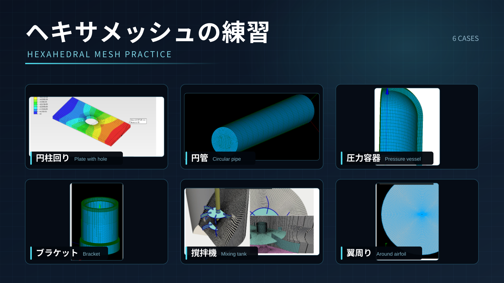

## この演習で目指すこと

撹拌機形状を題材に、Shaperで断面形状を作成し、Geometryで回転・押し出し・分割を行い、Meshでヘキサメッシュを作成する。

ヘキサメッシュを作成するには、形状を六面体として扱えるブロックに分割し、各ブロックで対向する辺同士の分割数を一致させる必要がある。複雑な形状も、回転・押し出し・Partitionを使って適切なブロックへ分けることで、すべての領域をヘキサメッシュで作成できる。この演習では、撹拌槽と羽根まわりの形状をブロックに分け、方向別の分割数を設定する考え方を扱う。

- Shaperでスケッチを作成する
- 寸法拘束と幾何拘束で形状を確定する
- ShellをGeometryへエクスポートする
- 回転、押し出し、Partitionでヘキサメッシュ用のブロックに分割する
- 対向する辺同士の分割数を一致させる
- グループを整理してOpenFOAMへ渡す境界名を作る
- ヘキサメッシュとサブメッシュを作成する


---

### 2020年サマースクール Track3

この撹拌槽モデルは、オープンCAEサマースクール2020 Track3で扱った題材でもある。2020年の演習では、`blockMesh` で扇形の6ブロックを作成し、`stitchMesh` で貼り合わせ、`mergeMesh` で組み合わせることで、羽根付きの撹拌槽形状をヘキサメッシュとして作り上げていた。


---

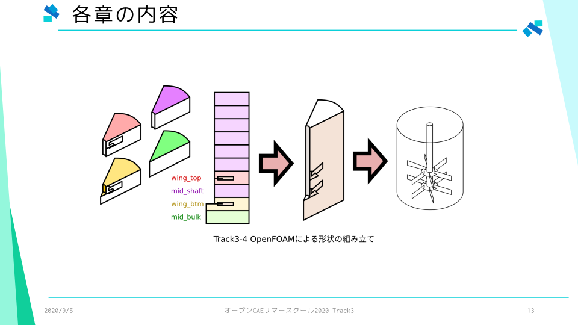

この2020年の手法（blockMesh・stitchMesh・mergeMesh）は、技術書典で販売されている技術書「OpenFOAMでメッシュ作成」にも解説されている。


---

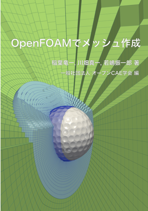

- 技術書典: <https://techbookfest.org/product/5752199185432576>

今回の演習では、同じ撹拌槽形状を題材にしつつ、`blockMesh` 手組みではなく **SALOME** でジオメトリとメッシュを作成する方法を扱う。


---

### この演習のゴール

今回の演習のゴールは、下図のように、羽根形状を含む1/6セクター（60°）分の撹拌槽形状に対して、SALOMEでヘキサメッシュを作成することである。


---

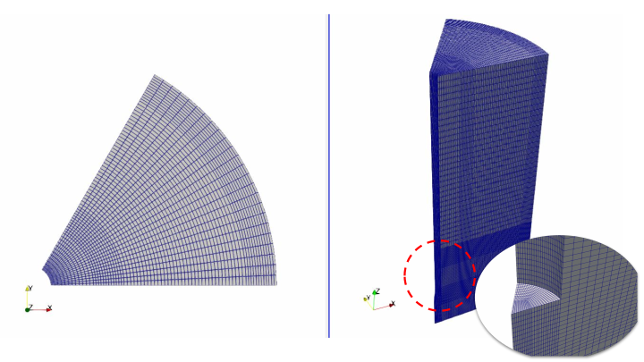

さらに余裕がある人向けに、作成したメッシュをOpenFOAMに渡して、羽根を曲げる変形テストと、セクターメッシュを回転コピー・結合した全周（360°）フルモデルの組み立てまで行う（章の後半で解説）。


---

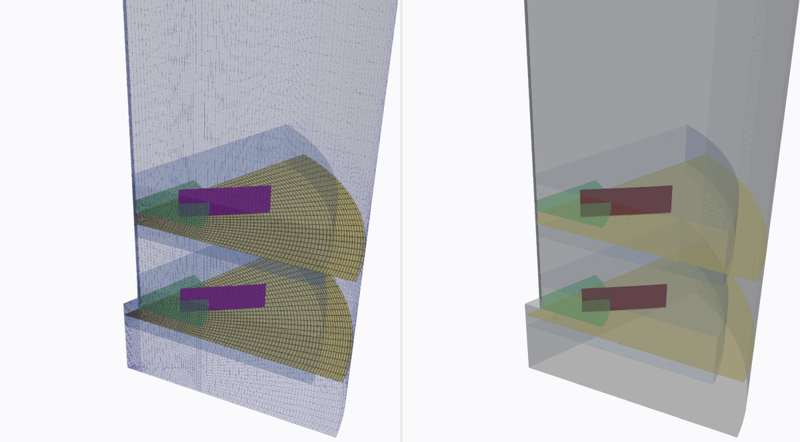

---

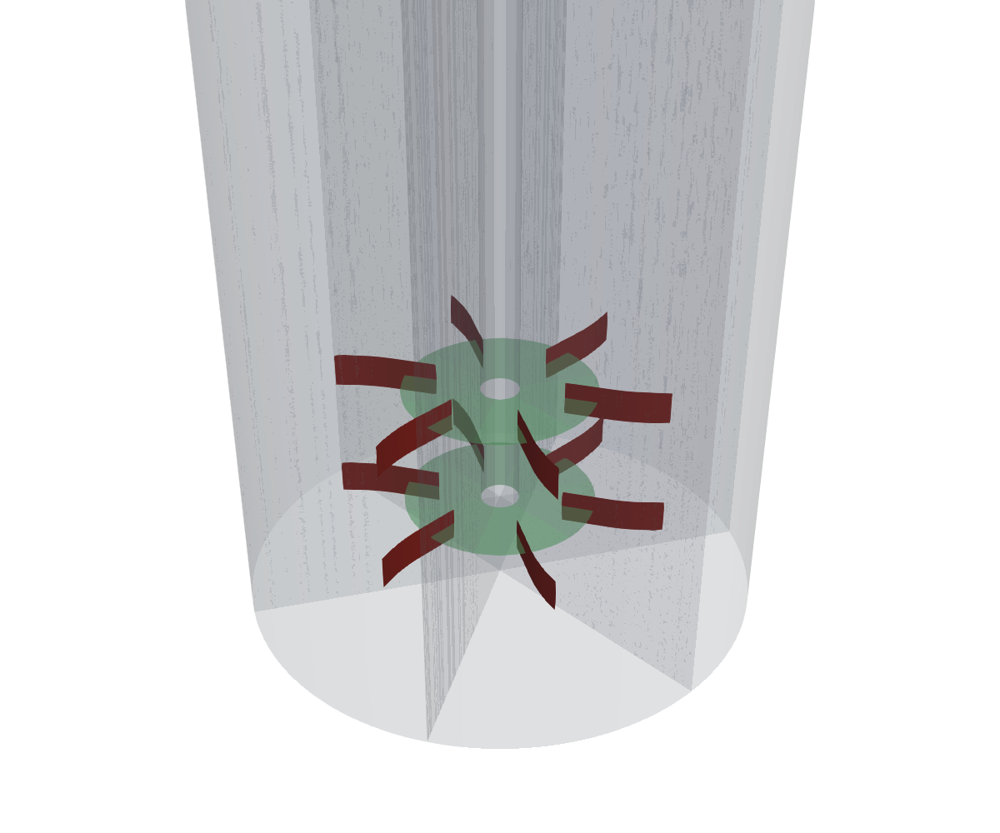

このモデルには、羽根まわりを囲む円柱状のセルゾーン `rotor1`・`rotor2` が定義してある。下図でピンクに薄く示した部分がそれで、MRFやスライディングメッシュで**回転させる領域**にあたる。


---


ここが、この演習でスケッチを細かく分割していく理由である。仕切り板（緑）・羽根（赤）・回転領域（ピンク）は、いずれもその境界にメッシュの面がぴったり合っていなければならない。すべてをヘキサメッシュで作るには、これらの境界を先に形状の分割線として引いておき、できあがるブロックがすべて四角形（押し出して六面体）になるようにスケッチを作る必要がある。断面スケッチで半径 `1.5` / `3` / `10` / `15` / `25` / `35` / `40` mm と細かく円弧を入れていくのは、この分割線を用意するためである。

完成した撹拌機のメッシュの内部を確認すると、仕切り板や羽根のまわりも含めて、すべてヘキサメッシュ（六面体）になっている。


---

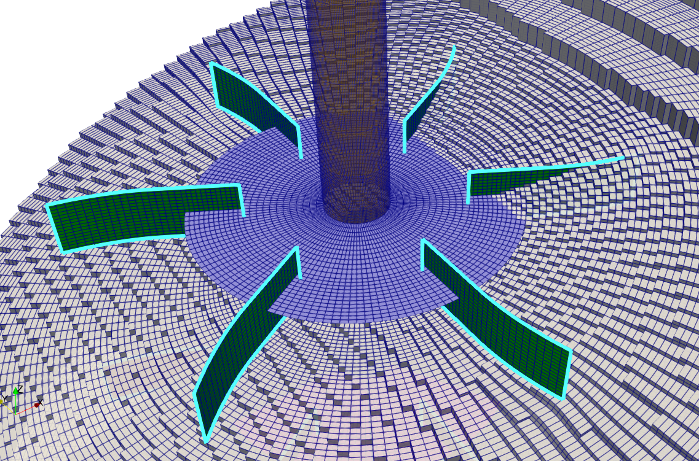


---

### 使用データの場所

この演習で使うファイル・計算結果は、リポジトリの以下のフォルダにある。

| フォルダ | 内容 |
|----------|------|
| `data/002_Stirrer/sample/mesh/mesh_of13` | SALOMEから出力した `Mesh_1.unv` と、UNV変換・topoSet・createBaffles を行うOpenFOAMケース（OpenFOAM 13） |
| `data/002_Stirrer/sample/mesh/mesh_of2512` | 同上のESI版OpenFOAM（v2512）ケース |
| `data/002_Stirrer/sample/mesh/master_curve_of13` | 羽根の可動化テスト（moveDynamicMesh）用のOpenFOAMケース（OpenFOAM 13） |
| `data/002_Stirrer/sample/mesh/master_curve_of2512` | 同上のESI版OpenFOAM（v2512）ケース |
| `data/002_Stirrer/sample/mesh/fullmodel_of13` | 変形済みセクターを回転コピー・結合して全周（360°）フルモデルを組み立てるOpenFOAMケース（OpenFOAM 13） |
| `data/002_Stirrer/sample/mesh/fullmodel_of2512` | 同上のESI版OpenFOAM（v2512）ケース |

---

## モデルの作り方

この撹拌槽の形状は、**向きの違う2つの平面にスケッチを描き、それぞれ別の方法で立体化する**ことで作る。下図がその全体像である。


---

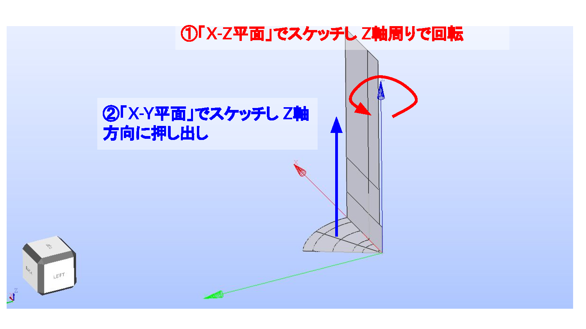

- ① **X-Z平面**にスケッチした断面を、**Z軸まわりに回転**させて、撹拌槽の壁（円筒状の外周）を作る。
- ② **X-Y平面**にスケッチした断面を、**Z軸方向に押し出し**て、槽の底や羽根まわりのブロックを作る。

<div style="display:flex; flex-wrap:wrap; gap:1.5em; align-items:flex-end; justify-content:center; margin:1.2em 0;">
  <figure style="flex:1 1 240px; max-width:340px; margin:0; text-align:center;">
    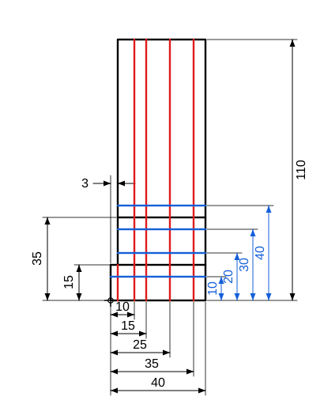
    <figcaption>① X-Z平面のスケッチ（回転で壁を作る）</figcaption>
  </figure>
  <figure style="flex:1 1 300px; max-width:440px; margin:0; text-align:center;">
    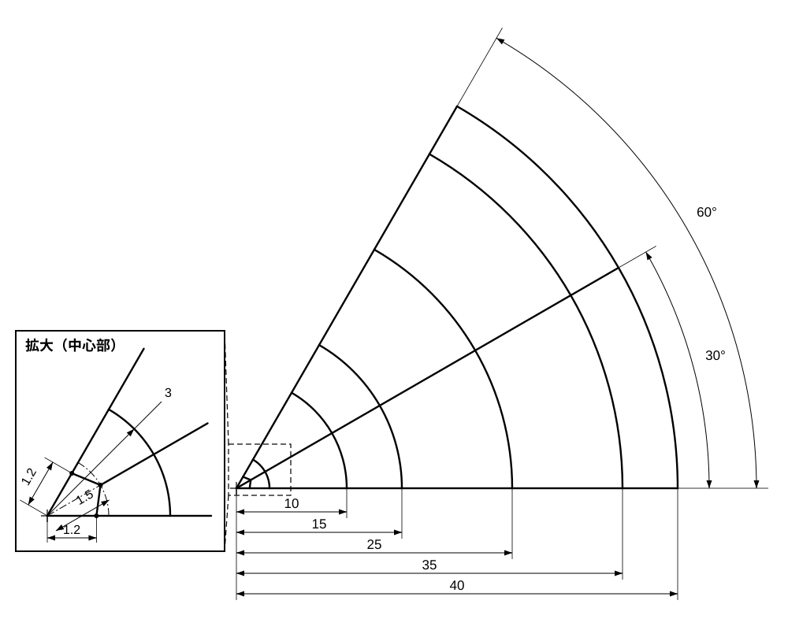
    <figcaption>② X-Y平面のスケッチ（押し出しで底・羽根まわりを作る）</figcaption>
  </figure>
</div>

このように「回転で作る部分」と「押し出しで作る部分」を組み合わせ、最後にPartitionで分割してヘキサメッシュ用のブロック形状に仕上げていく。以降の手順では、この2つのスケッチを順に作成していく。

線の色は、どこで作図するかを表している。

- **黒線**: Shaperのスケッチで作成する線。
- **赤線**: ①と②のどちらか一方で描いていればよい線。①を押し出したときに②の線と一致するため、両方で描く必要はない。
- **青線**: Geometryモジュールで後から追加する分割線。Shaperで描いてもよいが、今回は練習も兼ねてGeometryでも分割線を入れられることを示すため、あえてGeometry側で追加する。

---

## モデル作成


---

### 1. Shaperで断面スケッチを開始する

まず1つ目のスケッチとして、下図のような撹拌槽の壁の断面（X-Z平面）を描く。高さ110mm・幅40mmを基準に、内側の仕切り（幅3mm）や段（高さ15mm・35mm）を寸法拘束で決めていく。これをZ軸まわりに回転させると、槽の外周壁になる。


---

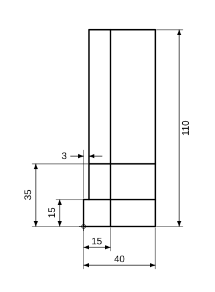


---

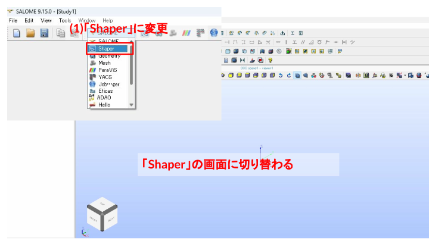

- (1) モジュールを `Shaper` に変更し、`Shaper` の画面へ切り替える。


---

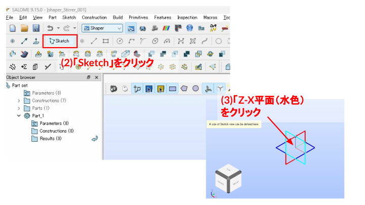

- (2) `Sketch` をクリックする。
- (3) `Z-X` 平面を選択する。


---

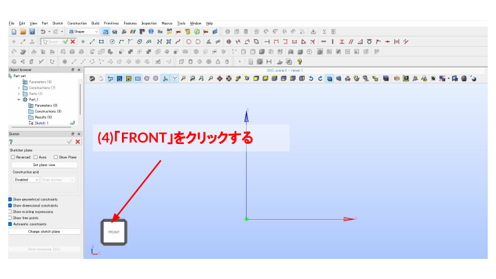

- (4) `FRONT` をクリックし、スケッチしやすい向きにする。


---

### 2. 最初のスケッチを描く

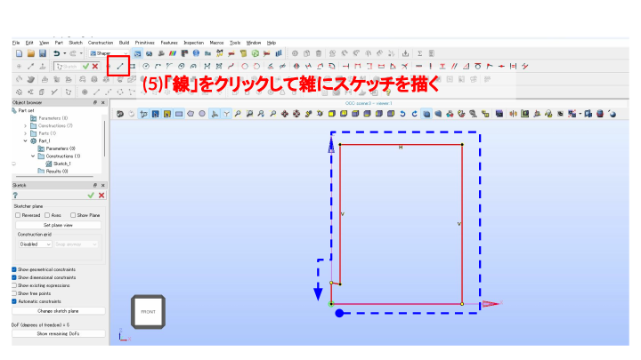

- (5) `線` を使い、まずは大まかな形状を描く。
- 最初は正確な寸法よりも、必要な線分を作ることを優先する。


---

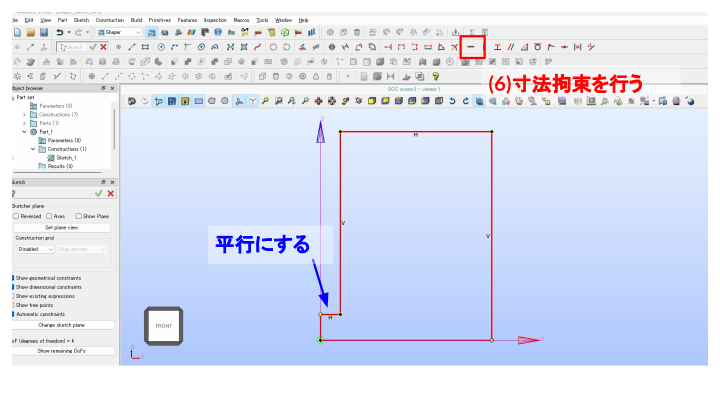

- (6) 寸法拘束を行う。
- 必要な線は平行拘束で向きをそろえる。


---

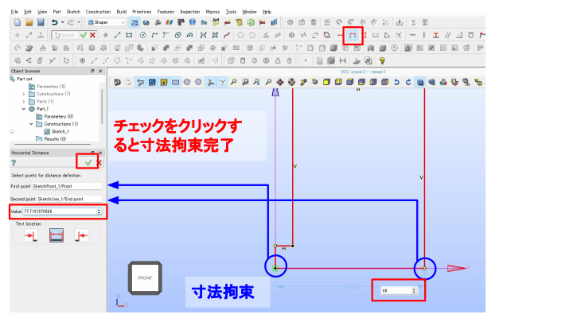

- 寸法拘束を入力し、チェックをクリックして確定する。


---

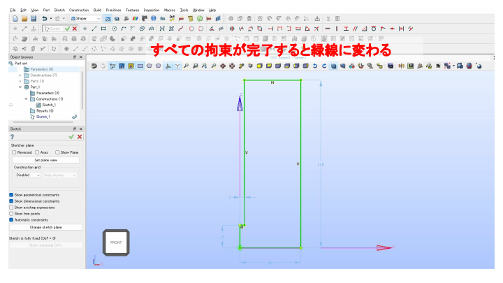

- すべての拘束が完了すると、スケッチ線が緑色になる。
- 緑色になっていない場合は、寸法拘束または幾何拘束が不足している。


---

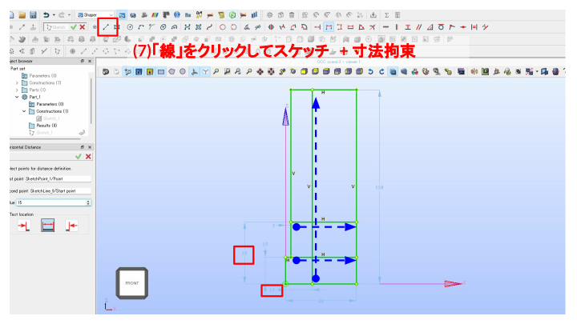

- (7) `線` をクリックして、追加のスケッチと寸法拘束を行う。


---

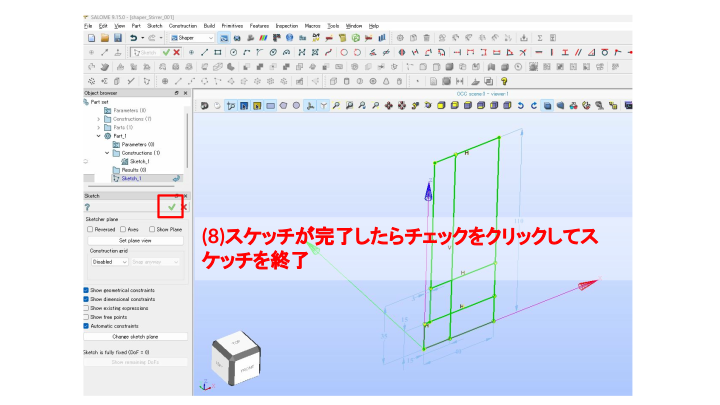

- (8) スケッチが完了したら、チェックをクリックしてスケッチを終了する。

---

## 追加断面のスケッチ

2つ目のスケッチは、上から見た（X-Y平面）扇形の断面である。下図のように、中心から半径 `10 / 15 / 25 / 35 / 40` mm の円弧で領域を分け、全体を `60°` の扇形とする。`30°` の二等分線が羽根の位置になる。中心付近は羽根の根本にあたるため、拡大図のように `1.2` / `1.5` / `3` mm の細かい寸法で形を整える。


---


この扇形をZ軸方向に押し出すことで、槽の底や羽根まわりのブロックを作る。円弧で分けた半径方向の区切りは、後でヘキサメッシュのブロック境界（サブメッシュの `r1`〜`r6` など）として使う。


---

### 1. 2つ目のスケッチを開始する

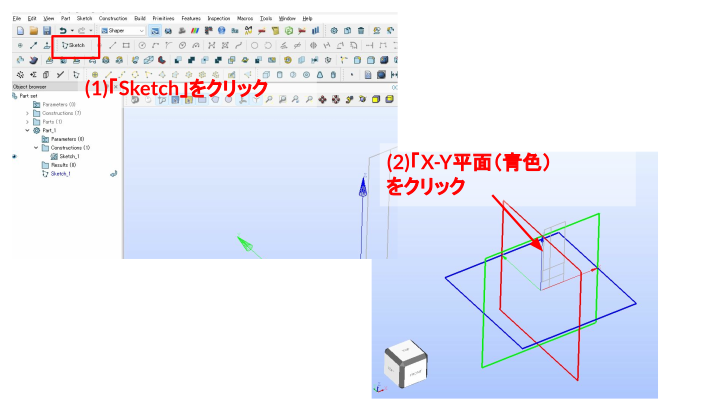

- (1) `Sketch` をクリックする。
- (2) `X-Y` 平面を選択する。


---

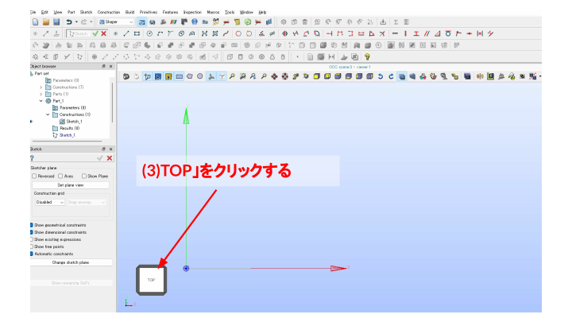

- (3) `TOP` をクリックして、上面からスケッチする。


---

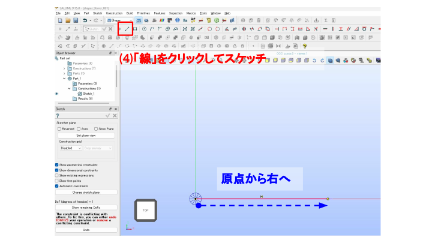

- (4) `線` をクリックし、原点から右方向へ線を描く。


---

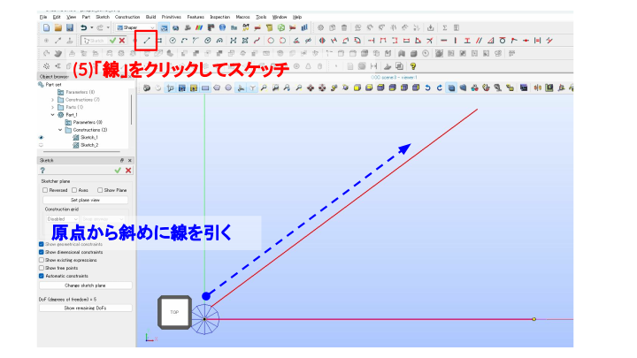

- (5) 原点から斜め方向へ線を描く。


---

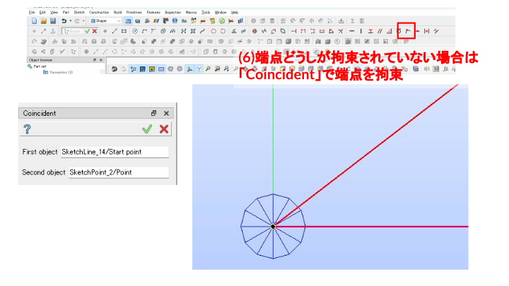

- (6) 端点どうしが拘束されていない場合は、`Coincident` で端点を一致拘束する。


---

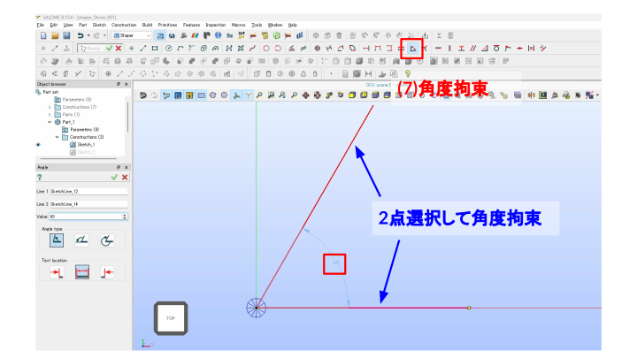

- (7) 2点を選択し、角度拘束を入れる。


---

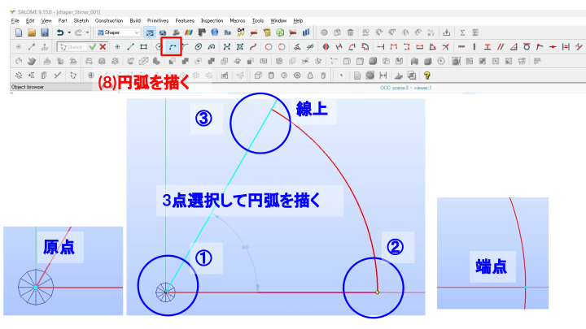

- (8) 3点を選択して円弧を描く。
- 原点、端点、線上の点を使い、円弧の位置を決める。


---

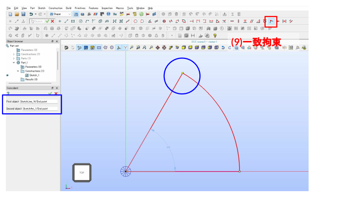

- (9) 必要な点に一致拘束を入れ、線と円弧を接続する。


---

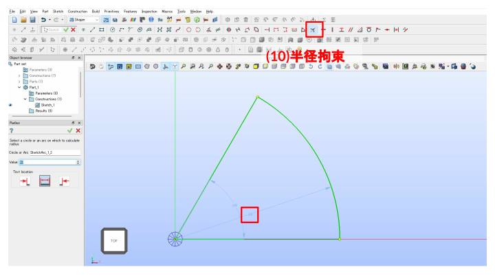

- (10) 円弧に半径拘束を入れる。


---

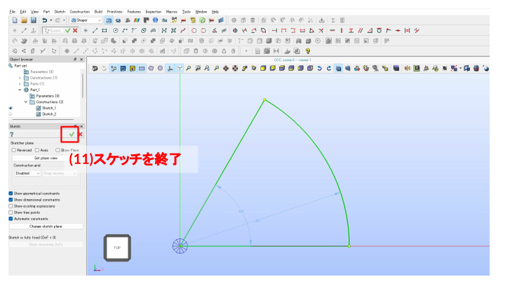

- (11) スケッチを終了する。


---

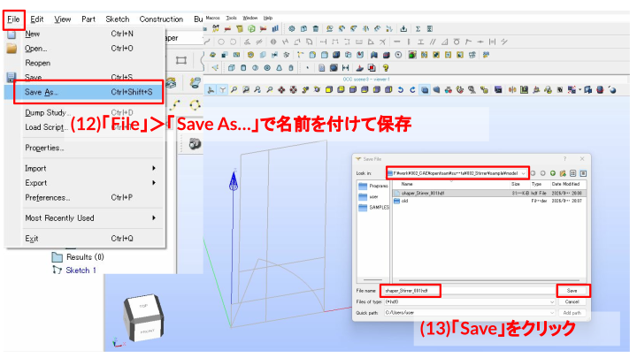

- (12) `File > Save As...` で名前を付けて保存する。
- (13) `Save` をクリックする。

---

## 羽根形状のスケッチ

ここで描いているのは、先ほどのX-Y平面スケッチ（[追加断面のスケッチ](#追加断面のスケッチ) の図）の**中心付近の拡大部分**にあたる。拡大図の `1.2` / `1.5` / `3` mm の寸法で示された、羽根の根本まわりの細かい円弧と補助線を作り込んでいく作業である。

作業は一度で終わらせなくてよい。スケッチを閉じたあとで描き足したり直したりする場合は、Object browserのスケッチ（`Sketch_1`、`Sketch_2` など）を右クリックし、`Edit` を選ぶと続きから編集できる。


---

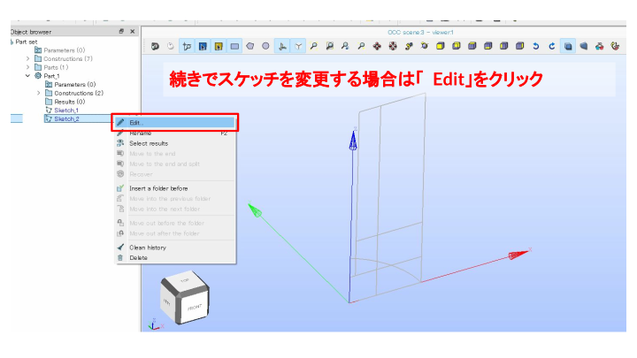


---

### 1. 円弧と補助線を作成する

以降の作業は、X-Y平面に描いた `Sketch_2` の続きである。`Sketch_2` を `Edit` で開き、中心付近を拡大した状態から描き込んでいく。


---

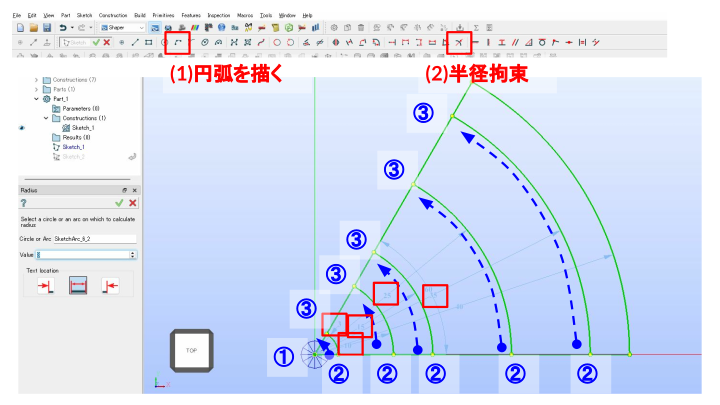

- (1) 中心付近に円弧を描く。
- (2) 半径拘束 `3` mm を入れる。外側の `10` / `15` / `25` / `35` / `40` mm の円弧は前の節で作成済みなので、内側から数えて `3` mm が6本目の円弧になる。

このままだと一番内側の領域が三角形になっていて、四角形になっていない。三角形のまま押し出しても六面体にはならないため、さらに内側に円弧を1本足して四角形に分割する。


---

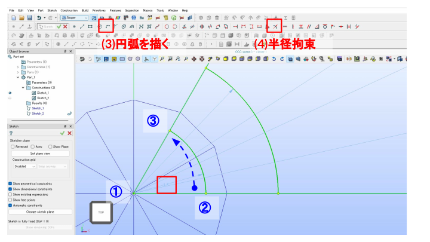

- (3) さらに内側に円弧を描く。
- (4) 半径拘束 `1.5` mm を入れる。これで円弧は内側から `1.5` / `3` / `10` / `15` / `25` / `35` / `40` mm の7本になる。


---

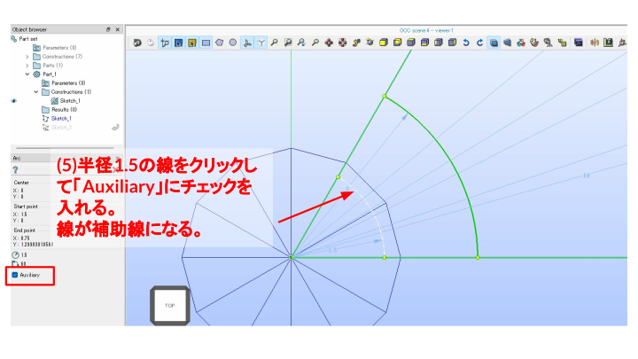

- (5) 半径 `1.5` の線をクリックし、`Auxiliary` にチェックを入れる。
- 線が補助線になる。


---

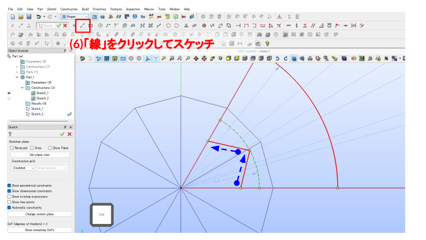

- (6) `線` をクリックして追加スケッチを描く。


---

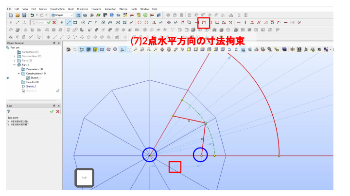

- (7) 2点の水平方向寸法拘束を入れる。


---

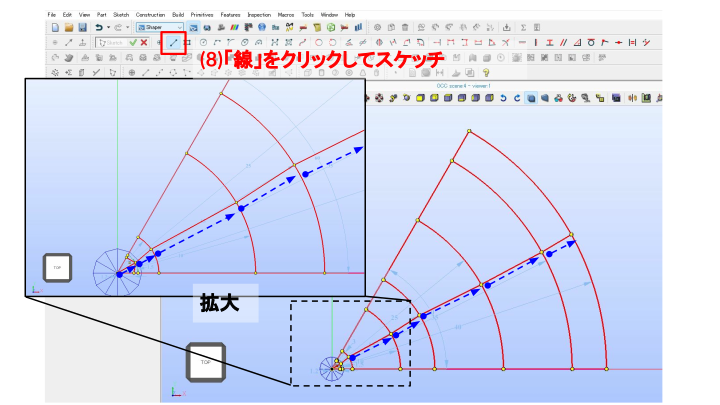

- (8) 拡大し、`線` で細部をスケッチする。


---

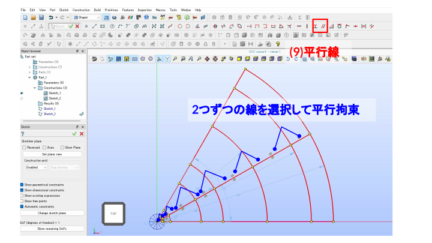

- (9) 2本ずつ線を選択し、平行拘束を入れる。


---

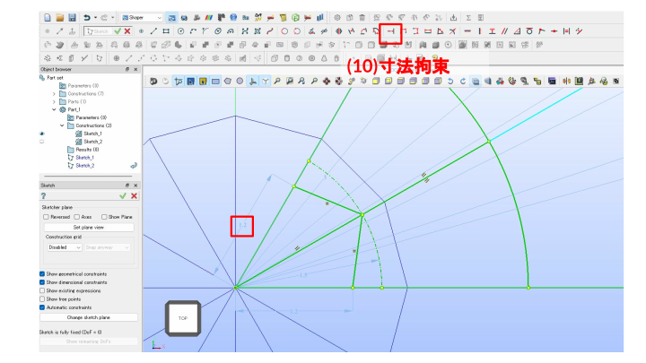

- (10) 寸法拘束を入れ、形状を確定する。


---

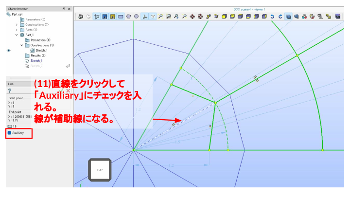

- (11) 直線をクリックし、`Auxiliary` にチェックを入れる。
- 線が補助線になる。


---

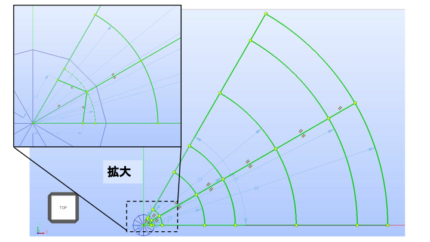

- 拡大表示で、拘束と接続が意図通りになっていることを確認する。


---

### 2. Shellを作成する

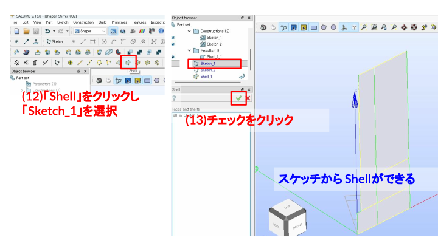

- (12) `Shell` をクリックし、`Sketch_1` を選択する。
- (13) チェックをクリックし、スケッチからShellを作成する。


---

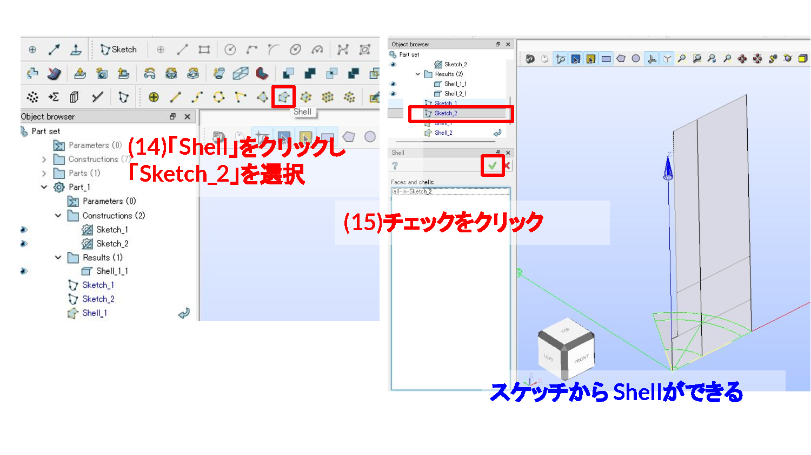

- (14) `Shell` をクリックし、`Sketch_2` を選択する。
- (15) チェックをクリックし、スケッチから `Shell_2` を作成する。


---

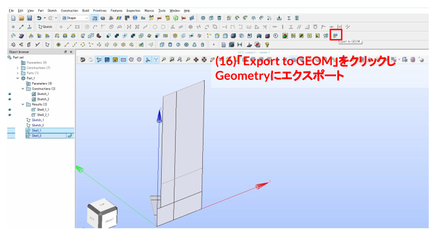

- (16) `Export to GEOM` をクリックし、Geometryへエクスポートする。


---

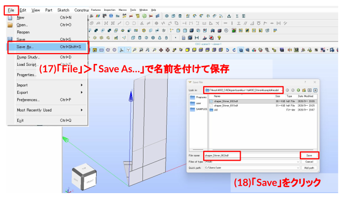

- (17) `File > Save As...` で名前を付けて保存する。
- (18) `Save` をクリックする。

---

## Geometryで形状を作る


---

### 1. Geometryへ切り替える

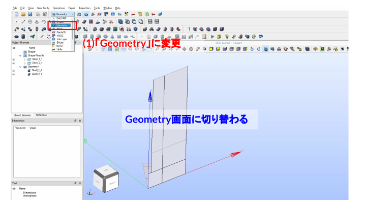

- (1) `Geometry` に変更し、Geometry画面へ切り替える。


---

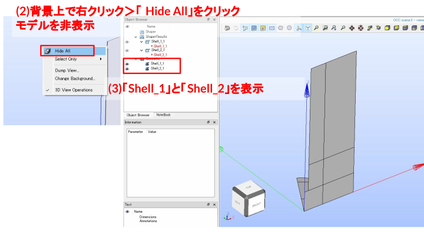

- (2) 背景上で右クリックし、`Hide All` をクリックする。
- (3) `Shell_1` と `Shell_2` を表示する。


---

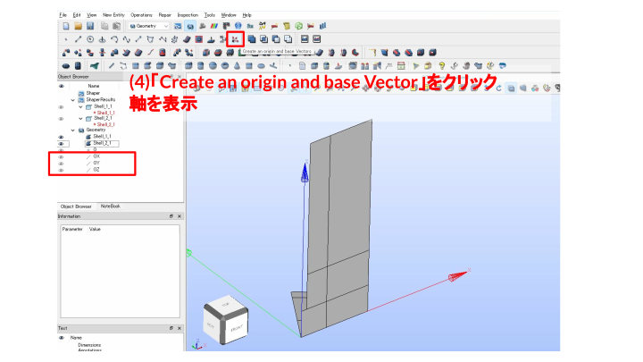

- (4) `Create an origin and base Vector` をクリックし、軸を表示する。


---

### 2. 回転と押し出しを行う

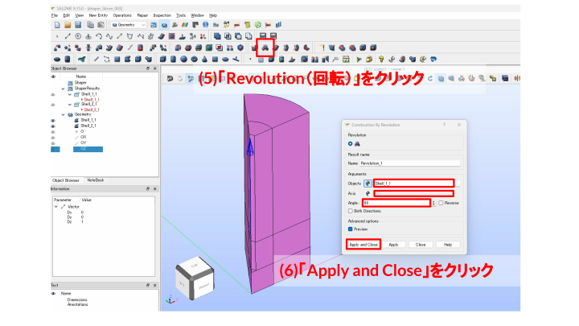

- (5) `Revolution` をクリックする。
- (6) `Apply and Close` をクリックする。


---

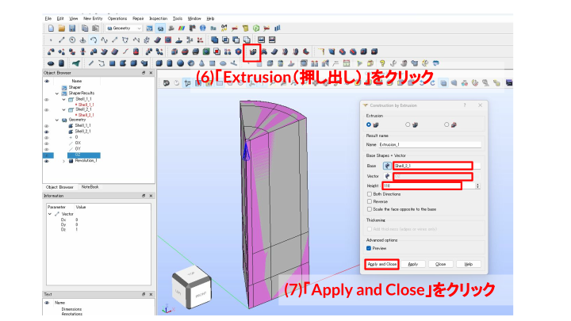

- (6) `Extrusion` をクリックする。
- (7) `Apply and Close` をクリックする。


---

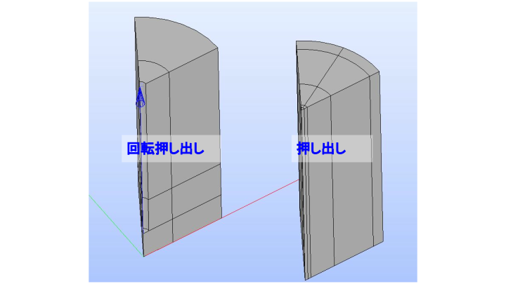

- 回転押し出しと押し出しで、撹拌機の基本形状を作る。


---

### 3. Partitionで分割する

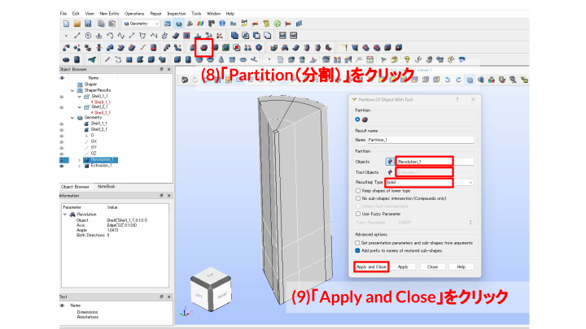

- (8) `Partition` をクリックする。
- (9) `Apply and Close` をクリックする。


---

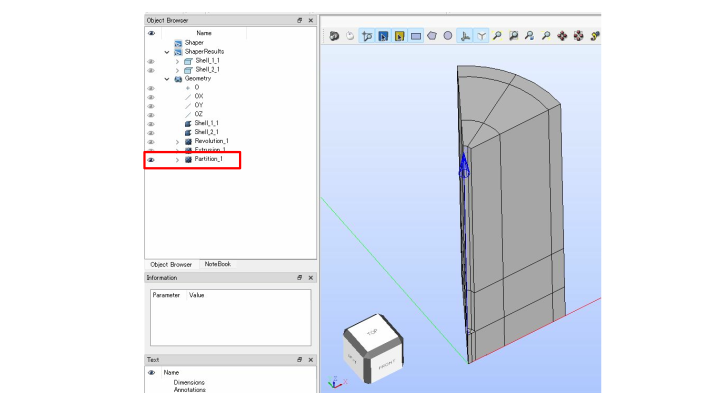

- Partition後の形状を確認する。

ここで、Shaperのスケッチに入れ忘れていた分割線を追加する。

本来は **Shaper側でスケッチを修正する方が、パラメトリックに（寸法や履歴をたどって）変更でき便利**である。ただしここでは、**Geometry側で直接修正することもできる**ということを体験するために、あえてGeometry上で分割線（分割面）を入れてみる。以下の手順で、後からブロック分割を足していく。


---

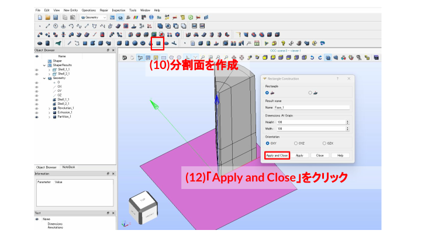

- (10) 分割面を作成する。
- (12) `Apply and Close` をクリックする。


---

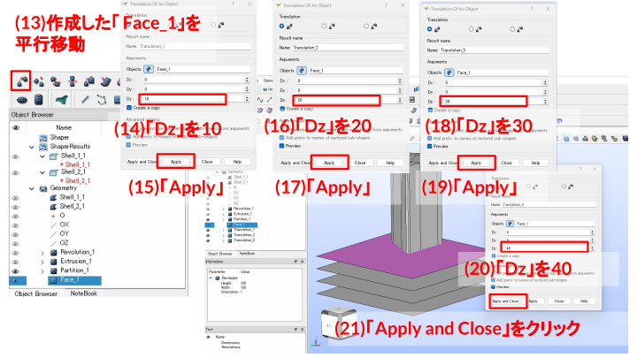

- (13) 作成した `Face_1` を平行移動する。
- (14) `Dz = 10` として `Apply` をクリックする。
- (16) `Dz = 20`、(18) `Dz = 30`、(20) `Dz = 40` として分割面を複製する。
- (21) `Apply and Close` をクリックする。


---

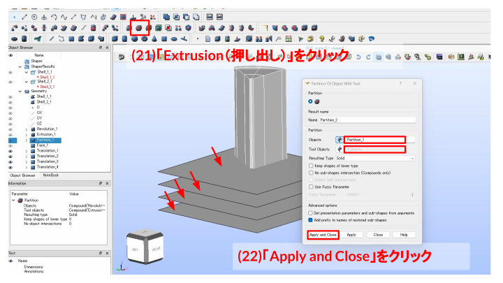

- (21) `Partition` をクリックし、Objectsに `Partition_1`、Tool Objectsに平行移動で作った4枚の分割面（`Translation_1`〜`Translation_4`）を指定する（画像内の説明文は `Extrusion` になっているが、実際に開いているのはPartitionのダイアログ）。
- (22) `Apply and Close` をクリックする。`Partition_2` が作成される。


---

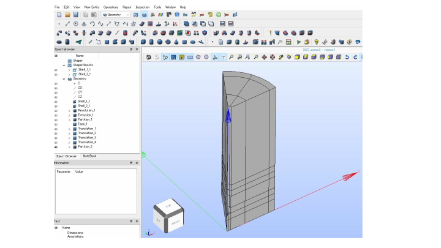

- `Partition_2` により、z=10〜40mmの4枚の面の位置で形状が水平方向に分割されたことを確認する。


---

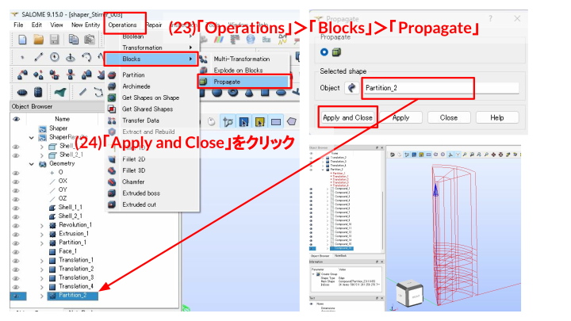

- (23) `Operations > Blocks > Propagate` をクリックする。
- (24) `Apply and Close` をクリックする。


---

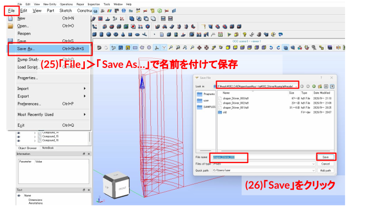

- (25) `File > Save As...` で名前を付けて保存する。
- (26) `Save` をクリックする。

---

## グループを整理する

OpenFOAMへ渡す面や線を整理するため、Geometry側でグループを作成する。境界条件に使う面、メッシュ分割に使う線を分かりやすい名前にしておく。

ここでは、Propagateで作られた `Compound_1`〜`Compound_15`（方向ごとの辺の集まり）を `Union Groups` でまとめ、後のサブメッシュ設定で使う線グループを作成する。作成する線グループは以下の11個。

| 線グループ | 方向 |
|-----------|------|
| `z1` / `z2` / `z3` | 軸（z）方向。高さ位置ごとの辺 |
| `z_rotor` | 軸（z）方向のうち回転領域まわりの辺 |
| `theta1` | 周方向の辺 |
| `r1`〜`r6` | 半径方向の辺 |


---

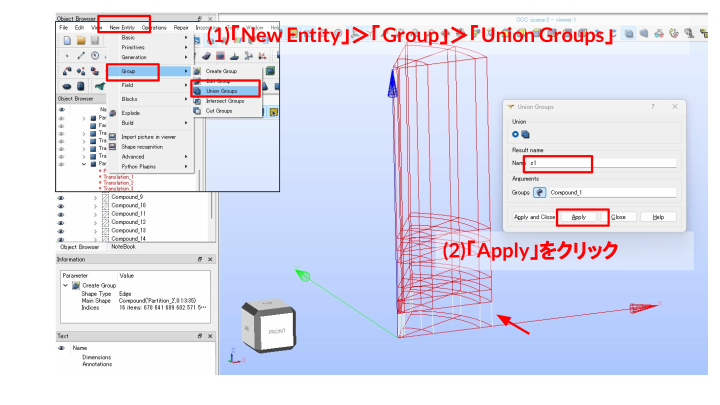

- (1) `New Entity > Group > Union Groups` をクリックする。
- (2) Nameを `z1` とし、対象のCompoundを選んで `Apply` をクリックする。


---

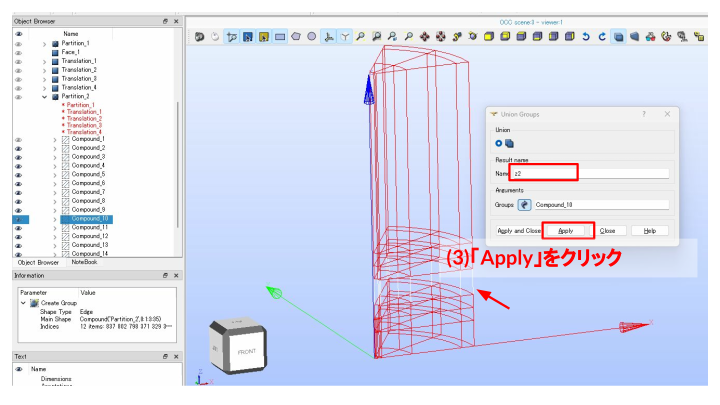

- (3) 同様にNameを `z2` として `Apply` をクリックする。


---

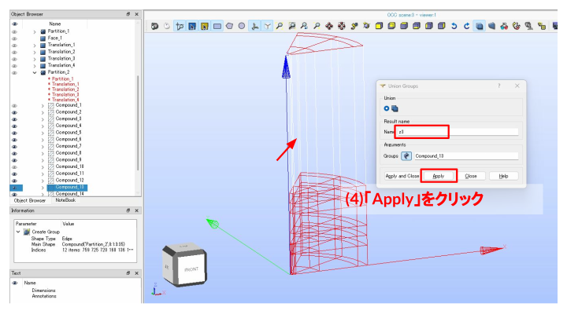

- (4) Nameを `z3` として `Apply` をクリックする。


---

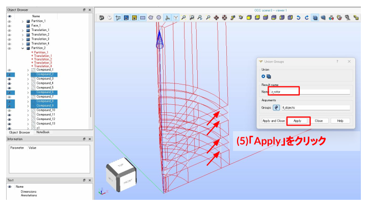

- (5) Nameを `z_rotor` とし、回転領域まわりの4つのCompoundを選んで `Apply` をクリックする。


---

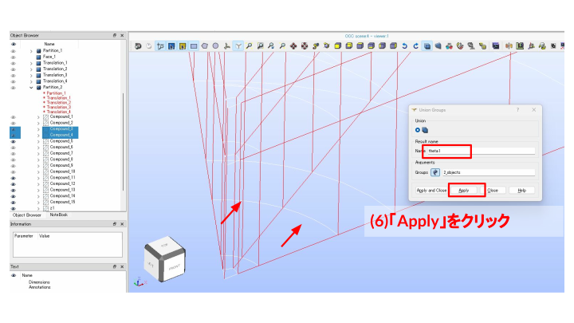

- (6) Nameを `theta1` とし、周方向の2つのCompoundを選んで `Apply` をクリックする。


---

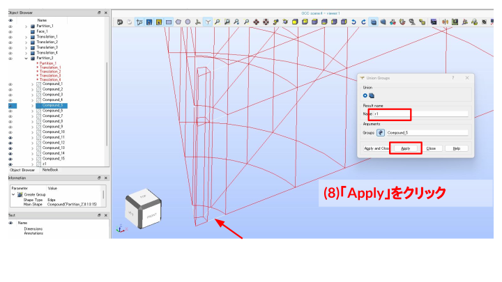

- (8) Nameを `r1` として `Apply` をクリックする。


---

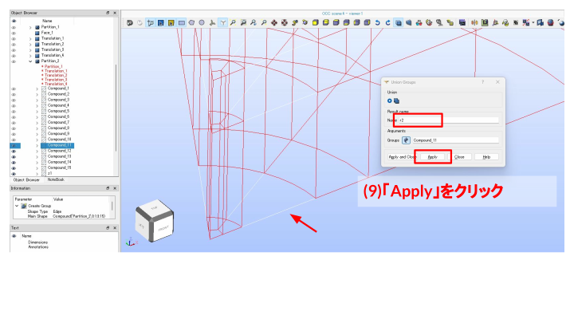

- (9) Nameを `r2` として `Apply` をクリックする。


---

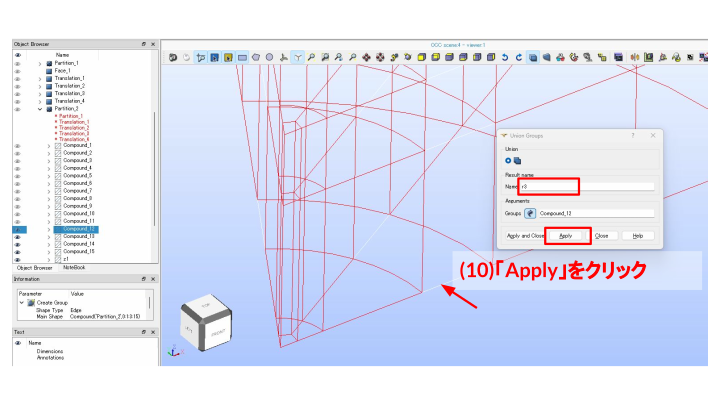

- (10) Nameを `r3` として `Apply` をクリックする。


---

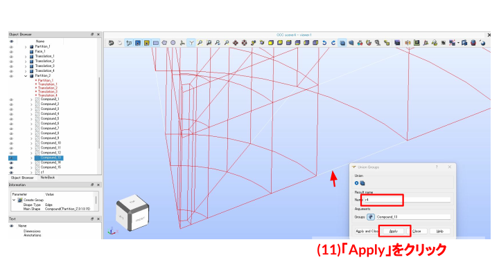

- (11) Nameを `r4` として `Apply` をクリックする。


---

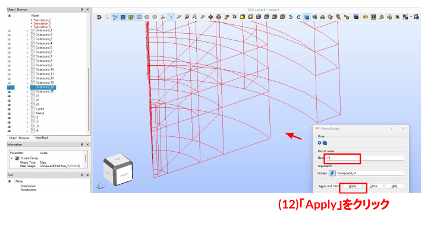

- (12) Nameを `r5` として `Apply` をクリックする。


---

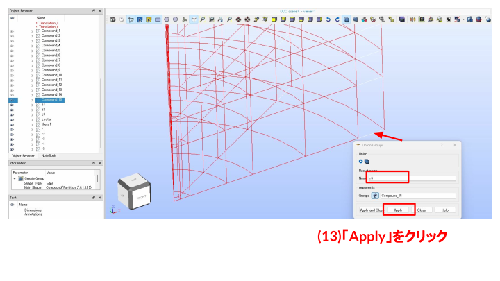

- (13) Nameを `r6` として `Apply` をクリックする。


---

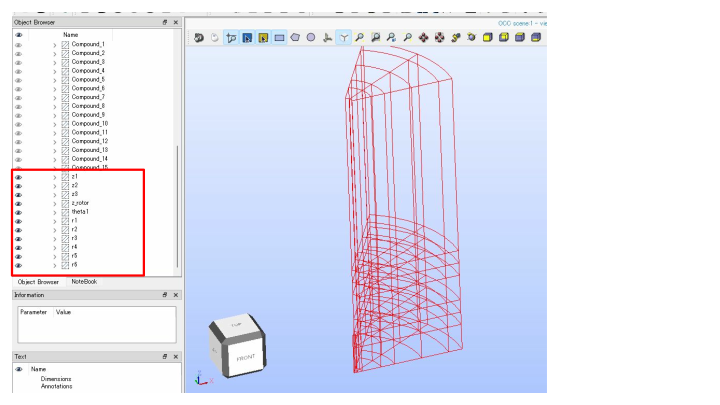

- ツリーに `z1` / `z2` / `z3` / `z_rotor` / `theta1` / `r1`〜`r6` の11個の線グループが並んでいることを確認する。


---

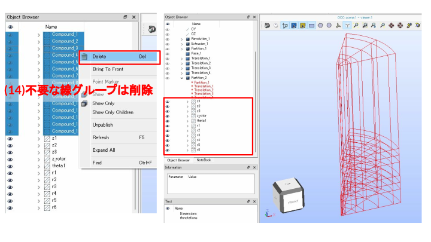

- (14) 不要な線グループは削除する。
- OpenFOAM変換に不要なグループを減らし、境界名の混乱を避ける。


---

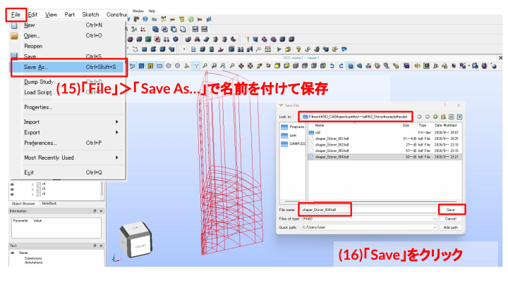

- (15) `File > Save As...` で名前を付けて保存する。
- (16) `Save` をクリックする。

---

## ヘキサメッシュ作成


---

### ヘキサメッシュの考え方

ヘキサメッシュはテトラメッシュのように「どんな形状にも自動で貼れる」ものではない。`Hexahedron (i,j,k)` アルゴリズムでヘキサメッシュを貼るには、**形状があらかじめ「6面体ブロックの集まり」に分割されている**必要がある。ここまでの手順で、回転・押し出しで作った形状を Partition で細かく分割してきたのは、まさにこの「ブロックの集まり」を作るためである。

ブロック分割のポイントは次の2つ。

- **すべての領域を、面が6つの「ゆがんだ直方体」（ブロック）にしておく**。円筒のような丸い形状も、断面を扇形のブロックに切り分ければ、各ブロックは6面体として扱える。
- **向かい合う辺の分割数をそろえる**。ヘキサメッシュはブロックの中に格子を規則正しく詰めるので、隣り合うブロックどうしで接する辺の分割数が一致していないとメッシュがつながらない。このため、同じ方向の辺（半径方向 `r`・周方向 `theta`・軸方向 `z`）をそれぞれ線グループにまとめ、グループ単位で分割数を指定する（次節のサブメッシュ）。

この「ブロックに分ける → 方向ごとに辺をグループ化する → グループごとに分割数を決める」という流れが、ヘキサメッシュ作成の基本の考え方である。


---

### 1. Meshモジュールへ切り替える

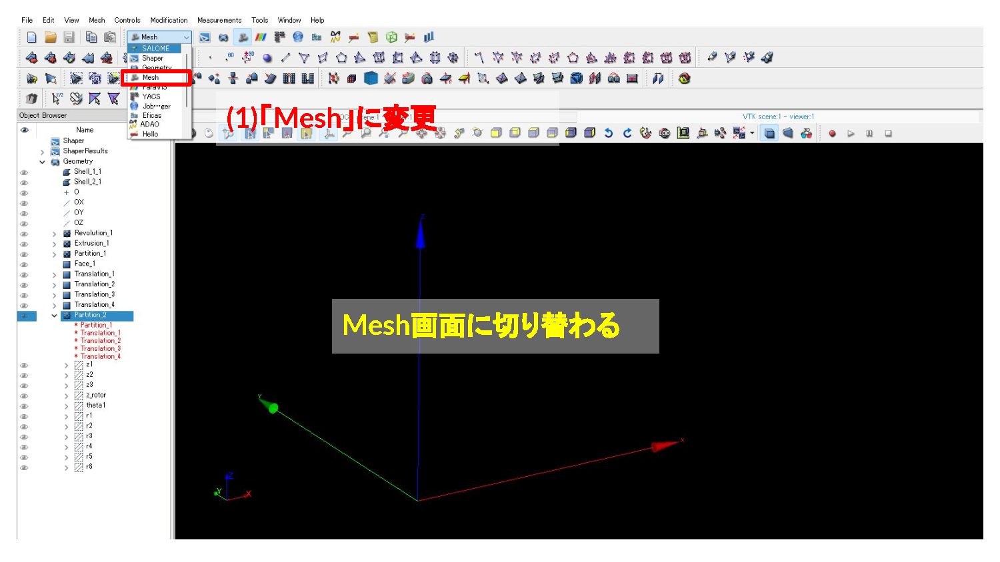

- (1) `Mesh` に変更し、Mesh画面へ切り替える。


---

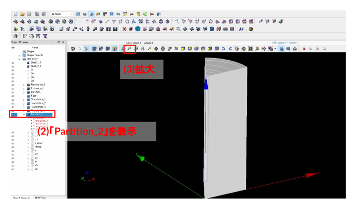

- (2) `Partition_2` を表示する。
- (3) 拡大し、メッシュ対象の形状を確認する。


---

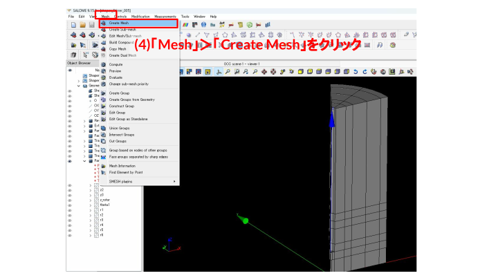

- (4) `Mesh > Create Mesh` をクリックする。


---

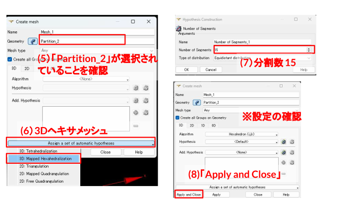

- (5) `Partition_2` が選択されていることを確認する。
- (6) 3Dヘキサメッシュを設定する。
- (7) 分割数を `15` とする。
- (8) `Apply and Close` をクリックする。


---

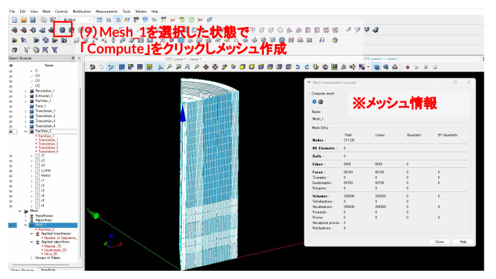

- (9) `Mesh_1` を選択した状態で `Compute` をクリックし、メッシュを作成する。
- メッシュ情報を確認する。


---

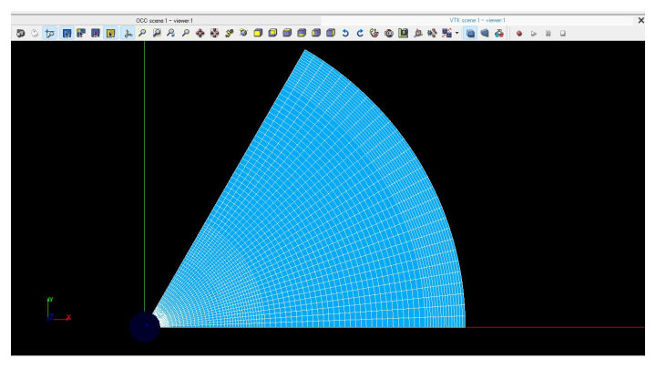

- 作成されたヘキサメッシュを確認する。


---

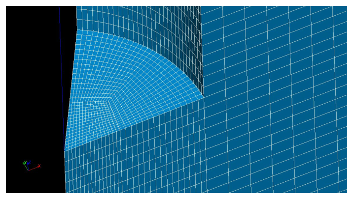

- 細部のメッシュ品質を確認する。


---

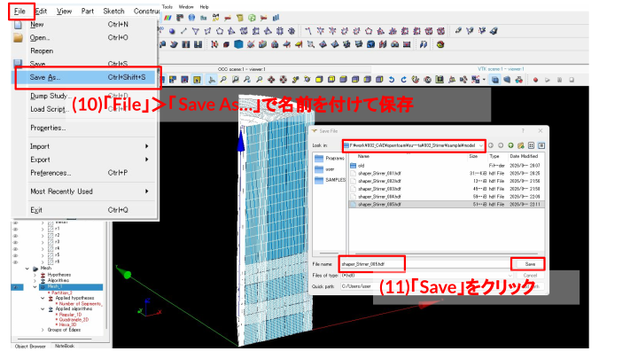

- (10) `File > Save As...` で名前を付けて保存する。
- (11) `Save` をクリックする。


---

### 2. サブメッシュで部分的に分割数を変える

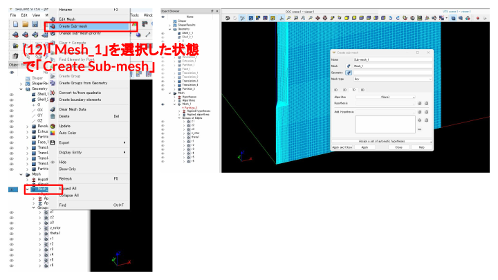

- (12) `Mesh_1` を選択した状態で `Create Sub-mesh` をクリックする。


---

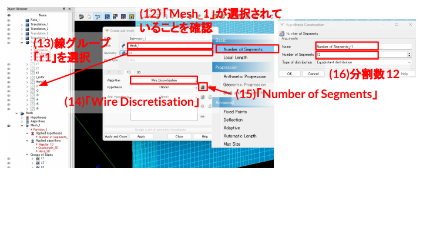

- (12) `Mesh_1` が選択されていることを確認する。
- (13) 線グループ `r1` を選択する。
- (14) `Wire Discretisation` を選択する。
- (15) `Number of Segments` を選択する。
- (16) 分割数を `12` とする。


---

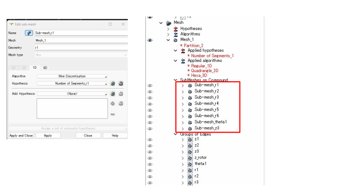

- サブメッシュ条件が対象線グループに設定されていることを確認する。


---

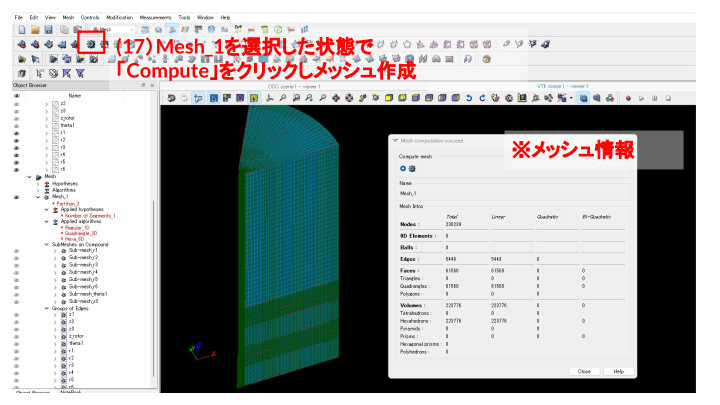

- (17) `Mesh_1` を選択した状態で `Compute` をクリックし、メッシュを再計算する。
- メッシュ情報を確認する。


---

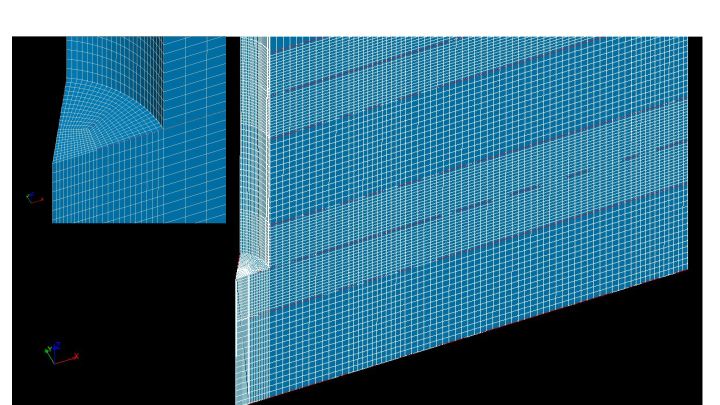

- サブメッシュ指定により、対象部分の分割数が変わったことを確認する。


---

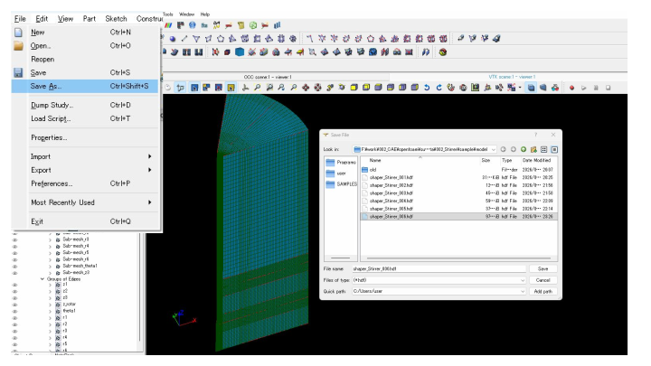

- ここでは `r1` 方向の分割数変更のみ確認したが、実際には他の方向（`r2`〜`r6`、`theta1`、`z3`）の線グループにも同様の手順でサブメッシュを設定する。


---

### 3. 全方向のサブメッシュを設定してメッシュを完成させる


- `r1`〜`r6`、`theta1`、`z3` すべての線グループに対して、同様にサブメッシュ（`Number of Segments`）を設定する。各グループの分割数は以下の通り。
    - `r1` / `r2` / `r3` / `r6` の`Number of Segments`を `12`
    - `r4` / `r5` … `18`（羽根まわりを細かくするため他のr方向より多くする）
    - `theta1`（周方向） の`Number of Segments`を `12`
    - `z3`（軸方向） の`Number of Segments`を`32`
- `SubMeshes on Compound` の下に、設定した数だけ（`Sub-mesh_r1`〜`r6`・`Sub-mesh_theta1`・`Sub-mesh_z3`）サブメッシュが並んでいることを確認する。


---

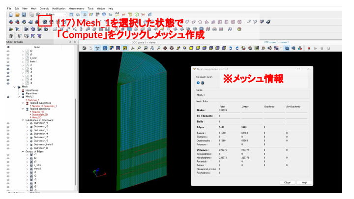

- (17) `Mesh_1` を選択した状態で `Compute` をクリックし、全方向のサブメッシュを反映してメッシュを再計算する。
- メッシュ情報を確認する（例: ノード数 238239、ヘキサヘドロン数 223776）。


---


- 羽根の根本や角部を拡大し、メッシュが歪みなく生成されていることを確認する。


---

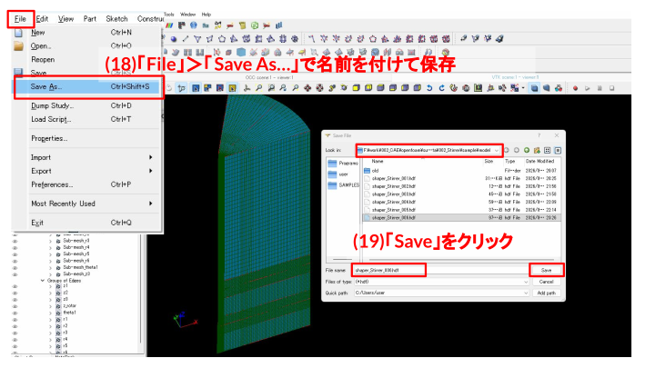

- (18) `File` > `Save As...` で名前を付けて保存する。
- (19) `Save` をクリックする。

## （余裕がある人向け）OpenFOAM側での計算

SALOME で作成したメッシュを OpenFOAM 形式に変換して利用する。全体の流れは以下の通り。


---


---

### OpenFOAM用にUNV出力する

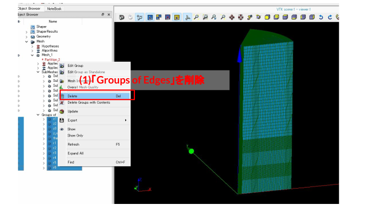

- (1) `Groups of Edges` を削除する。
- 補足: 線グループ（サブメッシュ分割用）はOpenFOAM変換に不要なため、削除して境界名の混乱を避ける。`Groups of Faces` はOpenFOAMの境界パッチ名として引き継がれるため残す。


---

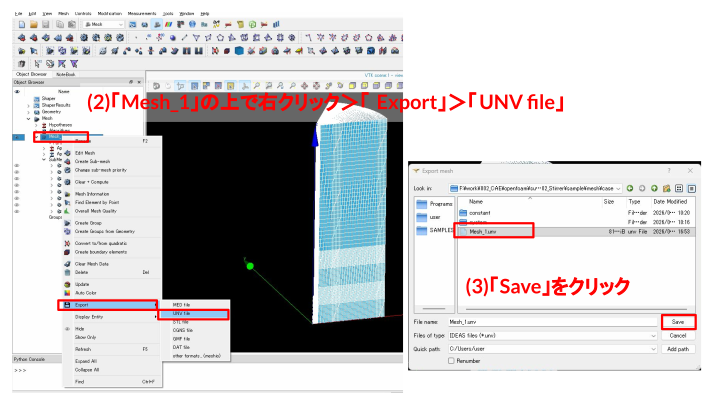

- (2) `Mesh_1` 上で右クリックし、`Export` > `UNV file` を選ぶ。
- (3) `Save` をクリックし、`Mesh_1.unv` として保存する。

---

### メッシュ変換とバッフル作成

SALOMEから出力した `Mesh_1.unv` は、そのままではOpenFOAMで使えない。UNV形式からOpenFOAM形式へ変換し、スケール変換（mm→m）を行った上で、羽根（wing）と仕切り板（circ）の位置に `topoSet` + `createBaffles` でバッフル（厚みゼロの内部壁）を作成する。

- 作業フォルダ: `data/002_Stirrer/sample/mesh/mesh_of13`

```bash
cd data/002_Stirrer/sample/mesh/mesh_of13
. /opt/openfoam13/etc/bashrc

ideasUnvToFoam Mesh_1.unv > log.ideasUnvToFoam 2>&1
transformPoints "scale=(0.001 0.001 0.001)" > log.transformPoints 2>&1
checkMesh > log.checkMesh.initial 2>&1

topoSet > log.topoSet 2>&1
createBaffles -overwrite > log.createBaffles 2>&1
checkMesh > log.checkMesh.final 2>&1
```

なお、同フォルダには上記一連の処理をまとめた `Allrun` スクリプトがあり、`./Allclean && ./Allrun` で最初から一括再実行できる。

ESI版OpenFOAM（v2512など）で試す場合は、`mesh_of2512` フォルダに同じ処理のv2512用ケース一式がある。構文がいくつか異なる（`transformPoints -scale "(0.001 0.001 0.001)"`、`createBafflesDict` の `patchPairs` 形式）。また、羽根シート（θ=30°面）の選択に使っている `rotatedBoxToFace` がESI版には無いため、`topoSetDict.wing` では代わりに**羽根シートの両側のセルを `rotatedBoxToCell` で拾い、「両方のセル集合に属する面＝シート面」として挟み撃ちで選択**している（結果はFoundation版と同じ480面×2枚）。

各コマンドの役割は以下の通り。

- `ideasUnvToFoam Mesh_1.unv`: SALOMEから出力したUNVメッシュを、OpenFOAMの `constant/polyMesh` 形式へ変換する。
- `transformPoints "scale=(0.001 0.001 0.001)"`: 全座標を1/1000倍する。SALOMEはmm単位で形状を作っているため、OpenFOAMが使うm単位へスケール変換する。
- `checkMesh`（1回目）: 変換直後のメッシュ品質・セル数・境界面を確認する。
- `topoSet`: `system/topoSetDict`（`topoSetDict.wing` / `topoSetDict.circ` / `topoSetDict.rotor` をinclude）に従い、羽根・仕切り板・回転領域の3種類のゾーンを作成する（内容は次節）。
- `createBaffles -overwrite`: `system/createBafflesDict` に従い、topoSetで作った羽根・仕切り板の面ゾーンを厚みゼロの `wall` バッフルへ変換する。`owner`/`neighbour` それぞれに `_master` / `_slave` のパッチ名を与え、羽根・仕切り板の両面を表現する。
- `checkMesh`（2回目）: バッフル作成後のメッシュ品質を再確認し、`Mesh OK` になっていることを確認する。


---

### topoSetで作成する3種類のゾーン

`topoSet` では、後工程で使う次の3種類のゾーンをメッシュ上に定義する。wing / circ は `createBaffles` でバッフル化するための**面ゾーン（faceZone）**、rotor は回転計算用の**セルゾーン（cellZone）**である。

**1. 羽根（wing）の面ゾーン**

`wingFaceZone` / `wingFaceZone2` は、羽根の位置にある面のゾーン（上下2枚分）。羽根のパーティション面はセクターの二等分線（30°）上にあるため、`rotatedBoxToFace` で30°回転させた薄い直方体を使って面を選び出す。

- 補足: 選択ボックスの境界がメッシュの面中心の座標とちょうど一致すると、端の面が拾われたり拾われなかったりして羽根のエッジがガタつく。これを避けるため、ボックスのz範囲は羽根より半セル分広げ、`normalToFace` で羽根の垂直面だけに絞っている。


---

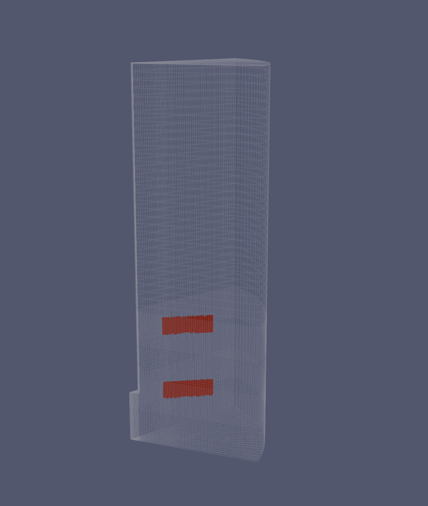

**2. 仕切り板（circ）の面ゾーン**

`circularFaceZone_z015` / `circularFaceZone_z035` は、仕切り板の位置にある面のゾーン。`cylinderToFace` で薄いz範囲を直接指定して選び出す。

- 補足: シャフト（軸）がz=15mmまで刺さっているため、仕切り板はシャフト周りの環状の板になる。z=15mm平面にはシャフト底面（境界面）も含まれてしまうため、`boundaryToFace` の `action delete` で境界面を取り除き、内部面だけを残している。


---

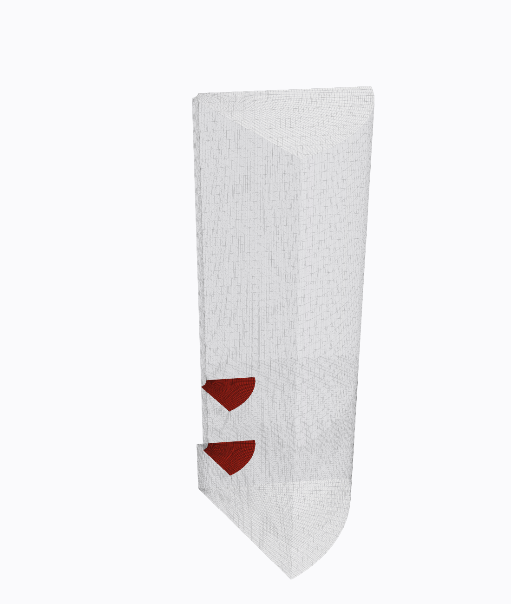

**3. 回転領域（rotor）のセルゾーン**

`rotor1` / `rotor2` は、羽根の周囲を囲む円柱状の回転領域のセルゾーン（MRFなど回転計算用）。`cylinderToCell` で円柱範囲を指定して作成する。


---

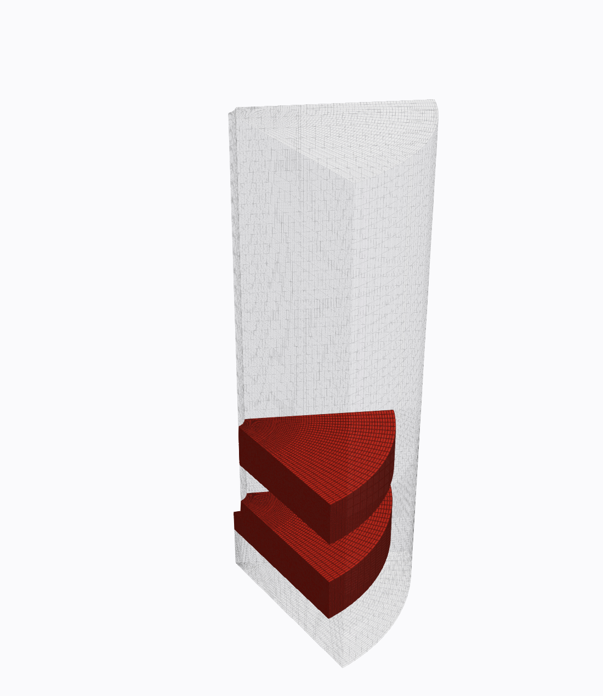


---

### 羽根の可動化テスト（master_curve_of13）

羽根（`wall_wing.*` パッチ）に、コード化された点変位（`codedFixedValue`）でx位置に応じた曲線状の変位を与え、`displacementSBRStress` モーションソルバでメッシュ全体を滑らかに追従変形できるかを確認する。

- 作業フォルダ: `data/002_Stirrer/sample/mesh/master_curve_of13`（`mesh_of13` で作成したバッフル済みメッシュを引き継ぐ）

```bash
cd data/002_Stirrer/sample/mesh/master_curve_of13
. /opt/openfoam13/etc/bashrc

rm -rf 0
cp -r 0.orig 0

moveDynamicMesh > log.moveDynamicMesh 2>&1
checkMesh -latestTime > log.checkMesh 2>&1
```

- `constant/dynamicMeshDict` で `displacementSBRStress` モーションソルバを指定する。
- `0.orig/pointDisplacement` の `wall_wing.*` 境界に `codedFixedValue` を設定し、時刻 `t` に応じて羽根表面の点をy方向へ滑らかに変位させる。
- `system/controlDict` で `application moveDynamicMesh`、`endTime 1`、`deltaT 0.1` として、10ステップに分けてメッシュを追従変形させる。
- 各時刻（`0.1`〜`1`）でメッシュが破綻せず追従できているかを、最終時刻の `checkMesh` で確認する（`Mesh OK`）。

`0.orig/pointDisplacement`（実行時に `0/` へコピーされる）の中身は次の通り。各点の変位（`pointVectorField`）を定義するファイルである。

```cpp
dimensions      [0 1 0 0 0 0 0];      // 変位なので単位は [m]

internalField   uniform (0 0 0);      // 内部の初期変位は0

boundaryField
{
    ".*"                              // 既定: すべての境界を変位0で固定
    {
        type            fixedValue;
        value           uniform (0 0 0);
    }

    "wall_wing.*"                     // 羽根パッチだけ上書き（コードで変位を計算）
    {
        type            codedFixedValue;
        name            makecurve;
        value           uniform (0 0 0);

        code
        #{
            const scalar& t = this->db().time().value();       // 現在時刻
            const vectorField& pos = patch().localPoints();    // 羽根表面の点座標
            vectorField f(pos.size(), vector(0,0,0));

            forAll(f, i)
            {
                const scalar x = pos[i][0];        // 各点のx座標(半径方向)
                const scalar height = 4e-3;        // 曲げの最大たわみ 4mm
                const scalar x0 = 15.0e-3;         // 曲げ始める半径 15mm
                const scalar x1 = 25.0e-3;         // 羽根先端の半径 25mm

                scalar y = 0.0;
                if(x > x0) {
                    // x0〜x1 を円弧状にたわませる（半径rの円の一部）
                    const scalar r = (pow((x1 - x0), 2) + pow(height, 2)) / 2.0 / height;
                    y = r - sqrt(pow(r, 2) - pow((x - x0), 2));
                }
                f[i] = vector(0.0, y*t, 0.0);      // y方向に y*t だけ変位（時刻に比例）
            }
            operator==(f);                          // この変位を境界に課す
        #};
    }
}
```

ポイントは以下の通り。

- **`".*"` → `fixedValue (0 0 0)`** … すべての境界を「動かない」に既定する。前述の `rotorPin`（rotor境界）や外周壁も、個別記述が無いのでこの既定にマッチして自動的に変位0で固定される。
- **`"wall_wing.*"` → `codedFixedValue`** … 羽根パッチだけを上書きし、C++コードで変位を計算する（正規表現は後に書いた方が優先されるため、羽根は固定ではなく変形する）。
- **コードの中身** … 羽根の半径15mm（`x0`）より外側を、先端25mm（`x1`）で最大たわみ4mm（`height`）になる円弧状にy方向へ曲げる。`y*t` としているので、時刻 `t`（0〜1）に比例して少しずつ曲がる。


---


- 羽根表面の変位に合わせて、周囲のメッシュも破綻せず滑らかに追従変形していることを確認する。


---

### 回転領域メッシュが動いてしまう問題と対処

このまま羽根を`moveDynamicMesh`で曲げると、**羽根だけでなく回転領域（rotor）のメッシュまで一緒に動いてしまう**（下のアニメーションで、羽根の変形が周囲へ広がり rotor 界面 r=35mm が円からずれる様子が確認できる）。


---

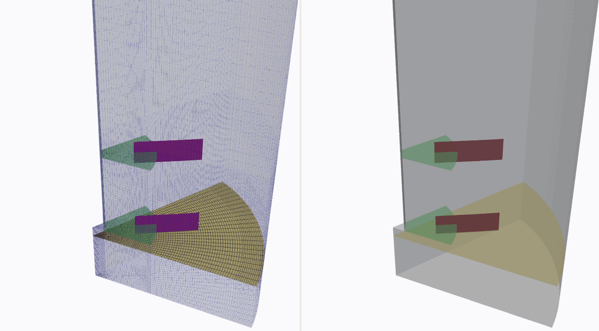

回転領域に使用する rotor は円柱状のきれいな領域であってほしいので、これは望ましくない。

対処法は、メッシュの作り方によって2通りある。

**（1）別部品で作って後で貼り合わせる方法（サマースクール2020・技術書の方法）**

羽根を含む部品を**別メッシュ**として作り、`createBaffles`＋`moveDynamicMesh`で羽根だけを曲げてから、`mergeMeshes`／`stitchMesh`で rotor のメッシュに貼り合わせる。こうすると変形を羽根の部品内に閉じ込められる。この手順は技術書「[OpenFOAMでメッシュ作成](https://techbookfest.org/product/5752199185432576)」（技術書典）に詳しく解説されているので、そちらを参照。


---

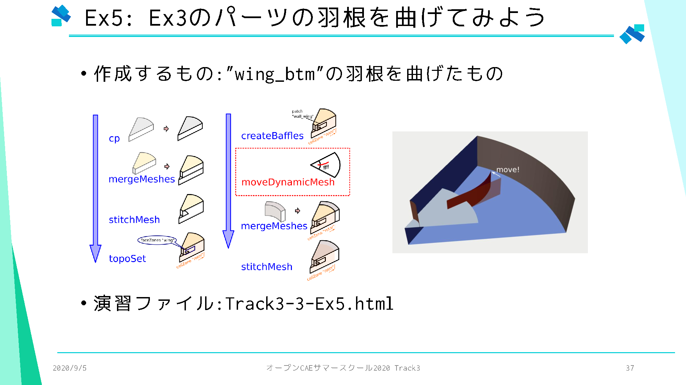

**（2）一体もの（1つの連続メッシュ）の場合の対処法（今回の方法）**

今回のようにメッシュが一体で作られている場合は、貼り合わせができないので、**rotor の境界（r=35mm の円筒面）を一時的に固定壁にして変形させ、あとで元に戻す**方法をとる。手順は次の4ステップ。

1. **`topoSet`** … rotor1 / rotor2 セルゾーンの境界面を faceZone（`rotorBoundary`）にする。
2. **`createBaffles`** … その面を**一時的な固定壁パッチ `rotorPin`** に変換する。`pointDisplacement` の `.*`（既定）が `fixedValue (0 0 0)` なので、`rotorPin` は自動的に変位0で固定される。
3. **`moveDynamicMesh`** … 羽根を変形させる。このとき rotor 境界（`rotorPin`）は変位0で固定されているので、変形は rotor 内側だけに閉じ込められる。
4. **`stitchMesh`** … 変形後、`rotorPin`（壁）を**内部面に戻す**。これで r=35 の壁が消え、**元の一体もの（壁のない連続メッシュ）に戻る**。ただし形状は変形済み。

実際のコマンドは次の通り（`master_curve_of13` の `Allrun` に記載）。

```bash
# 1. 半径3 mmのシャフト面をdefaultFacesからshaftへ分離
topoSet -dict system/topoSetDict.shaft
createPatch -dict system/createPatchDict.shaft

# 2-3. rotor境界(r=35)を一時的に固定壁(rotorPin)化
topoSet -dict system/topoSetDict.rotorpin
createBaffles -overwrite

# 4. 羽根を変形(rotorPinは変位0で固定)
rm -rf 0 && cp -r 0.orig 0
moveDynamicMesh

# 5. 固定壁を内部面へ戻す(壁を消し、元の一体ものメッシュに戻す)
stitchMesh -latestTime "((rotorPin_master rotorPin_slave))"
```

`system/topoSetDict.shaft` は `defaultFaces` のうち半径3 mmの円筒面を選択し、`system/createPatchDict.shaft` は選択した面を `type wall` の `shaft` パッチへ変更する。形状やセルは変更せず、境界名だけを分離している。1/6セクターでは `shaft` が4,512面になり、変形・結合後もこの境界名が保持される。

`createBaffles` で作る `rotorPin_master` / `rotorPin_slave` は `type wall`（両面とも壁）なので、そのままでは r=35 で流れが遮られてしまう。そこで変形が終わったら `stitchMesh` で両パッチを内部面へ結合し、**壁を消して元の状態に戻す**のがポイントである。

固定した面（`rotorPin`）は、下図でピンク色に示した rotor1 / rotor2 セルゾーンの**外周表面全体**である。具体的には、

- **外周の円筒壁（半径 r=35mm、高さ z=10〜20mm と z=30〜40mm）** … これを固定することで rotor が半径方向へ広がらず、円形を保つ。
- **上下のフタ（z=10 / 20 / 30 / 40mm の水平な扇形面。下図のピンクの扇形4枚）** … これを固定することで rotor が軸方向へも動かない。


---

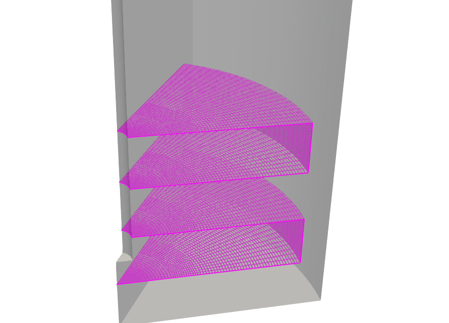

この閉じた表面を変位0で固定するため、rotor の内側（羽根と境界の間）だけが変形を吸収し、rotor の外側は一切動かない。

これにより、変形は rotor 内部（羽根と境界の間）だけに閉じ込められ、**rotor 界面は円形を保ち、外側のメッシュは完全に静止する**（実測で外側の変位0.000mm・界面の半径ずれ0.05mm、`checkMesh` も `Mesh OK`）。

対処後（rotor境界を固定した場合）の変形過程は以下のようになる。羽根（ピンク色）は変形するが、回転領域（水色）とその外側のメッシュは動かず、rotor は円形を保っている（「対処前」アニメーションと見比べると違いが分かる）。


---


このアニメーションは `rotorPin`（固定用の壁）が入ったままの状態である。変形が終わったら、前述の手順4のとおり **`stitchMesh` で `rotorPin` の壁を内部面に戻し、壁のない一体もの（変形済み）のメッシュにする**。

```bash
stitchMesh -latestTime "((rotorPin_master rotorPin_slave))"
```

こうしてできた「壁のない・羽根が曲がった変形済みメッシュ」（`master_curve_of13` の最終時刻 `1/`）が、次のフルモデル組み立ての**基準セクター**になる。以上のpin→変形→壁戻しの一連の処理は `master_curve_of13/Allrun` にまとめてある。

ESI版OpenFOAM（v2512など）には `master_curve_of2512` フォルダにv2512用ケースがある。構文がいくつか異なる（`topoSet` のfaceSet削除は `subtract`、`stitchMesh` は `stitchMesh -perfect rotorPin_master rotorPin_slave` の2引数形式、最終時刻への適用は `startFrom latestTime` への切り替えが必要）。`./Allrun` で羽根の変形（先端4 mm）・rotor固定・stitch（壁戻し）まで一括実行でき、Foundation版と同じく `Mesh OK` の一体メッシュになる。


---

### フルモデルの組み立て（回転コピー＋結合）

ここまでで作った変形済みの 1/6 セクター（60°）を、**60°ずつ回転コピーして6個結合**すると、全周（360°）の撹拌槽フルモデルになる。作業フォルダは `data/002_Stirrer/sample/mesh/fullmodel_of13`。

基準セクターには、`master_curve_of13` を `Allrun` で回した最終時刻（`1/`）の変形メッシュ（羽根が曲がり、rotor 境界は円形のまま、壁も無い一体もの）を使う。


---

#### 1. OpenFOAM 13の環境を読み込む

```bash
. /opt/openfoam13/etc/bashrc
```


---

#### 2. 変形済みの1/6セクターを作成する

先に `master_curve_of13` を実行する。この処理で、半径3 mmの面を `shaft` に変更し、rotor境界を固定した状態で羽根を曲げ、最後にrotor境界を内部面へ戻す。

```bash
cd data/002_Stirrer/sample/mesh/master_curve_of13
./Allrun
```

計算後は `1/polyMesh/boundary` に `shaft` があることと、メッシュ品質を確認する。

```bash
grep -A6 '^[[:space:]]*shaft$' 1/polyMesh/boundary
checkMesh -latestTime
```

今回の実行結果は、223,776セルがすべて六面体、`shaft` は4,512面で、`Mesh OK` となった。


---

#### 3. フルモデル用フォルダへ移動する

```bash
cd ../fullmodel_of13

SEC=../master_curve_of13/1/polyMesh
```

`SEC` は、手順2で作成した変形済み1/6セクターの `polyMesh` を指す。


---

#### 4. 基準となる0°セクターを配置する

```bash
rm -rf constant/polyMesh
cp -r "$SEC" constant/polyMesh
```

この時点では、フルモデル用ケースに0°の1/6セクターだけが入っている。


---

#### 5. セクターの両放射側面をパッチにする

回転コピーして並べただけでは、隣り合うセクターの境目（放射面）はつながらず、メッシュは6個のブロックが接触して並んでいるだけの状態になる。あとで `stitchMesh` を使ってこの境目を貼り合わせ、**セクター間が面でつながった1つの連続メッシュ**にする。

`stitchMesh` は「2つの名前付きパッチどうし」を貼り合わせる。ところが結合直後は、放射面（θ=0° と θ=60° の2枚）は外周壁・天面・底面といっしょに `defaultFaces` に混ざっていて、そのままでは指定できない。そこで先に、基準セクターの両放射面を `topoSet`＋`createPatch` で専用パッチ `side_0deg` / `side_60deg` として切り出しておく。

```bash
topoSet     -dict system/topoSetDict.sides
createPatch -dict system/createPatchDict.sides -overwrite
```

`topoSetDict.sides` は、`defaultFaces` に限定してから面の法線でθ=0°面（法線 `(0 -1 0)`）とθ=60°面（法線 `(-sin60 cos60 0)`）を選ぶ。`createPatchDict.sides` は、それを `side_0deg` / `side_60deg` という名前のパッチにする。1/6セクターでは、それぞれ8,784面が切り出される。回転コピー前に付けておくと、6個すべてが同じ側面パッチを持つ。


---

#### 6. 回転コピーを作ってz軸まわりに回す

60°から300°までの5個を `sec1`〜`sec5` に作り、それぞれ60°ずつ回す。通常は側面パッチ付きの `constant/polyMesh` をコピーして `transformPoints` で回せばよい。

```bash
for k in 1 2 3 4 5; do
    ang=$((k * 60))
    mkdir -p sec$k/constant sec$k/system
    cp -r constant/polyMesh sec$k/constant/polyMesh
    cp system/controlDict sec$k/system/
    transformPoints -case sec$k "Rz=$ang"
done
```

基準セクターを含め、0°・60°・120°・180°・240°・300°の6セクターがそろう。

> **補足（Windows/WSL の `/mnt/f` = drvfs で実行する場合）**: drvfs 上では、`cp` でコピーした `polyMesh/points` が読み取り専用になり、`transformPoints` による「その場上書き」が失敗する（回転が反映されず、`rm` も Permission denied になる）。このため `fullmodel_of13/Allrun` では `transformPoints` を使わず、回転で変わらないトポロジ系ファイル（`faces`・`owner` など）はコピーで流用し、**回転後の `points` だけを別ファイルとして新規書き出し**する（`system/rotatePointsTo.py`）。新規作成なら drvfs でも確実に書けるため、6セクターすべてが確実に回転する。Linux ネイティブFS上ではこの回避策は不要で、上の `transformPoints` 版でよい。


---

#### 7. 6セクターを結合する

```bash
mergeMeshes -addCases '("sec1" "sec2" "sec3" "sec4" "sec5")'
```

`mergeMeshes` は、0°の基準セクターへ5個の回転済みセクターを追加する。これにより、1,342,656セルの360°フルモデルが `constant/polyMesh` にできる。ただしこの時点ではまだ6個のブロックが接触して並んでいるだけで、`checkMesh` すると `Number of regions: 6`（互いに面でつながっていない6領域）になる。


---

#### 8. 放射面を貼り合わせて1つの連続メッシュにする

隣り合うセクターの `side_0deg` と `side_60deg` は幾何的にぴったり重なっている。`stitchMesh` で両パッチを貼り合わせて内部面に戻すと、6個の境目が全部つながって `Number of regions: 1` の一体メッシュになる。

```bash
stitchMesh -tol 1e-3 '((side_0deg side_60deg))'
```

`-tol` は一致点をマージする許容量（局所辺長に対する相対値）で、既定は `1e-4`。回転コピー時のわずかな数値誤差で接合線に微小なスリバー面ができ非直交エラーになることがあるため、ここでは少し緩めの `1e-3` を使う。実行すると `Source/target coverage = 1/1`（両側とも完全に貼り合わさった）となり、`side_0deg` / `side_60deg` は境界から消えて内部面になる。結合後、一時セクターは削除してよい（`rm -rf sec1 sec2 sec3 sec4 sec5`）。


---

#### 9. フルモデルのメッシュを確認する

```bash
checkMesh
```

今回の実行結果は、1,342,656セルがすべて六面体、`Number of regions: 1`、非直交 Max 49°・スキュネス 0.79 で `Mesh OK` となった。セクター間がつながった、計算にも使える1つの連続メッシュである。

以上の手順（4〜9）は `fullmodel_of13/Allrun` にまとめてあり、`./Allrun` で一括実行できる（作業はすべてこのフォルダ内で完結する）。


---

#### 10. フルモデルを可視化する

`post.foam` をParaViewで開き、タンクを半透明にして羽根（赤）と仕切り板（緑）を表示する。曲がった羽根が全周に12枚並んでいることを確認する。


---


このモデルには、羽根まわりを囲む円柱状のセルゾーン `rotor1`・`rotor2` が定義してある。下図でピンクに薄く示した部分がそれで、MRFやスライディングメッシュで**回転させる領域**にあたる。羽根とその周囲をひとまとまりの領域として扱い、その外側の静止領域との間で値を受け渡す。


---


---


- 上記の一連の手順は、`fullmodel_of13/Allrun` にまとめてある（`./Allrun` で再生成できる）。
- ESI版OpenFOAM（v2512など）用には `fullmodel_of2512` フォルダがある（先に `mesh_of2512` → `master_curve_of2512` を実行してから `./Allrun`）。Foundation版と同じく**変形済みセクター**から全周を組み立てる。v2512では `mergeMeshes` が2ケースずつの逐次実行、stitchは `stitchMesh -perfect`（点の完全一致が必要なため、θ=60°面の点をθ=0°面の+60°回転値へ厳密スナップしてから回転コピーする）など手順が異なる（詳細は同フォルダの `Allrun` を参照）。結果はFoundation版と同じく `Number of regions: 1`・`Mesh OK` の連続メッシュになる。
- この方法（セクターをOpenFOAM側で回転コピー＋stitch）は、変形済みセクターから全周モデルを組み立てる手軽な手段である。一方で、最初から整った全周メッシュが欲しいだけなら、次のようなやり方もある。
    - **SALOMEで最初から全周360°をメッシュする**（タンク＋6枚の羽根を含む全体形状を1つの連続メッシュとして生成する）。接合面がそもそも存在しないので、最初から1つにつながっている。
    - **1セクター（60°）の両側面を cyclic（周期）境界にして、回転周期性で計算する**。フルモデルを作らずに1/6だけで解ける（撹拌計算では MRF/AMI とあわせてよく使われる定石）。

---

## ヘキサメッシュをつくるコツ

すべての形状をヘキサメッシュだけで作成するのは、CADソフトからは難しい場面が多い。それでもヘキサメッシュをどうしても使いたい場面がある場合は、次のことを覚えておくとよい。


---

### 1. 六面体ブロックの節点移動で作成できる形状

1つの六面体ブロックは、**節点（頂点・辺・面）を動かすだけで、元の立方体と「位相的に同相（homeomorphic）」な形状であれば作成できる**。位相幾何学では、切ったり貼ったりせずに連続的に変形して移り合える形どうしを「同相」という。立方体と球は同相なので、下図のように立方体の8つの頂点・6つの面を球面へ写すだけで、六面体1個で球を表現できる（メッシュのつながり方＝トポロジは立方体のまま）。逆に、ドーナツ（穴あき）のように立方体と同相でない形状は、1個の六面体ブロックでは作れない。


---

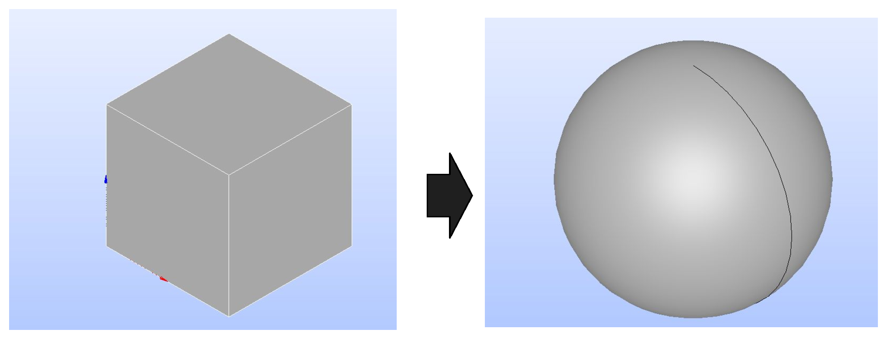

これをさらに3次元的に考えると、**立方体状のブロックを球面へフィットさせて、球体まわりのヘキサメッシュ**を作成できる。さらに、その球面を `dynamicMesh` の節点移動で対象形状へフィットさせれば、たとえば**バスケットボール（表面の溝つき）まわりのヘキサメッシュ**まで作成できる（そんな機会はないかもしれないが、考え方の参考として）。


---

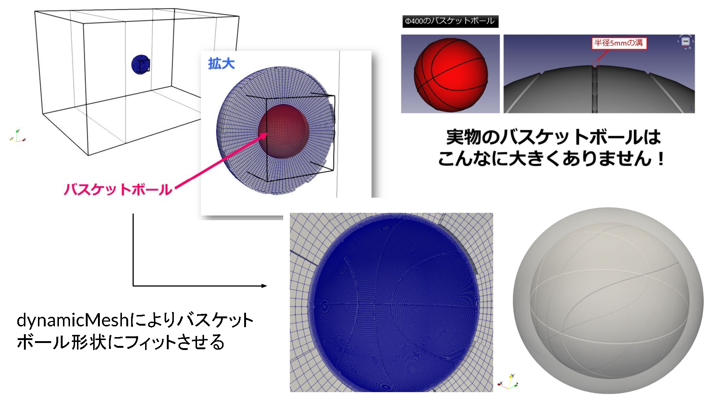


---

### 2. 2次元スケッチを回転押し出し（revolve）

軸まわりに回転対称な形状は、**断面を2次元スケッチで描いて回転押し出し**すれば、きれいなヘキサメッシュになる。断面をブロックに分けておけば、回転方向にそのまま六面体が並ぶ。


---

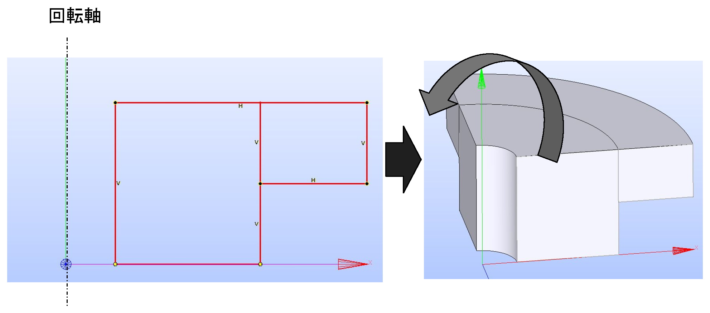


---

### 3. 2次元スケッチを押し出し（extrude）

一方向に断面が変わらない形状は、**断面を2次元スケッチで描いて押し出す**のが最も簡単で確実である。円のような断面も、扇形＋中央の四角のブロックに分割しておけば六面体で押し出せる。


---

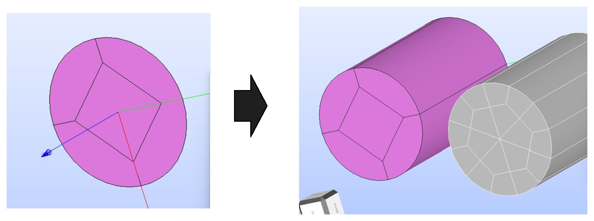

まとめると、**「立方体と同相な形」「回転押し出しで作れる形」「押し出しで作れる形」に持ち込めるかどうか**が、ヘキサメッシュを作れるかどうかの見極めどころになる。複雑な形状は、これらのブロックに分割（Partition）できる形へ落とし込んでいくのがコツである。

---

## 離散化スキームの違い（本当にヘキサメッシュが必要か）

ここまで「ヘキサメッシュをつくるコツ」を見てきたが、計算の精度を決めるのは**メッシュの種類（ヘキサ／テトラ）だけではない**。対流項をどの**離散化スキーム**で解くか、そして**メッシュが流れに沿っているか**も同じくらい効く。ここでは単純な移流問題でそれを確かめ、「本当にヘキサメッシュでないといけないか」を考える材料にする。

題材は下図の形状（幅100 × 高さ50）。中央にダイヤ型のブロックを置き、左右のブロックと分割数をそろえてヘキサメッシュにしている。この中央部でメッシュが流れ方向に対して斜めになる。


---

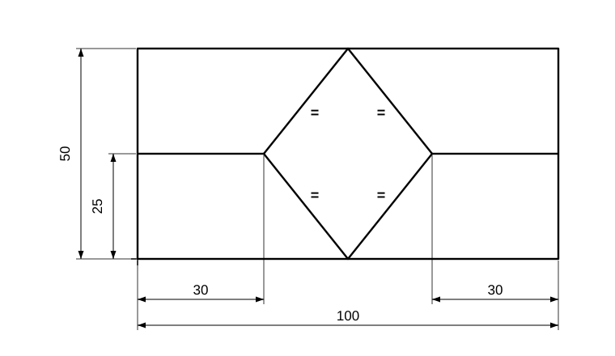


---

### 単純な移流方程式

移流方程式は、2次元では次の形をしている（$\mathbf{u}=(u,v)$ は流速）。

$$
\frac{\partial T}{\partial t} + u\,\frac{\partial T}{\partial x} + v\,\frac{\partial T}{\partial y} = 0
\tag{1}
$$

このうち、$\partial T/\partial t$ は**時間変化項**、$u\,\partial T/\partial x + v\,\partial T/\partial y$（流速 × 空間微分、ベクトルで書けば $\mathbf{u}\cdot\nabla T$）が**対流項（移流項）**である。OpenFOAMではこの対流項が `div(phi,T)` にあたり、`system/fvSchemes` の `divSchemes` で離散化スキームを指定する。この節で「対流項の離散化スキームを変える」と言っているのは、**この項をどう離散化するか**を変える、という意味である。

今回は流れが $x$ 方向のみ（$\mathbf{u}=(u,\,0)$、すなわち $v=0$）なので、式(1)は

$$
\frac{\partial T}{\partial t} + u\,\frac{\partial T}{\partial x} = 0
\tag{2}
$$

に簡約される。厳密解は $T(x,t) = T(x - ut,\, 0)$、つまり**分布の形を保ったまま伝搬する**はず。しかし実際は**対流項の離散化スキームで結果が大きく変わる**。

- 今回は**粘性ゼロ（純移流）**なので、スキームの違いが極端に表れる。実際のナビエ・ストークス方程式は粘性項（拡散）を持つため、これほど極端には出にくい。
- 計算は2次元なので、後述の「斜めメッシュでのなまり」は $x$・$y$ 方向が絡む**偽拡散**であり、1次元の式だけでは見えない。


---

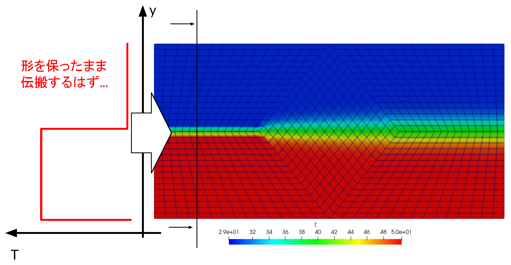

今回は上図のような2次元領域で、**上側入口を30℃・下側入口を50℃**として右へ流す（拡散なしの純移流、`DT=0`）。理想的には上下の温度差（`y=25`の界面）がシャープなまま出口まで運ばれるはずである。


---

### 対流項の離散化スキームまとめ

ここで対象にするのは、移流方程式の**対流項**（下式の $(2)$ の部分）。この対流項をどう離散化するかで挙動が変わる。

$$
\underbrace{\frac{\partial T}{\partial t}}_{(1)}
\;+\;
\underbrace{u\,\frac{\partial T}{\partial x} + v\,\frac{\partial T}{\partial y}}_{(2)}
\;=\; 0
$$

ここで $(1)$ は**時間変化項**、$(2)$ が**対流項**（＝ `div(phi,T)`。以下で変えるのはこの項のスキーム）。

ざっくり、**「安定性」と「精度」はトレードオフ**と覚えておくとよい。**安定性を取ると数値拡散（解がなまる）が生じやすく、精度を取ると数値振動が起こりやすい**。

- **1次精度：風上差分（upwind）** … 安定性重視。安定だが、**数値拡散**で解がなまる（界面がなまる）。
- **2次精度：中心差分（linear）・QUICK** … 精度重視。不連続をシャープに捉えるが、**数値振動**（オーバーシュート／アンダーシュート）が起こりやすい。
- **TVDスキーム：minmod、vanLeer、vanAlbada、superBee** が有名。**安定性と精度のいいとこ取り**を狙い、不連続部で振動を抑えつつ解をシャープに捉える。


---

### OpenFOAMで比べてみる

同じ移流問題を、`system/fvSchemes` の `divSchemes` にある対流項スキーム `div(phi,T)` だけ変えて計算した結果が下図（青=30℃、赤=50℃）。左上から時計回りに、1次風上（upwind）・2次中心差分（linear）・TVD（vanLeer）・2次風上（linearUpwind）。

```
// system/fvSchemes
divSchemes
{
    default      none;
    div(phi,T)   Gauss upwind;   // ← ここを linear / linearUpwind grad(T) / vanLeer などに変える
}
```


---

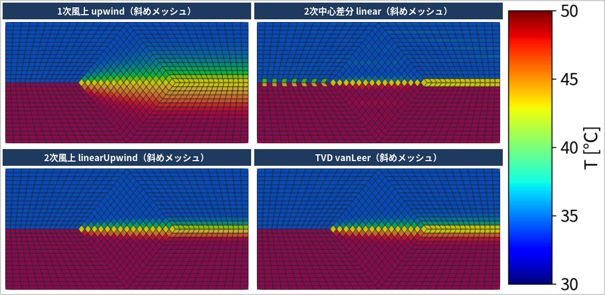

- **upwind（1次風上）**: 界面が大きくなまる。数値拡散が大きい（`T` は 30〜50 に収まり振動はしない）。
- **linear（2次中心差分）**: 界面はシャープだが、30〜50を超える**数値振動**が出る（実測で `T` が約22〜58℃）。
- **linearUpwind（2次風上）**: シャープで、振動はわずか（約28〜52℃）。
- **vanLeer（TVD）**: シャープさを保ちつつ振動を抑える（約26〜54℃）。


---

### 実は「メッシュが流れに沿っているか」も効く

**見てほしい点**: 上の4枚とも、左半分（格子が流れに整列）では界面がシャープで、右半分（V字の斜め格子）でなまっている。

**わかること**: なまりの主因はスキームの数値拡散ではなく、**格子が流れに斜交して生じる偽拡散（false diffusion）**である。

**確かめ**: 同じ `linearUpwind` を、格子を流れに整列させた `blockMesh` で解くと、界面はシャープなまま出口まで届く（下図）。→ 精度は「スキーム」だけでなく「**格子を流れに沿わせること**」でも大きく変わる。


---

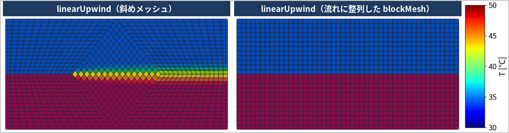


---

### 本当にヘキサメッシュが必要か

精度を決めるのは、メッシュの種類（ヘキサ／テトラ）だけではなく、

- **対流項の離散化スキーム**（1次風上・2次・TVD）
- **メッシュが流れに沿っているか**（斜交すると偽拡散が出る）

も同じくらい効く。ヘキサメッシュ化に大きな手間をかける前に、「その形状で**本当にヘキサが必要か**」「**流れに沿ったメッシュ**にできるか」「**スキーム**で十分な精度が出せるか」をあわせて考えると、労力に見合った良いメッシュ・良い計算にたどり着きやすい。


---

### 使用データ

移流スキーム比較のケースは `data/000_ex/` 以下にある（それぞれ `./Allrun` で再現でき、`div(phi,T)` だけが異なる）。ESI版 v2512（`run_of2512_*`）と Foundation版 OpenFOAM 13（`run_of13_*`）の**両方**を用意している（対応するOpenFOAM環境を読み込んでから `./Allrun`）。

| フォルダ（`run_of2512_*` / `run_of13_*`） | 内容 |
|----------|------|
| `..._upwind` | 1次風上差分（`Gauss upwind`）／斜めメッシュ |
| `..._linear` | 2次中心差分（`Gauss linear`）／斜めメッシュ |
| `..._linearUpwind` | 2次風上（`Gauss linearUpwind grad(T)`）／斜めメッシュ |
| `..._vanLeer` | TVD（`Gauss vanLeer`）／斜めメッシュ |
| `..._blockMesh_linearUpwind` | 2次風上（`linearUpwind`）／**流れに整列した blockMesh**（斜めメッシュとの比較用、セル数はほぼ同じ） |


---

### 参考記事

離散化スキームについては、以下の記事も参考になる。

- [【OpenFOAM】移流方程式で離散化スキームの勉強をする](https://takun-physics.net/15355/)
- [【OpenFOAM】移流方程式で色々な離散化スキームをPythonで自動実行して試してみた](https://takun-physics.net/15471/)
- [【OpenFOAM】移流方程式で色々な離散化スキーム（解の振る舞いと計算時間）](https://takun-physics.net/15492/)
- [【OpenFOAM】領域ごとに対流項スキームを変えるzoneBlended schemeを試してみた](https://takun-physics.net/17853/)

---

# 003 Heatsink: SALOMEでヒートシンクの熱流体・固体連成メッシュを作る

## この演習で目指すこと

ヒートシンクを題材に、流体領域（box）と固体領域（heatSink・heatSource・basis）を分けたマルチリージョン用メッシュを作成する。OpenFOAM 13の `foamMultiRun` で流体ソルバと固体ソルバを連成し、熱流体・固体連成解析につなげる。

- STEPファイルを読み込み、ソリッド単位に分解して名前を整理する
- Partitionで4つの領域（box・heatSink・heatSource・basis）を分割する
- 各領域の境界面にグループ名を付け、OpenFOAMへ渡すパッチ名を決める
- テトラメッシュを作成し、フィン周りに境界層（Viscous Layers）を追加する
- Sub-meshで流体領域だけメッシュサイズを調整する
- UNV形式でOpenFOAM用に出力する

モデル構成は次の4リージョンからなる。

- `box`: 周囲を流れる空気の流体領域（240 × 102 × 103 mm）
- `heatSink`: フィン部分の固体領域
- `heatSource`: 発熱源となる底板の固体領域
- `basis`: ヒートシンクを載せる土台の固体領域


---

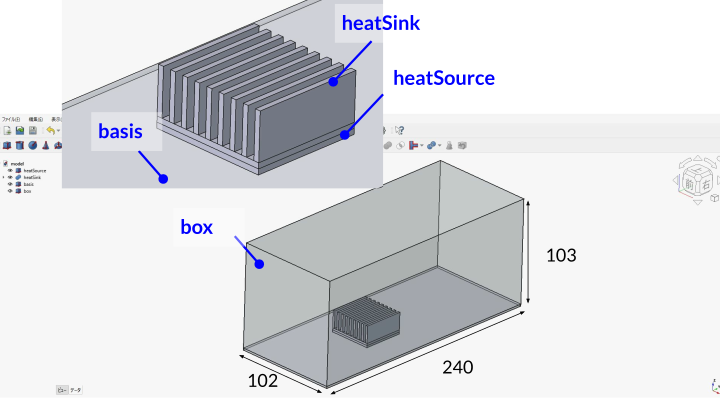


---

### 使用データの場所

この演習で使うファイル・計算結果は、リポジトリの以下のフォルダにある。

| フォルダ | 内容 |
|----------|------|
| `data/003_heatsink/sample/model` | FreeCADで作成したCADモデル `model.FCStd` と、SALOMEへ読み込むために出力したSTEPファイル `model.step` の保存場所 |
| `data/003_heatsink/run001_of13` | SALOMEから出力した `Mesh_1.unv` と、OpenFOAM 13で `foamMultiRun` を実行するケース一式（セットアップスクリプト `setup.sh` を含む） |
| `data/003_heatsink/run001_of2512` | 同じメッシュをESI版OpenFOAM（v2512）の `chtMultiRegionFoam` で計算するケース一式（`setup.sh`・計算結果を含む） |

なお、CADモデルはFreeCADで作成しており、FreeCADの編集用ファイルを `model.FCStd`、SALOMEへ渡す形状データを `model.step` として保存している。この演習では、作成済みのCADモデルから出力したSTEPファイルをSALOMEへ読み込み、OpenFOAM用のマルチリージョンメッシュを作成するところまでを行う。


---

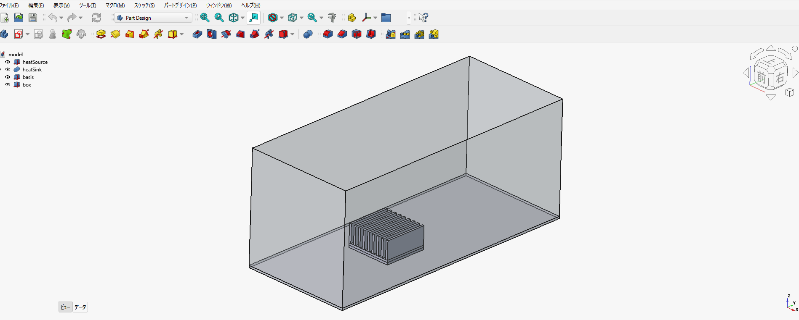

この演習のOpenFOAM計算は **OpenFOAM 13**（www.openfoam.org 版）で行う。最終的には、マルチリージョンソルバによる熱流体・固体連成の計算を行う。


---

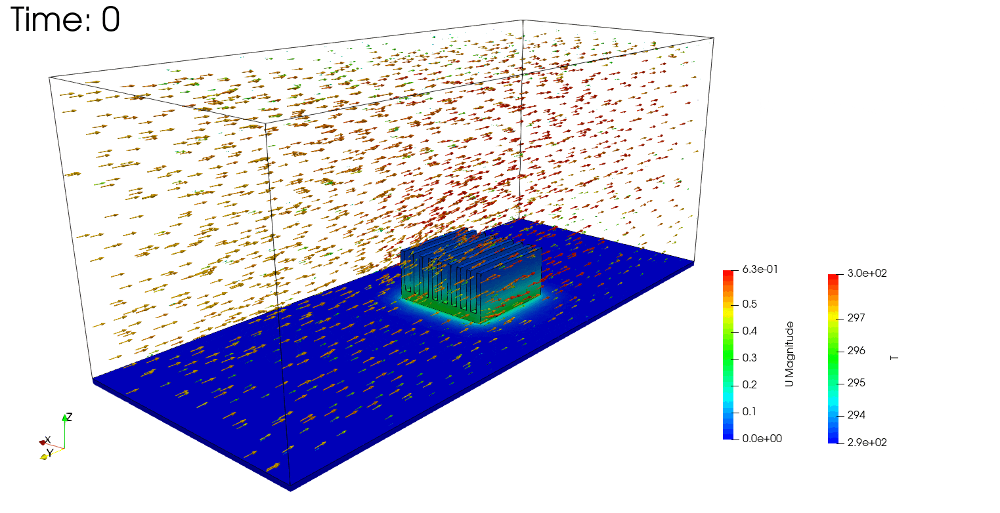

---

## Geometry: STEPファイルを読み込む


---

### 1. Geometryモジュールへ切り替える


- (1) `Geometry` に変更する。


---

### 2. STEPファイルをインポートする

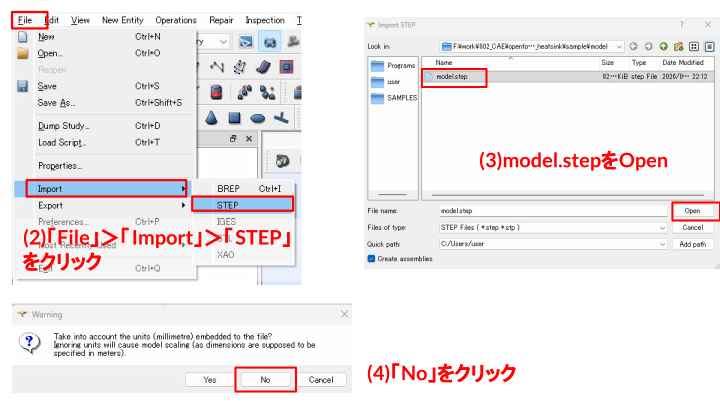

- (2) `File` > `Import` > `STEP` をクリックする。
- (3) `model.step` を選択し `Open` をクリックする。
- (4) 単位をmm前提で読み込むため、警告ダイアログでは `No` をクリックする（`Yes`にするとモデルのスケールが変わってしまう）。


---

### 3. 内部形状を確認する

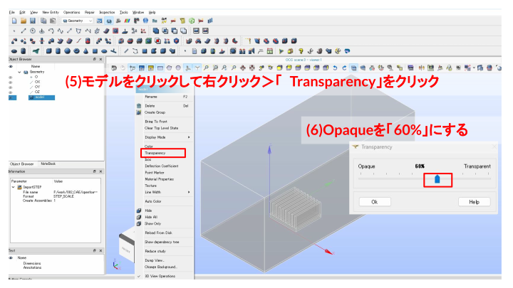

- (5) オブジェクトブラウザまたは3Dビューで `model` をクリックして選択し、右クリック > `Transparency` をクリックする。
- (6) `Opaque` のスライダを `60%` にして `Ok` をクリックし、boxの中にあるheatSink・heatSourceの形状を確認する。

---

## Geometry: ソリッドを分解して名前を付ける


---

### 1. Explodeでソリッド単位に分解する

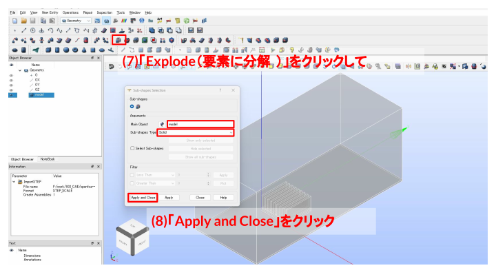

- (7) `Explode（要素に分解）` をクリックする。
- Sub-shapes Type を `Solid` にする。
- (8) `Apply and Close` をクリックする。


---

### 2. 4つのソリッドをリネームする

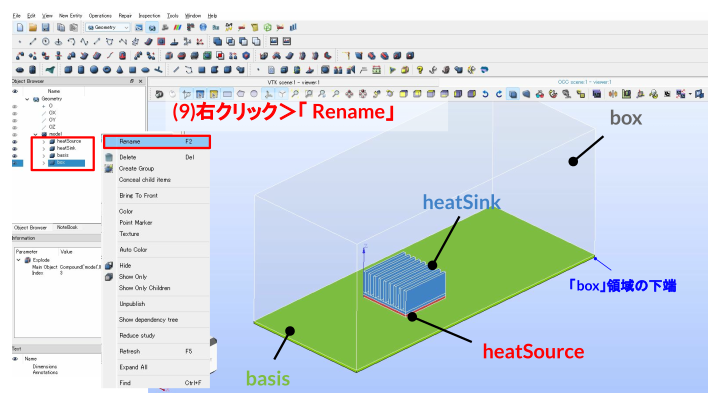

**この章ではこの操作は不要です。** FreeCADでモデルを作った時点で各ソリッドに `heatSource` / `heatSink` / `basis` / `box` という名前を付けてあり、その名前がSTEPファイルに保存されているため、Explodeした時点で自動的に同じ名前が付く。

- (9) 名前が付いていない場合（`Solid_1` のような名前になっている場合）だけ、分解された4つのソリッドを右クリック > `Rename` で、それぞれ `heatSource` / `heatSink` / `basis` / `box` に名前を変更する。
- ここでの名前は、後の境界面グループ作成や、OpenFOAM側のリージョン設定でそのまま使う。上図と同じ名前になっていることを確認しておく。

---

## Geometry: Partitionで領域を分割する


---

### 1. Partitionを実行する

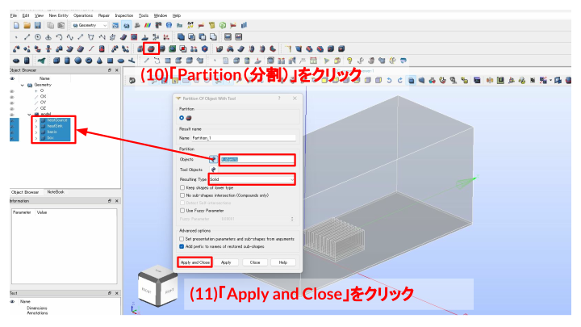

- (10) `Partition（分割）` をクリックする。
- Objects に4つのソリッド（heatSource・heatSink・basis・box）を指定する。
- Resulting Type を `Solid` にする。
- (11) `Apply and Close` をクリックする。


---

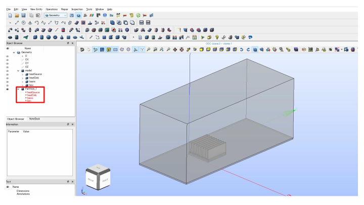

- `Partition_1` の下に、4つのソリッドが子要素として作られたことを確認する。これらの共有面が、後でOpenFOAM側の流体-固体連成境界になる。


---

### 2. Partition結果を再度分解してリネームする

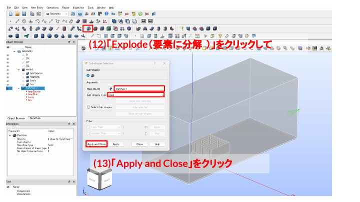

- (12) `Explode` をクリックする。Main Objectは `Partition_1`、Sub-shapes Typeは `Solid` にする。
- (13) `Apply and Close` をクリックする。


---

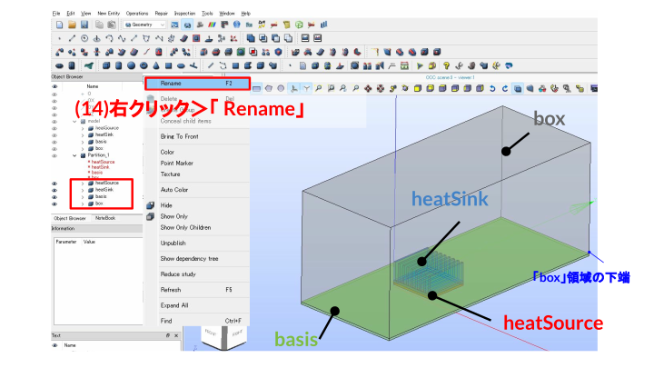

- (14) 分解された4つのソリッドを右クリック > `Rename` で、`heatSource` / `heatSink` / `basis` / `box` にリネームする。


---

### 3. 保存する

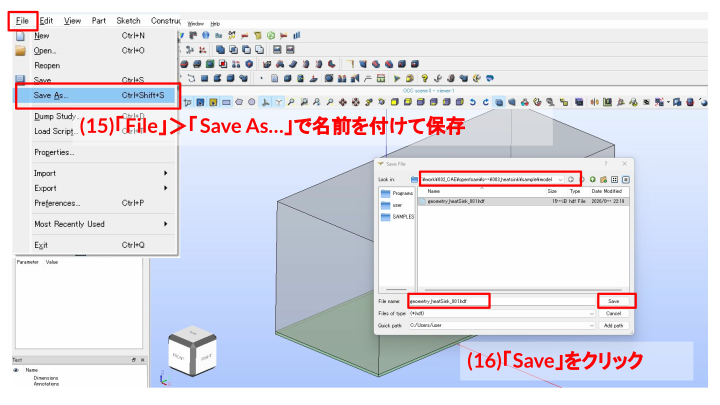

- (15) `File` > `Save As...` をクリックする。
- (16) ファイル名 `geometry_heatSink_001.hdf` で `Save` をクリックする。

---

## Geometry: box領域の境界面にグループを作る

OpenFOAMでは境界条件は面の名前に対して設定するため、SALOME側で面グループを作り、後でOpenFOAMのパッチ名として使う。ここではまずbox（流体領域）の8つの境界面グループを作る。


---

### 1. 外壁面のグループを作る（YMin・ZMax・XMax・YMax・XMin）

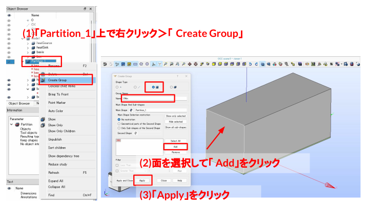

- (1) `Partition_1` を右クリック > `Create Group` をクリックする。
- Shape Typeを面（Face）にし、Group Nameに `YMin` と入力する。
- (2) 対象の面を選択して `Add` をクリックする。
- (3) `Apply` をクリックする。


---

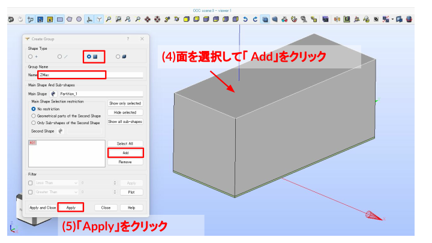

- (4)(5) 同様に `ZMax` の面を選択して `Add` → `Apply`。


---

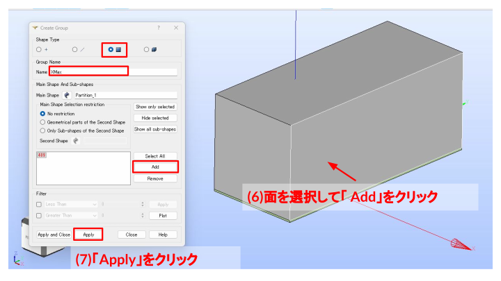

- (6)(7) 同様に `XMax` の面を選択して `Add` → `Apply`。


---

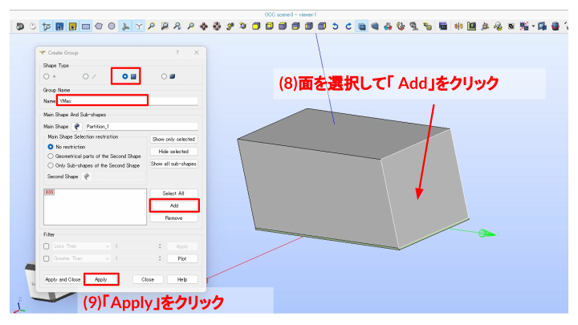

- (8)(9) 同様に `YMax` の面を選択して `Add` → `Apply`。


---

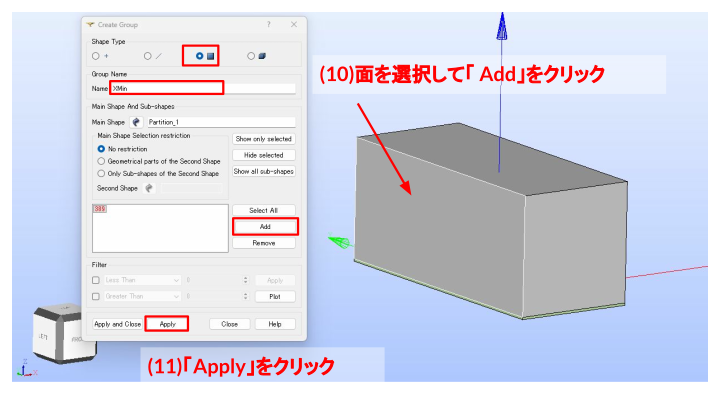

- (10)(11) 同様に `XMin` の面を選択して `Add` → `Apply`。


---

### 2. basisとの接触面グループを作る


- (12) `Shape Type` を面にし、`Name` に `basis` と入力する。`basis` の側面4面と底面1面の計5面を選択して `Add` をクリックする。
- (13) `Apply` をクリックする。


---

### 3. heatSink・heatSourceとの接触面グループを作る

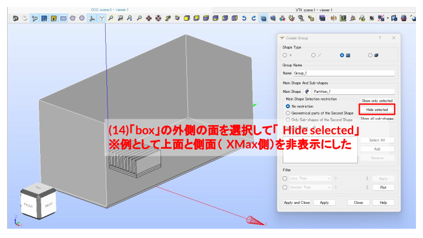

- (14) 内部のheatSink・heatSourceの面を選択しやすくするため、box外側の面（上面・側面など）を選択して `Hide selected` で非表示にする。


---

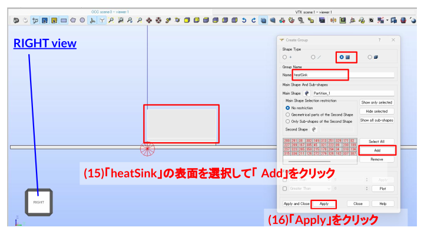

- (15) `RIGHT view` に切り替え、heatSinkの表面（フィン部分）を選択して `Add` をクリックする。
- (16) `Apply` をクリックする。


---

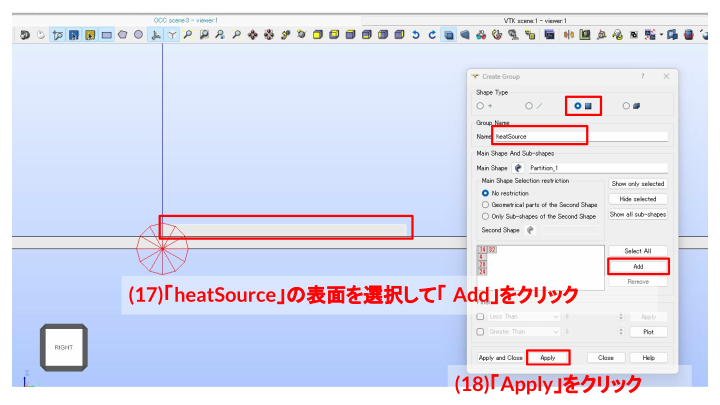

- (17) 同様にheatSourceの表面を選択して `Add` をクリックする。
- (18) `Apply` をクリックする。


---

### 4. basis側の上面グループを作る

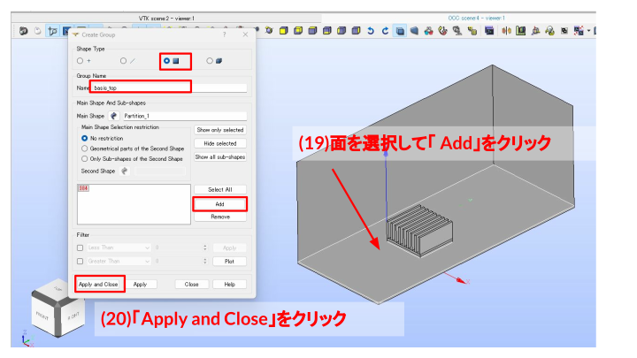

- (19) 今度はbasis自体の視点で、heatSourceと接する上面を選択して `Add` をクリックする。
- (20) `Apply and Close` をクリックする。グループ名は `basis_top` とする。


---

### 5. 完成した境界グループを確認する

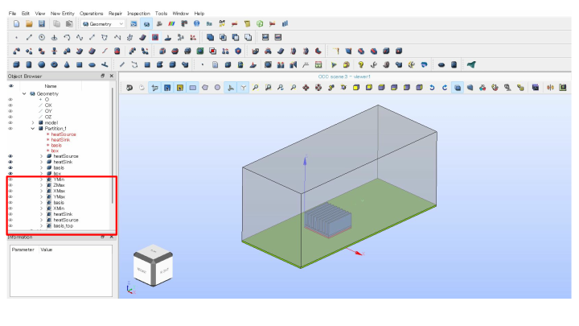

- `Partition_1` の配下に、`YMin` / `ZMax` / `XMax` / `YMax` / `basis` / `XMin` / `heatSink` / `heatSource` / `basis_top` の9つの面グループが揃ったことを確認する。
- その上にある `heatSource` / `heatSink` / `basis` / `box` は、Partitionで分割されたソリッド（リージョン）のグループで、面グループとは別物である。


---

### 6. 保存する

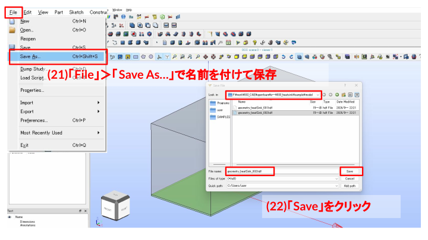

- (21) `File` > `Save As...` をクリックする。
- (22) ファイル名 `geometry_heatSink_002.hdf` で `Save` をクリックする。

---

## Mesh: テトラメッシュを作成する


---

### 1. Meshモジュールへ切り替える

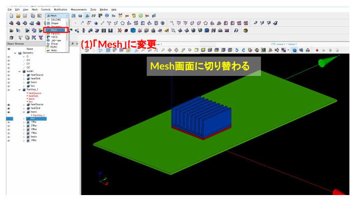

- (1) 画面左上のモジュールのプルダウンを `Mesh` に変更する。Mesh画面に切り替わり、Object Browserには `Partition_1` とその配下の面グループがそのまま表示される。


---

### 2. メッシュを新規作成する

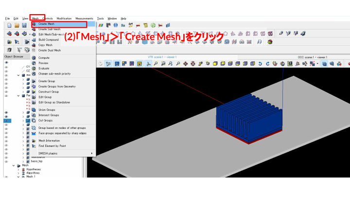

- (2) `Mesh` > `Create Mesh` をクリックする。


---

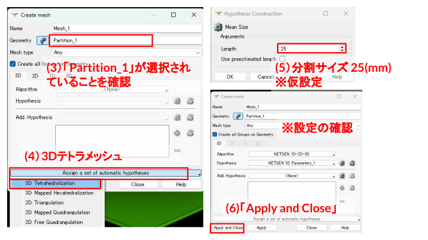

- (3) `Geometry` に `Partition_1` が選択されていることを確認する。`Create all Groups on Geometry` にチェックを入れておくと、Geometryで作った面グループがそのままメッシュのグループになる。
- (4) 3Dタブの下にある `Assign a set of automatic hypotheses` から `3D: Tetrahedralization` を選ぶ。
- (5) `Hypothesis Construction` ダイアログが開くので、`Length`（分割サイズ）を `25`（mm）にして `OK` をクリックする。ここでは仮設定であり、後で調整する。
- (6) `Algorithm` が `NETGEN 1D-2D-3D`、`Hypothesis` が `NETGEN 3D Parameters_1` になっていることを確認し、`Apply and Close` をクリックする。


---

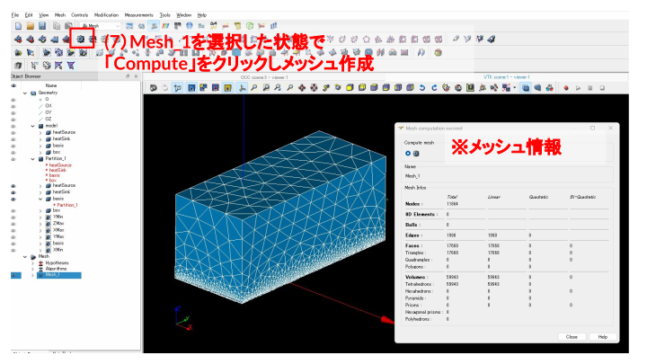

- (7) `Mesh_1` を選択した状態で `Compute` をクリックし、メッシュを作成する。
- 計算成功（Nodes 11864、Tetrahedrons 59943）を確認する。


---

### 3. 断面で内部形状を確認する

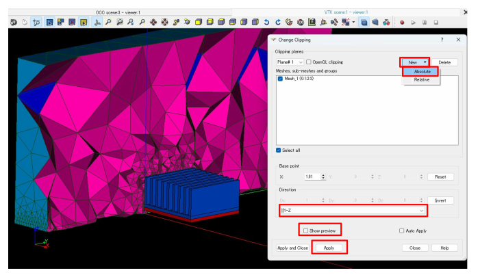

- Clipping平面（Y-Z面）を使い、boxの中のheatSink形状とメッシュの様子を確認する。


---

### 4. メッシュサイズを調整する

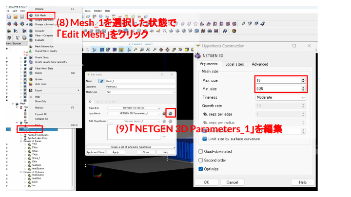

- (8) `Mesh_1` を選択した状態で `Edit Mesh` をクリックする。
- (9) `NETGEN 3D Parameters_1` を編集し、Max sizeを `10`、Min sizeを `0.25` に変更する。

---

## Mesh: 境界層（Viscous Layers）を追加する


---

### 1. heatSink・heatSourceの表面に境界層を追加する

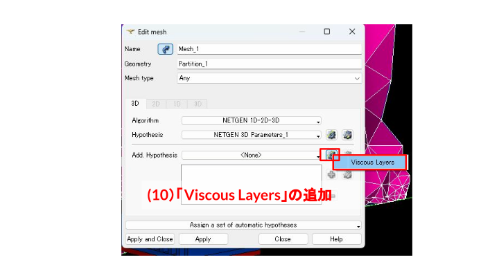

- (10) Add. Hypothesisで `Viscous Layers` を追加する。


---

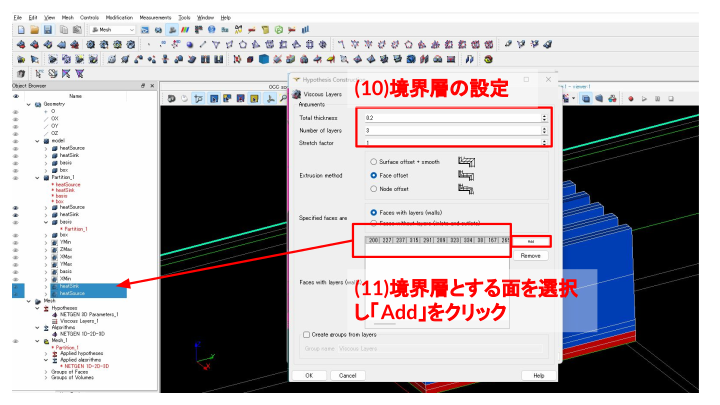

- Total thicknessを `0.2`、Number of layersを `3`、Stretch factorを `1` にする。
- Extrusion methodは `Face offset` を選ぶ。
- (11) heatSink・heatSourceの面を選択して `Add` をクリックする。


---

### 2. basis側の境界層との接続に注意する

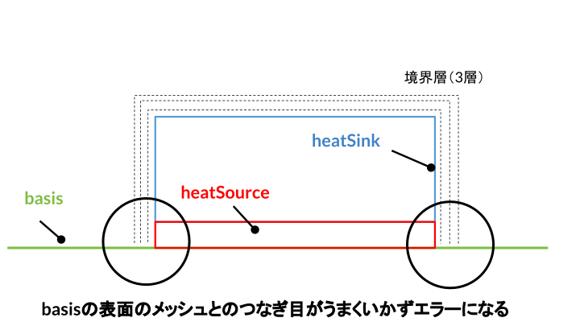

- heatSink・heatSourceだけに境界層を付けると、境界層の外側の輪郭がbasisの表面メッシュとぴったり重ならず、つなぎ目でメッシュ生成エラーになりやすい。
- これを避けるため、basis側にも対応する境界層（Viscous Layers）を追加し、輪郭を合わせる。


---

### 3. basis側にも境界層を追加する

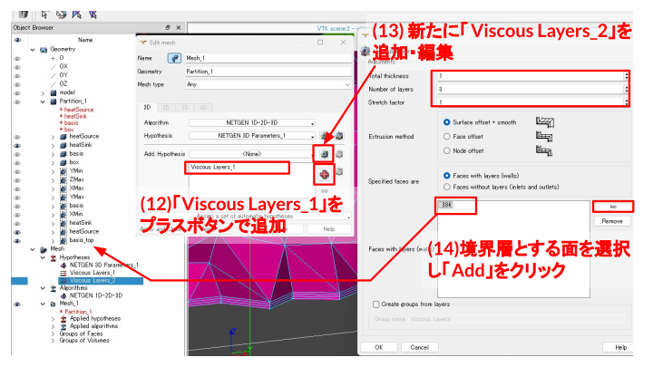

- (12) Viscous Layers_1に続けて、プラスボタンで新たに `Viscous Layers_2` を追加する。
- basis_topの面を選択して `Add` する。
- Total thicknessを `1`、Number of layersを `3` にし、Extrusion methodは `Surface offset + smooth` を選ぶ（heatSink・heatSourceの境界層と滑らかに接続させるため）。


---

### 4. 再計算して確認する

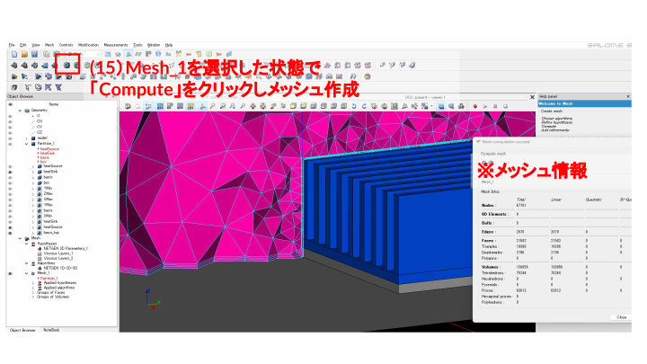

- (13) `Compute` をクリックする。計算成功（Nodes 47701、Tetrahedrons 75244、Prisms 63612）を確認する。


---

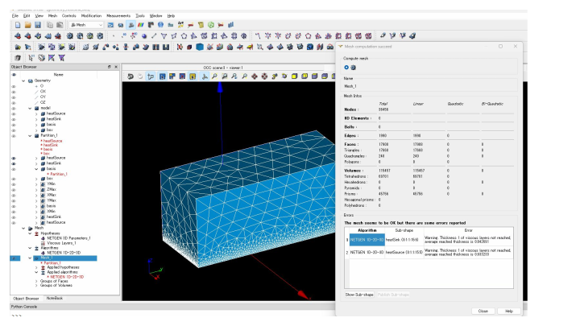


---

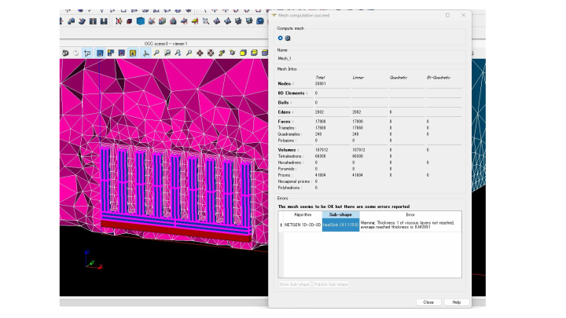

- 計算は成功するが、フィン間隔が狭いため「Thickness of viscous layers not reached（指定した境界層厚さに届いていない）」という警告が出ることがある。
- 警告が出ていても致命的なエラーでなければ、そのまま次に進めてよい。


---

### 5. boxの外壁にも境界層を追加する

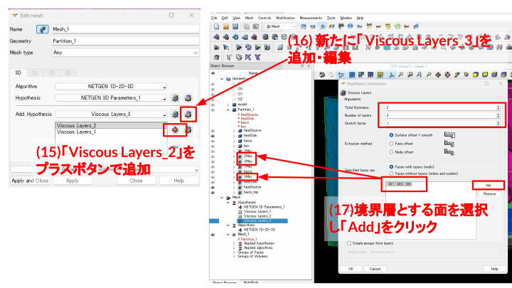

- (14) 新たに `Viscous Layers_3` を追加する。
- Total thicknessを `2`、Number of layersを `3`、Extrusion methodは `Surface offset + smooth` にする。
- (15) boxの外壁（ZMax・XMax・XMin）の面を選択して `Add` をクリックする。


---

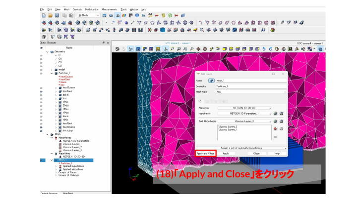

- Add. HypothesisにViscous Layers_1〜3がすべて追加されていることを確認し、`Apply and Close` をクリックする。


---

### 6. 最終メッシュを計算する

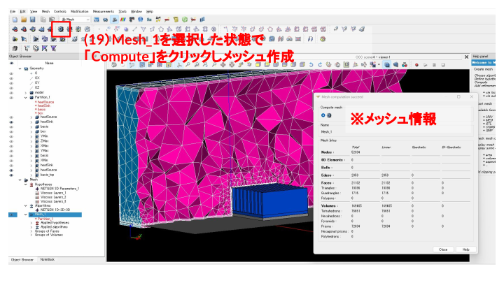

- (16) `Compute` をクリックする。計算成功（Nodes 52304、Tetrahedrons 76661、Prisms 72804）、エラーなしを確認する。


---


- フィン間の境界層とテトラメッシュの接続部分を拡大し、品質を確認する。

---

## Mesh: Sub-meshで流体領域だけ細分化する


---

### 1. box用のSub-meshを作成する

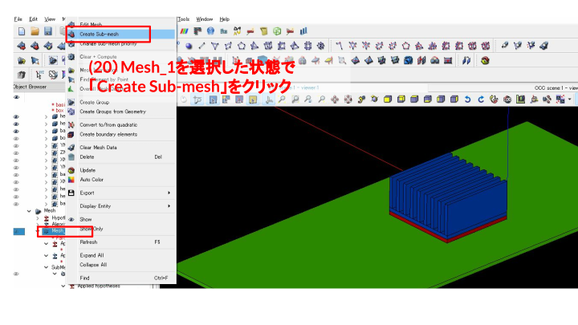

- (17) `Mesh_1` を選択した状態で `Create Sub-mesh` をクリックする。


---

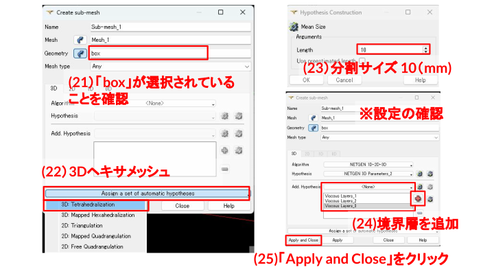

- (18) Geometryに `box` が選択されていることを確認する。
- (19) 3Dタブで `3D: Tetrahedralization` を選ぶ。
- NETGEN 3D Parameters_2でLengthを `10`（mm）にする。
- (20) Add. HypothesisにViscous Layers_1〜3を追加する。
- (21) `Apply and Close` をクリックする。


---

### 2. Sub-meshを計算する

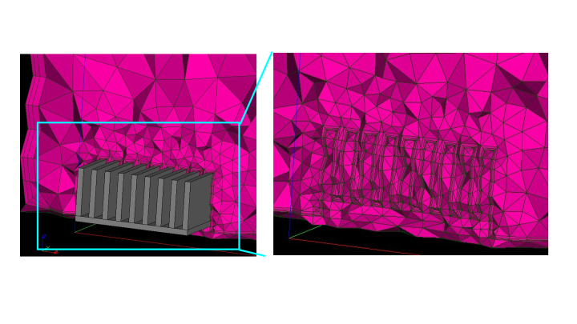

- box領域内のフィン周りが、全体メッシュより細かくなっていることを確認する。


---

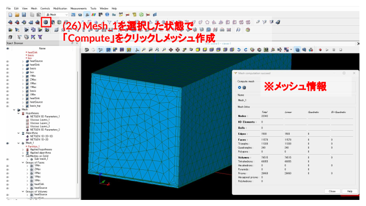

- (26) `Mesh_1` を選択した状態で `Compute` をクリックし、Sub-meshを反映してメッシュを再計算する。


---

### 3. 不要なグループを削除する

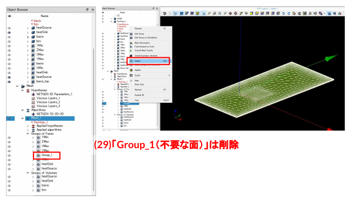

- (29) グループ作成時に重複してできた `Group_1`（basisの底面）は不要なため、右クリック > `Delete` で削除する。


---

### 4. 保存する

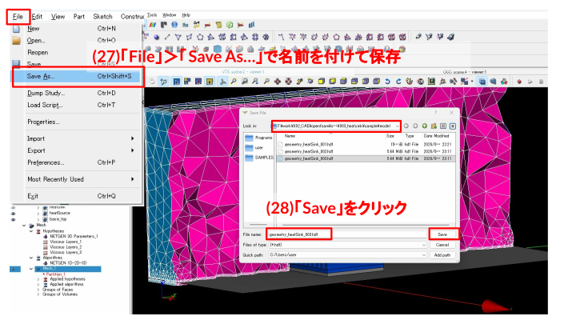

- (27) `File` > `Save As...` をクリックする。
- (28) ファイル名 `geometry_heatSink_003.hdf` で `Save` をクリックする。

---

## Mesh: OpenFOAM用にUNV出力する

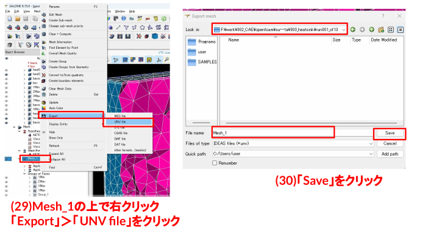

- (29) `Mesh_1` を右クリック > `Export` > `UNV file` をクリックする。
- (30) ファイル名 `Mesh_1.unv` として、OpenFOAMの計算フォルダ `run001_of13` に `Save` する。
- 作成した面グループ名（YMin・YMax・ZMax・XMax・XMin・basis・heatSink・heatSource・basis_top）がそのままOpenFOAMのパッチ名になる。

---

## （余裕がある人向け）OpenFOAM側での計算

SALOME で作成したメッシュを OpenFOAM 形式に変換して利用する。全体の流れは以下の通り。


---


- 作業フォルダ: `data/003_heatsink/run001_of13`


---

### OpenFOAM 13環境の読み込み

この演習の計算はOpenFOAM 13で行う。まずOpenFOAM 13の環境を読み込む。

```bash
source /opt/openfoam13/etc/bashrc
cd data/003_heatsink/run001_of13
```


---

### setup.shによるメッシュ変換とケース設定

ケースフォルダには、UNVメッシュの変換からリージョン分割・境界条件設定までを一括実行する `setup.sh` を用意している。

```bash
bash setup.sh
```

`setup.sh` の中では、以下の処理を順に行っている。


---

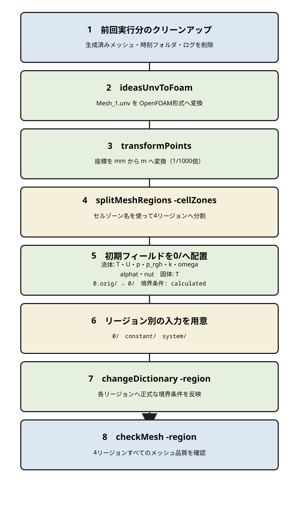

```text
1. 前回実行分のクリーンアップ
2. ideasUnvToFoam Mesh_1.unv     … UNVメッシュをOpenFOAM形式へ変換
3. transformPoints "scale=(0.001 0.001 0.001)"  … mm単位からm単位へスケール変換
4. splitMeshRegions -cellZones  … セルゾーン名を使い4リージョンへ分割
5. 0.orig/ のフィールドテンプレートを 0/ へコピー
   流体は T・U・p・p_rgh・k・omega・alphat・nut、固体は T を用意し、各境界を calculated にしておく
6. 0・constant・system にリージョン別の入力を用意
7. changeDictionary -region <各リージョン>  … 正式な境界条件へ上書き
8. checkMesh -region <各リージョン>  … 分割後のメッシュを確認
```

- `ideasUnvToFoam` でUNVメッシュをOpenFOAM形式に変換する。SALOMEでmm単位のモデルを作っているため、`transformPoints "scale=(0.001 0.001 0.001)"` でOpenFOAMが使うm単位に変換する。
- `splitMeshRegions -cellZones` は、UNVメッシュ作成時に付けたセルゾーン名（box・heatSink・heatSource・basis）を使ってメッシュを4つのリージョンに分割する。これにより、`constant/<region>/polyMesh` と `0/<region>` が作成される。`system/<region>` には、あらかじめ各リージョンの数値計算設定と境界条件辞書を用意している。
- `system/<region>/changeDictionaryDict` に各パッチの境界条件を記述しておき、`changeDictionary -region <region>` で `0/<region>` の各フィールドへ反映する。流体と固体の接触面には `coupledTemperature` を設定し、リージョン間で温度と熱流束を受け渡す。
- 各リージョンの物性値は `constant/<region>`、数値スキーム・行列ソルバ設定は `system/<region>` に用意している。


---

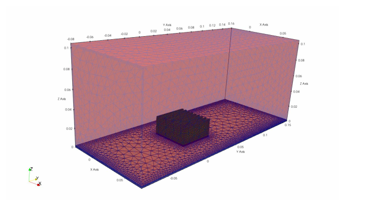

- ParaView等で、box（流体）とheatSink・heatSource・basis（固体）を含むメッシュ全体像を確認する。


---

### foamMultiRunの実行

セットアップが完了したら、熱流体・固体連成ソルバを実行する。

```bash
foamMultiRun > log.foamMultiRun.of13 2>&1
```

- OpenFOAM 13では `foamMultiRun` が `system/controlDict` の `regionSolvers` を読み込み、`box` を流体ソルバ、`heatSink`・`heatSource`・`basis` を固体ソルバとして連成計算する。
- 流体側は乱流モデル（`kOmegaSST`）で速度・圧力・温度・乱流量を解き、固体側は温度を解く。
- v2512の参照ケースと同じ `maxCo 100` を使用する。なお `system/controlDict` には `maxDi 100` も書いてあるが、OpenFOAM 13の `solid` モジュールは `maxDi` を読まず、固体側の時間刻み上限は `maxDeltaT` だけで決まる。この記述はv2512ケースとの対応を残すためのもので、OpenFOAM 13では効果がない。
- `system/controlDict` の設定により、時刻 `2` から `60` まで2秒間隔で結果を書き出す。
- 流入条件は `U = (0 -0.5 0) m/s`（y方向へ0.5 m/s）、初期温度は `293.15 K` としている。発熱源の設定は `constant/heatSource/fvModels`、各リージョンの境界条件は `system/<region>/changeDictionaryDict` を参照する。
- 補足: OpenFOAM 13の `foamMultiRun` は、初期の過渡でフィン近傍の境界層セルに負温度・速度スパイクが発生して発散する（v2512の `chtMultiRegionFoam` は同条件で安定）。このため `system/box/fvConstraints` に温度制限（`limitTemperature` 280〜400 K）と速度制限（`limitMag` 5 m/s）を設定して安定化している。
- なお、`setup.sh` から計算実行までは `./Allrun` で一括実行できる。計算は数時間かかるが、`startFrom latestTime` のため、途中で止めても `./Allrun` の再実行で続きから計算される。


---

### ESI版OpenFOAM（v2512）で計算する場合

同じメッシュをESI版で計算するケースを `data/003_heatsink/run001_of2512` に用意している。実行方法はOpenFOAM 13側と同じく `./Allrun` だが、**ソルバも設定ファイルの置き場所も異なる**ので注意する。

```bash
cd data/003_heatsink/run001_of2512
. /usr/lib/openfoam/openfoam2512/etc/bashrc
./Allrun          # setup.sh → chtMultiRegionFoam
```

| 項目 | OpenFOAM 13（`run001_of13`） | OpenFOAM v2512（`run001_of2512`） |
|------|------------------------------|-----------------------------------|
| ソルバ | `foamMultiRun`（モジュール式） | `chtMultiRegionFoam` |
| リージョンの指定 | `system/controlDict` の `regionSolvers`（`box fluid;` / `heatSink solid;` …） | `constant/regionProperties` の `regions (fluid (box) solid (heatSink heatSource basis))` |
| 乱流モデル | `constant/box/momentumTransport`（`simulationType RAS;` + `model kOmegaSST;`） | `constant/box/turbulenceProperties`（`RASModel kOmegaSST;`） |
| 発熱源 | `constant/heatSource/fvModels`。`type heatSource;` で `Q` を時刻テーブル指定 | `system/heatSource/fvOptions`。`type scalarSemiImplicitSource;` でエンタルピー `h` に投入 |
| 固体の時間刻み | `maxDi` は読まれない（`maxDeltaT` のみ有効） | `maxDi 100` が有効 |
| 書き出し制御 | `writeControl adjustableRunTime;` | `writeControl adjustable;` |
| 安定化の追加設定 | `system/box/fvConstraints` が必要（下の補足を参照） | 不要（同条件で安定） |

- 発熱条件はどちらも同じで、計算開始から10秒間だけ100 Wを投入し、その後は0にする。
- 流入条件（`U = (0 -0.5 0) m/s`）・初期温度（`293.15 K`）・`maxCo 100`・`endTime 60`・2秒間隔の書き出しも両者で揃えてある。
- `setup.sh` の流れ（`ideasUnvToFoam` → `transformPoints` → `splitMeshRegions` → `changeDictionary`）は共通である。


---

### 計算結果の確認

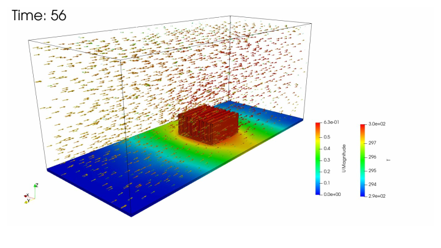

- 流体領域では速度ベクトル分布、固体領域では温度分布を確認する。
- ヒートシンク周りの流れが発熱部からの熱を受け取り、フィン表面から周囲へ熱を逃がしている様子を確認する。

計算が進むにつれて、発熱源からフィン先端まで温度が上昇し、周囲の空気が対流で熱を運び去っていく過程をアニメーションで確認できる。


---


