# SALOMEとは

## 概要

SALOME はフランス電力（EDF）が中心となって開発しているオープンソースの CAE プリ・ポスト処理プラットフォーム。
ジオメトリ作成からメッシュ生成・結果可視化まで一貫して行える。

- ライセンス: LGPL（無料・商用利用可）
- 開発元: EDF（Électricité de France）
- 対応OS: Linux / Windows

## SALOMEとSalome-Mecaの違い

SALOMEには2種類の配布形態があり、混同しやすいので最初に整理しておく。

| 名称 | 内容 | 配布元 |
|------|------|--------|
| **SALOME** | プリ・ポスト処理プラットフォーム本体。ソルバは付属しない | https://www.salome-platform.org/ |
| **Salome-Meca** | SALOMEに構造解析ソルバ **Code_Aster** を統合したパッケージ | https://www.code-aster.org/ |

- SALOME自体はジオメトリ作成・メッシュ生成・可視化のためのツールで、解析ソルバは含まれない。ソルバ（OpenFOAM、Code_Asterなど）は別途用意し、SALOMEで作ったメッシュを渡して使う。
- Salome-Mecaは、SALOMEと構造解析ソルバCode_Asterをセットにした配布版で、構造解析までを一体で行いたい場合に使う。
- 本講義ではソルバとしてOpenFOAMを使うため、**Salome Platform配布のSALOME 9.15**（ソルバなし版）を使用する。

---

## SALOMEのインストール（Windows版）

<https://www.salome-platform.org/> からSALOMEをダウンロードしてインストールする。ここでは**Windowsを対象にしたダウンロード方法**を記載している（Linuxの場合は、OSの選択で使用ディストリビューションに合わせたファイルを選ぶ）。

**Macの方はDockerを使用すること。** 手順は [004_salome_docker.md](004_salome_docker.md) を参照（Docker Desktopをインストールし、Docker Hubで公開している講義用SALOMEイメージを取得して使う）。


---

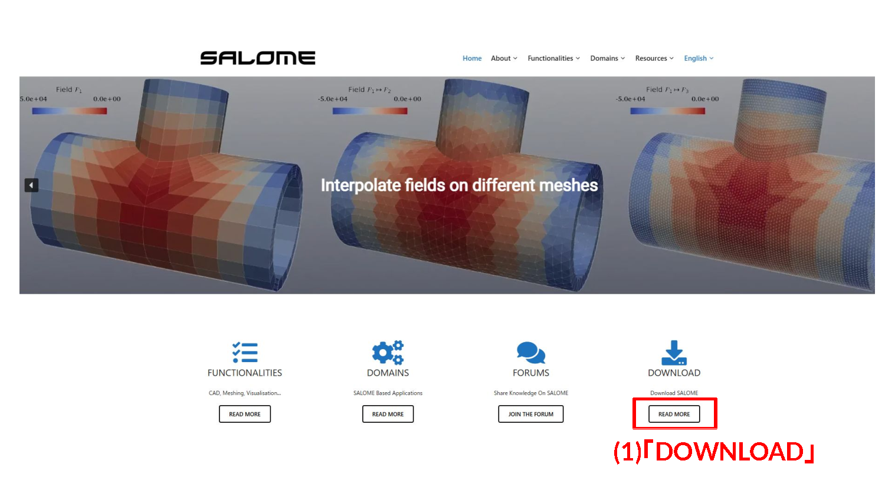

- (1) 公式サイトのトップページで `DOWNLOAD` の `READ MORE` をクリックする。


---

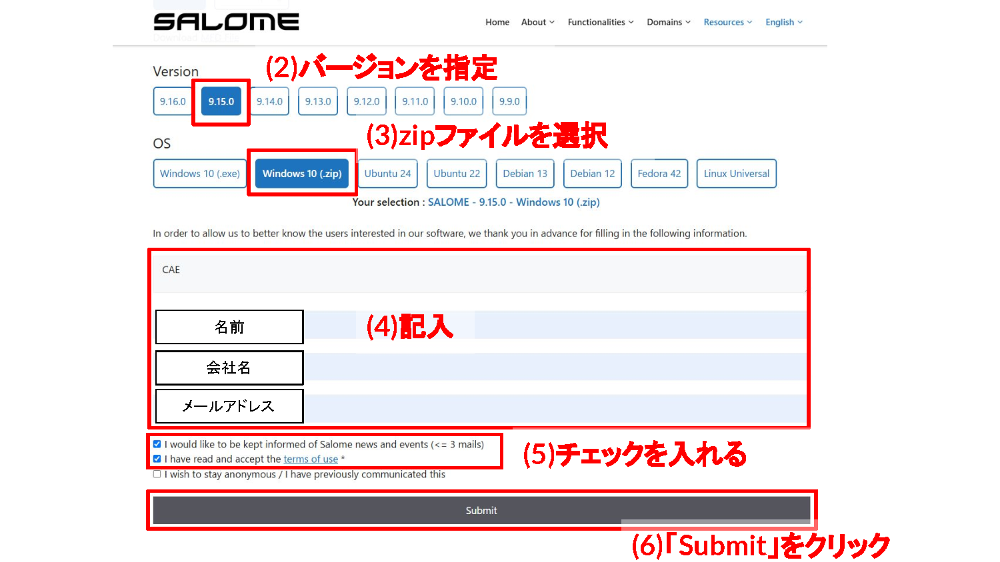

- (2) Versionで `9.15.0` を指定する（本講義で使用するのは **9.15.0**。他のバージョンを選ばないこと）。
- (3) OSで `Windows 10 (.zip)` を選択する（Windowsの場合。Linuxは使用ディストリビューションに合わせて選ぶ）。
- (4) 名前・会社名・メールアドレスを記入する。
- (5) ニュース配信と利用規約のチェックを入れる。
- (6) `Submit` をクリックする。


---

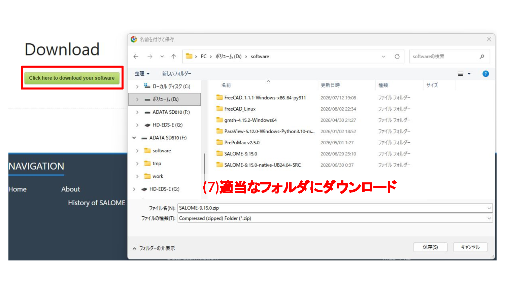

- (7) `Click here to download your software` をクリックし、`SALOME-9.15.0.zip` を適当なフォルダにダウンロードする。SALOMEは動作に必要な一式のファイルがzipに同封されているため、適当なフォルダに置いても動作する。


---

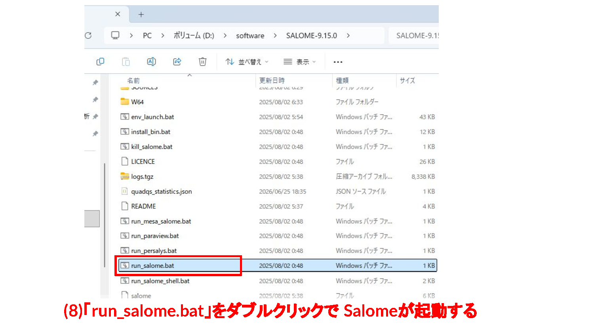

- (8) zipを展開し、`SALOME-9.15.0` フォルダ内の `run_salome.bat` をダブルクリックするとSALOMEが起動する（インストーラは無く、展開するだけで使える）。

---

## 主なモジュール

起動するとこのような画面が立ち上がる。


---


SALOMEのツールバーには、上図のように数多くのモジュールが並んでいる。主なモジュールは以下の通り。ただし本講義で実際に使うのは次の3つだけである。

- ジオメトリ作成の **Shaper**
- 直接モデリングの **Geometry（GEOM）**
- メッシュ生成の **Mesh**

| モジュール | 役割 |
|-----------|------|
| Shaper | パラメトリック CAD（スケッチ・フィーチャーベース） |
| Geometry（GEOM） | 直接モデリング・Python スクリプト対応 |
| Mesh | メッシュ生成（テトラ・ヘキサ・境界層など） |
| ParaVis | 結果の可視化（ParaView ベース） |
| YACS | ワークフロー管理 |

SALOME起動後は、画面左上のプルダウンから使用するモジュールを切り替える。


---


---

## Shaper モジュール

パラメトリック CAD モジュール。従来の Geometry（GEOM）の後継。


---

### できること

- スケッチベースモデリング（2D スケッチ → 押し出し・回転で 3D 化）
- フィーチャーツリーによる履歴管理（後から寸法変更が容易）
- ブーリアン演算（和・差・積）
- プリミティブ（Box・円柱・球など）
- 変換（移動・回転・ミラー・スケール）
- アセンブリ（複数パーツの組み立て）

例えば、2Dスケッチを描いて押し出すと、以下のように3D形状が作られる。


---


---

### GEOM（Geometry）モジュールとは

GEOM は Shaper より前からある直接モデリング（ダイレクトモデリング）方式のジオメトリモジュールで、CAD モデルの作成・編集を行う。Shaper のようなフィーチャーツリーに基づく履歴は持たないが、Box・円柱などのプリミティブ生成やブーリアン演算（Fuse・Cut・Common）、Python スクリプトによる自動化に強く、SALOME では現在も広く使われている。

例えば、2つの Box をブーリアン演算（Fuse）で結合すると、以下のように1つの形状にまとまる。


---


---

### GEOM モジュールとの比較

| | Shaper | Geometry（GEOM） |
|---|--------|-----------------|
| モデリング方式 | パラメトリック（履歴あり） | 直接モデリング（履歴なし） |
| 後からの変更 | 容易 | 難しい |
| 成熟度 | 新しい（機能追加中） | 枯れている |
| Python スクリプト | 対応（発展中） | 充実 |

---

## Mesh モジュール

Shaper / GEOM で作成したジオメトリからメッシュを生成するモジュール。


---

### メッシュの種類

| 種類 | 説明 | セルの形 |
|------|------|----------|
| テトラメッシュ | 四面体。複雑形状に自動生成しやすい | 4つの三角形の面で囲まれた最もシンプルな立体。NETGEN などのアルゴリズムで複雑な形状にも自動で敷き詰められる |
| ヘキサメッシュ | 六面体。計算精度が高く OpenFOAM と相性が良い | 直方体（サイコロ状）のセル。同じ体積ならテトラよりセル数が少なく、面が壁に沿いやすいため数値誤差が小さい |
| プリズム（境界層） | 壁面付近に層状に生成。境界層の解像度を上げる | 壁に沿って薄い層を積み重ねた三角柱／四角柱状のセル。壁に近いほど薄く、離れるほど厚くする |
| ハイブリッド | ヘキサ＋テトラの混在 | 形状が単純な部分はヘキサ、複雑な部分はテトラというように、領域ごとに異なる種類のセルを組み合わせる |

<figure style="margin:1.5rem 0; text-align:center;">
  
</figure>


---

### 分割の設定階層

メッシュの細かさは 1D → 2D → 3D の順に設定する。1D（辺）の分割が2D（面）のメッシュの粗さを決め、2D（面）のメッシュが3D（体積）のメッシュの粗さを決める、という積み上げの関係になっている。

| 階層 | 対象 | 設定内容 | 具体例 |
|------|------|----------|--------|
| 1D | エッジ（辺） | 分割数・分割比（グレーディング） | `Wire Discretisation` で `Number of Segments`（分割数）を指定する |
| 2D | フェイス（面） | 面メッシュのアルゴリズム | `NETGEN 2D Parameters` で `Max. Size` / `Min. Size`（面メッシュの最大・最小サイズ）を指定する |
| 3D | ソリッド（体積） | 体積メッシュのアルゴリズム | `NETGEN 3D Parameters` で `Max. Size` / `Min. Size`（セルの最大・最小サイズ）を指定する |

1D・2D・3D をすべて指定すると、辺の分割数を優先しつつ、面・体積は指定したサイズ範囲でメッシュが生成される。具体的な操作手順は [001_box.md](001_box.md) の「1D/2D/3Dを指定してメッシュを制御する」を参照。


---


---

### 主なアルゴリズム

| アルゴリズム | 次元 | 特徴 |
|------------|------|------|
| Wire Discretization | 1D | エッジを指定分割数で均等分割 |
| Quadrangle（Mapping） | 2D | 四角形メッシュ。ヘキサ化に必須 |
| Hexahedron（i,j,k） | 3D | 構造ヘキサメッシュ。規則的な形状に使用 |
| NETGEN 1D-2D-3D | 3D | テトラ自動生成 |


---

### 同梱されているメッシャー

上の表のアルゴリズムは、SALOMEに同梱された複数のメッシャー（メッシュ生成エンジン）が提供している。SALOME 9.15には以下が入っている。

| メッシャー | 提供アルゴリズム | 備考 |
|-----------|----------------|------|
| SMESH内蔵 | Wire Discretisation、Quadrangle (Mapping)、Hexahedron (i,j,k) など | SALOME本体の基本アルゴリズム |
| NETGEN | NETGEN 1D-2D-3D（テトラ）、NETGEN 1D-2D（三角形） | オープンソースの自動メッシャー |
| Gmsh | Gmshの1D/2D/3Dアルゴリズム | オープンソースメッシャーGmshのプラグイン |
| MMG | リメッシュ（メッシュ改善） | オープンソースのリメッシャー |
| MeshGems | MG-CADSurf（BLSURF）、MG-Tetra（GHS3D）、MG-Hexa（Hexotic）、MG-Hybrid | 商用メッシャー。プラグインは同梱されているが**別途商用ライセンスが必要** |

本講義で使うのは、SMESH内蔵アルゴリズム（ヘキサ）とNETGEN（テトラ）だけである。


---

### 境界層（Viscous Layers）

壁面付近に薄い層状のプリズムメッシュを追加する機能。

- **層数**: 積層する枚数
- **厚み**: 最初の層の厚さ
- **伸長率**: 層ごとの厚みの増加比率


---


実際にヒートシンクのフィン表面へ境界層を入れると、以下のようにテトラメッシュの壁面側だけに薄い層状のメッシュが積み重なる。


---


---

### サブメッシュ

特定のフェイスやエッジだけ分割設定を変えたい場合に使用。
部分的に細かくしたり、境界条件ごとに名前（グループ）をつけるのに使う。


---

### グループ

OpenFOAM のパッチ（境界条件）に対応させるため、フェイスに名前をつける機能。
メッシュ生成前にグループを設定しておくと UNV エクスポート後もパッチ名が引き継がれる。

---

## OpenFOAM との連携

SALOME で作成したメッシュを OpenFOAM 形式に変換して利用する。全体の流れは以下の通り。


---


本講義では、メッシャーとしてSALOMEを使った場合のメッシュ作成の基礎およびテクニックを学ぶことを目的とし、最終的にOpenFOAMで計算できる形へ変換するところまでを扱う。

ただし、OpenFOAMでの計算の解説は行わない。OpenFOAMの設定ファイルも同封しているため、興味があれば取り組んでほしい。

各演習のデータ（SALOMEから出力したUNVメッシュ・OpenFOAMケース一式・計算結果）は、リポジトリの以下のフォルダにある。

| 演習 | データフォルダ | 内容 |
|------|----------------|------|
| 001 Box | `data/001_box/run001_of13` | `Mesh_4.unv`、OpenFOAM 13の定常流体解析ケース（結果 `90/`） |
| 002 撹拌機 | `data/002_Stirrer/sample/mesh/mesh_of13` | `Mesh_1.unv`、UNV変換・topoSet・createBafflesのケース |
| 002 撹拌機 | `data/002_Stirrer/sample/mesh/master_curve_of13` | 羽根可動化テスト（moveDynamicMesh）のケース |
| 003 ヒートシンク | `data/003_heatsink/run001_of2512` | `Mesh_1.unv`、OpenFOAM v2512の熱流体・固体連成ケース（結果 `2/`〜`60/`） |

---

# 001 Box: SALOMEでOpenFOAM用メッシュを作る

## この演習で目指すこと

SALOMEで直方体モデルを作成し、OpenFOAMで使える境界名つきメッシュとしてUNV出力する。基本形状を題材に、メッシュ作成で頻繁に使う操作を一通り確認する。

- 直方体形状を作成する
- 辺・面・境界に名前を付ける
- テトラメッシュとヘキサメッシュを作成する
- 各辺で分割数を変える
- 特定の面だけメッシュを細分化する
- 境界層メッシュを入れる
- OpenFOAM用にUNVを書き出す


---

### 使用データの場所

この演習で使うファイル・計算結果は、リポジトリの以下のフォルダにある。

| フォルダ | 内容 |
|----------|------|
| `data/001_box/run001_of13` | SALOMEから出力した `Mesh_4.unv` と、OpenFOAM 13で流体解析を行うケース一式（`0`・`constant`・`system`、収束後の結果 `90/`） |


---

## モデル作成

---

### 1. Geometryモジュールへ切り替える


- (1) `Geometry` に変更し、Geometry画面へ切り替える。

---

### 2. Box形状を作成する


- (2) `Create a box` をクリックする。
- (3) 寸法を `100 x 60 x 10` として入力する。ここではmm単位で形状を作る。
- (4) `Apply and Close` でBoxを作成する。

---

### 3. Box作成結果を確認する


- 確認: 作成した直方体がビュー上に表示されていることを確認する。
- 確認: ツリー上にBoxオブジェクトが作成されていることを確認する。

---

### 4. 辺方向を抽出する


- (5) `Operations > Blocks > Propagate` をクリックする。
- (6) `Box_1` を選択する。
- (7) `Apply and Close` で確定する。

---

### 5. Propagateで作られるCompoundを確認する


- 確認: `Compound_1`, `Compound_2`, `Compound_3` が作成される。
- 確認: これらはBoxの各方向の辺グループとして、後で方向別の分割数指定に使える。

---

### 6. Compoundを方向名に変更する


- (8) Compoundをクリックし、Groupsに選択したCompoundが入っていることを確認する。
- (9) Nameを方向名に変更する。`Compound_1` を `x`、`Compound_2` を `y`、`Compound_3` を `z` にする。

---

### 7. 線グループの考え方


- 確認: 線グループは、方向ごとの分割数を指定するために使う。
- ※ OpenFOAMの境界条件には通常使わないが、SALOME内のメッシュ制御では重要になる。

---

### 8. 面グループを作成する準備


- (10) `Box_1` を選択した状態で `New Entity > Group > Create Group` を開く。

---

### 9. inlet面グループを作成する


- (11) 面グループ作成画面で、対象が `Box_1` であることを確認する。
- (12) 面の名前を `inlet` にする。
- (13) inletにしたい面を選択する。
- (14) `Add` で選択面をグループに追加する。
- (15) `Apply` をクリックする。

---

### 10. 面選択の確認

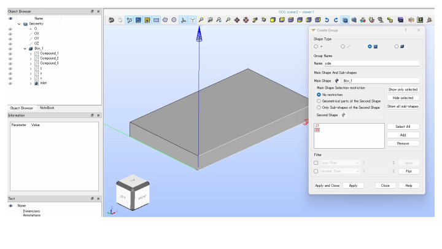

- 確認: 選択した面が意図した入口面になっているか確認する。
- 確認: 境界名はOpenFOAMのパッチ名になるため、ここでの選択ミスは解析条件のミスにつながる。

---

### 11. 他の境界面も作成する

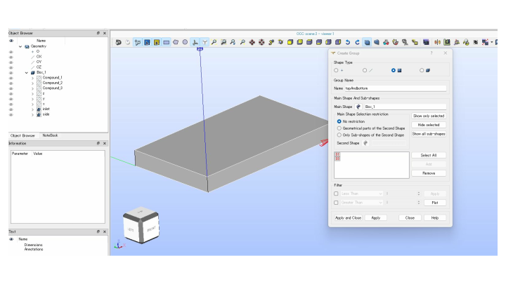

- 確認: `outlet`, `side`, `topAndbottom` など、解析に必要な面グループを作成する。
- 確認: 2D解析に使う前後面は、OpenFOAM側で `empty` にする。

---

### 12. 面グループ作成を確定する

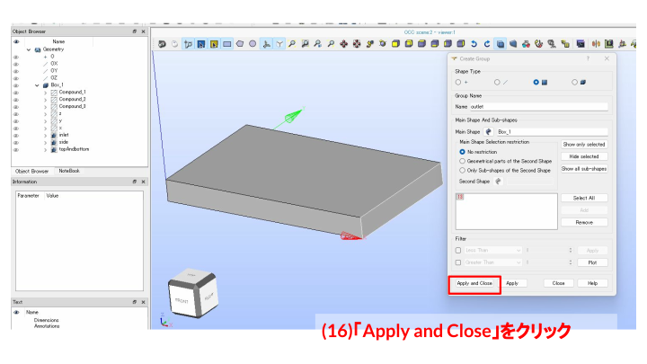

- (16) 必要な面グループを作成したら `Apply and Close` で閉じる。

---

### 13. Geometryファイルを保存する

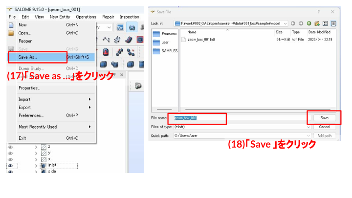

- (17) `Save as ...` をクリックする。
- (18) `Save` をクリックし、SALOMEのプロジェクトファイルとして保存する。

---

### 14. 線グループと面グループの役割


- 確認: 線グループはメッシュ分割数を制御するために使う。
- 確認: 面グループはOpenFOAMの境界パッチ名に対応する。
- 確認: OpenFOAMへ渡す境界は、面グループとして作成しておく。

---

## メッシュ作成

---

### テトラメッシュの作成

---

#### 1. Meshモジュールへ切り替える

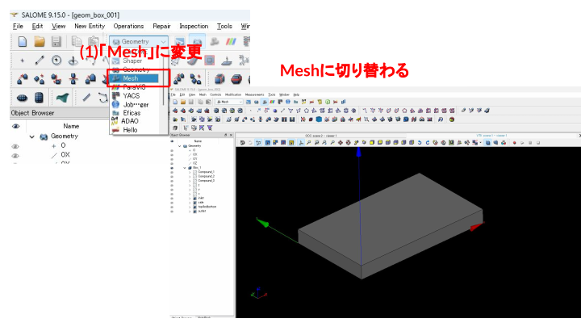

- (1) SALOMEのモジュールを `Mesh` に切り替える。

---

#### 2. 新規メッシュを作成する

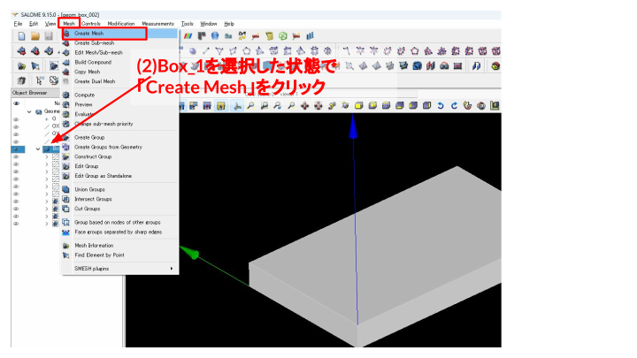

- (2) `Box_1` を選択した状態で `Create Mesh` をクリックする。

---

#### 3. テトラメッシュを設定する


- (3) `Box_1` が選択されていることを確認する。
- (4) 3Dテトラメッシュを選択する。
- (5) メッシュサイズを `5 mm` に設定する。
- (6) アルゴリズムとパラメータを確認する。
- (7) `Apply and Close` で設定を保存する。

---

#### 4. テトラメッシュを計算する

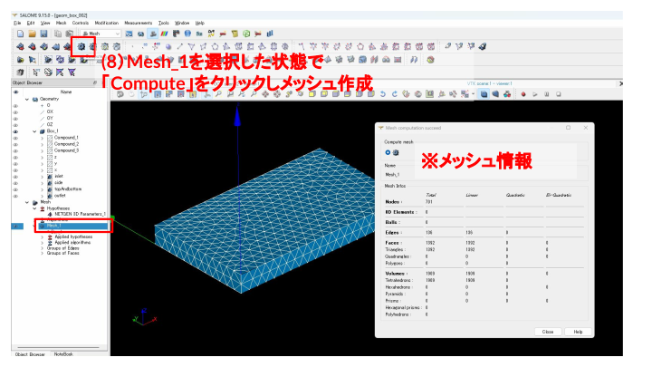

- (8) `Mesh_1` を選択した状態で `Compute` をクリックし、メッシュを作成する。
- 確認: メッシュ情報を確認し、セル数や品質を把握する。

---

#### 5. テトラメッシュ結果を確認する


- 確認: 生成されたテトラメッシュの見た目を確認する。
- 確認: 複雑形状には使いやすいが、直方体ではヘキサメッシュも比較する。

---

### ヘキサメッシュの作成

---

#### 1. ヘキサメッシュを設定する


- (1) `Box_1` が選択されていることを確認する。
- (2) 3Dヘキサメッシュを選択する。
- (3) 分割数を `15` にする。
- (4) 設定内容を確認して `Apply and Close` する。

---

#### 2. ヘキサメッシュを計算する


- (5) `Mesh_2` を選択した状態で `Compute` をクリックし、メッシュを作成する。
- 確認: ヘキサメッシュのセル数と分割の入り方を確認する。

---

### 1D/2D/3Dを指定してメッシュを制御する

---

#### 1. 1D分割数を指定する


- (1) `Box_1` が選択されていることを確認する。
- (2) `1D` タブを開く。
- (3) `Number of Segments` をクリックし、分割数を `5` にする。

---

#### 2. 2D面メッシュサイズを指定する


- (4) `2D` タブを開く。
- (5) `NETGEN 2D Parameters` をクリックし、`Max. Size = 5`, `Min. Size = 1` を指定する。

---

#### 3. 3D体積メッシュサイズを指定する


- (7) `3D` タブを開く。
- (8) `NETGEN 3D Parameters` をクリックし、`Max. Size = 2`, `Min. Size = 1` を指定する。

---

#### 4. 1D/2D/3D指定メッシュを計算する


- (9) `Mesh_3` を選択した状態で `Compute` をクリックし、メッシュを作成する。
- 確認: 1D, 2D, 3D の設定がメッシュに反映されていることを確認する。

---

#### 5. 断面表示で内部メッシュを確認する


- (1) 右クリックから `Clipping` をクリックする。
- (2) `New > Relative` を選択する。
- (3) `Y-Z` 面で断面を作り、`Apply` をクリックする。
- 確認: 断面表示により、内部のセル分布を確認する。
- 確認: 表面だけでは分からないメッシュ密度の偏りを確認できる。

---

### 各辺で分割数を変える

---

#### 1. 方向別分割数の設定準備


- (1) `Box_1` が選択されていることを確認する。
- (2) 3Dヘキサメッシュを選択する。
- (3) 分割数を `15` にする。
- (4) 設定内容を確認して `Apply and Close` する。

---

#### 2. サブメッシュを作成する


- (5) `Mesh_4` を選択した状態で `Create Sub-mesh` をクリックする。

---

#### 3. x方向の分割数を増やす


- (6) Geometryとして線グループ `x` を選択する。
- (7) `1D` を選択する。
- (8) `Wire Discretisation` を選択する。
- (9) `Number of Segments` を選択する。
- (10) 分割数を `40` にする。

---

#### 4. サブメッシュ設定を確認する


- 確認: 選択した線グループが正しいか確認する。
- 確認: サブメッシュは全体設定より優先されるため、対象の選択が重要になる。

---

#### 5. 方向別分割の考え方


- 確認: 全体メッシュ設定とサブメッシュ設定を組み合わせて使う。
- 確認: 流れ方向や勾配が大きい方向だけ分割数を増やせる。

---

#### 6. 方向別分割メッシュを計算する


- (11) `Mesh_4` を選択した状態で `Compute` をクリックし、メッシュを作成する。
- 確認: 1分割、12分割、40分割の違いを比較し、方向別分割の効果を確認する。

---

#### 7. 分割結果を確認する

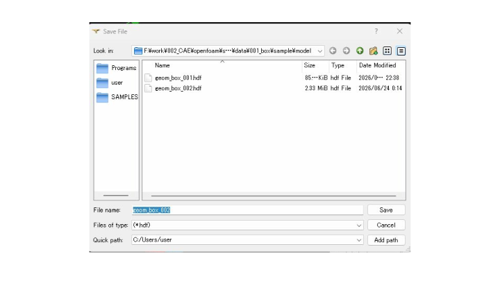

- 確認: メッシュ密度が方向ごとに変わっていることを確認する。
- 確認: 流れ方向・壁面近傍・勾配の大きい場所で分割を調整する。

---

#### 8. メッシュ品質を確認する

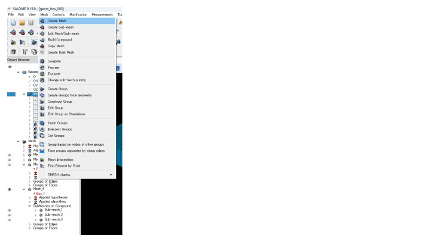

- 確認: サブメッシュ設定後のセル形状を確認する。
- 確認: 極端なアスペクト比や不自然なセルがないかを見る。

---

### 特定の面を細分化する

---

#### 1. 特定面だけ細分化する準備


- (1) `Box_1` が選択されていることを確認する。
- (2) `3D` タブを開く。
- (3) 3Dテトラメッシュを選択する。
- (4) メッシュサイズを `10 mm` にする。
- (5) 設定内容を確認して `Apply and Close` する。

---

#### 2. 面サブメッシュを作成する


- (6) `Mesh_5` を選択した状態で `Create Sub-mesh` をクリックする。

---

#### 3. inlet面だけ細分化する


- (7) Geometryとして `inlet` を選択する。
- (8) `2D` を選択する。
- (9) 2Dテトラメッシュを選択する。
- (10) メッシュサイズを `2 mm` にする。
- (11) `Apply and Close` で確定する。

---

#### 4. 局所細分化メッシュを計算する


- (12) `Mesh_5` を選択した状態で `Compute` をクリックし、メッシュを作成する。
- 確認: `inlet` 周辺だけメッシュサイズが `2 mm` になっていることを確認する。

---

#### 5. 局所細分化結果を確認する

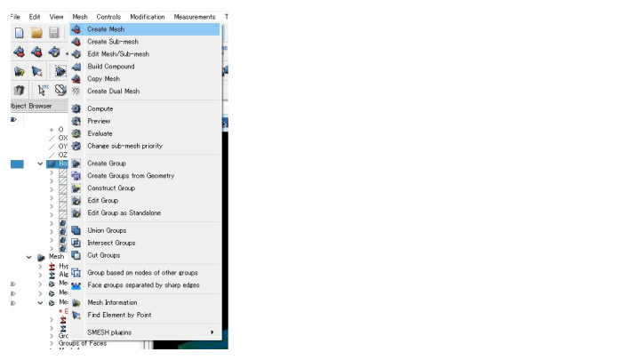

- 確認: 細分化した面とその周辺のセル接続を確認する。
- 確認: 局所細分化は計算コストと精度のバランスを取るために使う。

---

### 境界層メッシュを入れる

---

#### 1. 境界層メッシュを設定する


- (1) `Box_1` が選択されていることを確認する。
- (2) `3D` タブを開く。
- (3) 3Dテトラメッシュを選択する。
- (4) メッシュサイズを `5 mm` にする。
- (5) `Viscous Layers` をクリックする。

---

#### 2. 境界層パラメータを指定する


- (6) トータル厚みを `2 mm`、レイヤー数を `3層` に設定する。
- 補足: パターン1は何も設定しない例、パターン2は `inlet` 面を選択して追加する例を示している。

---

#### 3. 境界層対象面を確認する


- 確認: 境界層を入れる面、または除外する面を確認する。
- 確認: 壁面近傍を解きたい場合は、壁面側に境界層を入れる。

---

## OpenFOAM側での計算

SALOMEで作成したメッシュをOpenFOAMへ渡すには、UNV形式で書き出し、OpenFOAMのケースフォルダへ変換・配置する必要がある。

---

### OpenFOAM用にUNV出力する

---

#### 1. OpenFOAM計算で使うメッシュを選ぶ

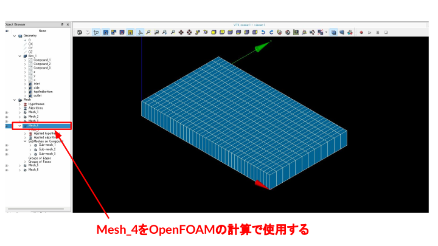

- 確認: 今回のOpenFOAM計算では `Mesh_4` を使う。
- 確認: `Mesh_4` は方向別分割を設定したヘキサメッシュで、直方体流路の基礎計算に使いやすい。

---

#### 2. OpenFOAMへ渡すグループを整理する

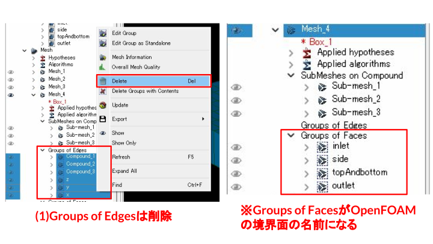

- (1) `Groups of Edges` は削除する。
- 補足: `Groups of Faces` がOpenFOAMの境界面の名前になる。
- 補足: 不要な線グループやCompoundグループをUNVに含めると、`ideasUnvToFoam`でエラーになることがある。

---

#### 3. UNV形式でエクスポートする


- (2) `Mesh_4` 上で右クリックし、`Export > UNV file` を選ぶ。
- (3) ファイル名を `Mesh_4` として保存する。

---

#### 4. エクスポート結果を確認する

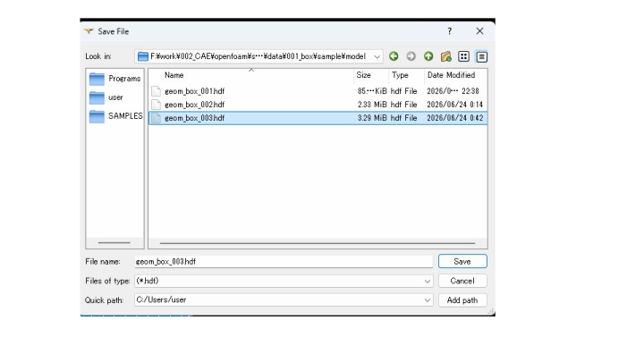

- 確認: 指定した場所に `Mesh_4.unv` が作成されたことを確認する。
- 確認: OpenFOAMケース側へコピーまたは参照して変換する。

---

#### 5. Geometryからメッシュグループを作る

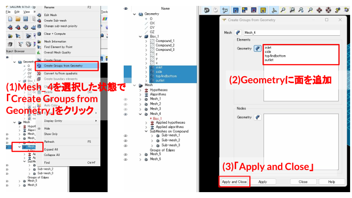

- (1) `Mesh_4` を選択した状態で `Create Groups from Geometry` をクリックする。
- (2) Geometryに面を追加する。
- (3) `Apply and Close` で確定し、OpenFOAMに渡すパッチ名を整える。
- 補足: メッシュを作成した後にGeometry側で面グループを作成した場合も、`Create Groups from Geometry` を使うと、Geometryの面グループをメッシュ側のグループとして割り当てることができる。

---

### OpenFOAMを用いた流体解析

OpenFOAMでは、メッシュだけでは計算できない。計算には、初期条件を入れる `0`、物性やメッシュを入れる `constant`、計算条件を入れる `system` が必要になる。

今回は定常・非圧縮流れの計算を行うため、OpenFOAM 13のチュートリアル `incompressibleFluid/pitzDailySteady` をベースにする。

```bash
cd data/001_box/run001_of13
cp -r /opt/openfoam13/tutorials/incompressibleFluid/pitzDailySteady/{0,constant,system} .
rm -f system/blockMeshDict
```

- `pitzDailySteady` は、非圧縮流体の定常解析用チュートリアルである。
- `system/controlDict` では、`solver incompressibleFluid` を使う設定になっている。
- `system/fvSchemes` では、時間微分を `steadyState` として扱う。
- `system/fvSolution` では、定常解析で使うSIMPLE法の設定が入っている。
- `system/blockMeshDict` はチュートリアル付属のメッシュ作成用ファイルである。今回はSALOMEで作成したUNVメッシュを使うため削除する。

---

#### OpenFOAMへの変換

UNVを書き出した後は、OpenFOAM側で以下の計算フォルダへ移動して作業する。

```bash
cd data/001_box/run001_of13
```

- 計算フォルダは `data/001_box/run001_of13` とする。
- `Mesh_4.unv` は `data/001_box/run001_of13/Mesh_4.unv` に保存する。
- `0`、`constant`、`system` も、この計算フォルダ内に置く。

計算フォルダに入った後、OpenFOAM 13を読み込み、SALOMEから出力したUNVメッシュをOpenFOAM形式へ変換する。

```bash
. /opt/openfoam13/etc/bashrc
ideasUnvToFoam Mesh_4.unv > log.ideasUnvToFoam.of13 2>&1
transformPoints "scale=(0.001 0.001 0.001)" > log.transformPoints.of13 2>&1
checkMesh > log.checkMesh.of13 2>&1
```

- `. /opt/openfoam13/etc/bashrc` は、OpenFOAM 13のコマンドを使えるようにする。
- `ideasUnvToFoam Mesh_4.unv` は、SALOMEから出力したUNVメッシュをOpenFOAMの `constant/polyMesh` 形式へ変換する。
- `> log.ideasUnvToFoam.of13 2>&1` は、変換時の標準出力とエラー出力をログファイルへ保存する。
- `transformPoints "scale=(0.001 0.001 0.001)"` は、座標をx, y, zすべて `1/1000` 倍する。SALOMEでmm単位の形状を作った場合、OpenFOAMで使うm単位へ変換するために使う。
- `checkMesh` は、変換後のメッシュ品質、境界面、セル数、寸法などを確認する。
- `log.checkMesh.of13` を確認し、`Mesh OK` が出ていれば、基本的なメッシュチェックは通っている。

---

#### 境界条件を設定する

チュートリアルからコピーした `0` フォルダの各ファイルを、SALOMEで付けた境界名（`inlet`・`outlet`・`side`・`topAndbottom`）に合わせて編集する。主な設定は以下。

- `0/U`: `inlet` を `fixedValue`、`value uniform (0.01 0 0)` とし、x方向へ0.01 m/sの一様流入を与える。`outlet` は `zeroGradient`、`side` は壁（`noSlip`）、`topAndbottom` は `empty` とする。
- `0/p`: `outlet` を基準圧として `fixedValue 0`、`inlet` と `side` は `zeroGradient`、`topAndbottom` は `empty` とする。
- `topAndbottom` を `empty` にするため、`constant/polyMesh/boundary` の該当パッチの `type` も `empty` になっていることを確認する（`ideasUnvToFoam` 変換直後は `patch` になっているため、必要に応じて修正する）。

---

#### 計算を実行する

境界条件を設定したら、ソルバを実行する。

```bash
foamRun > log.foamRun.of13 2>&1
```

- OpenFOAM 13では、`foamRun` が `system/controlDict` の `solver incompressibleFluid;` を読み込み、非圧縮流体の定常計算（SIMPLE法）を行う。
- `system/controlDict` の `endTime` は `2000` としているが、定常解析では残差が収束判定を満たした時点で計算が終了する。今回の計算は90反復で収束し（`log.foamRun.of13` に `SIMPLE solution converged in 90 iterations` と出力される）、結果は `90/` フォルダに書き出された。
- `log.foamRun.of13` の各反復で `Ux`・`Uy`・`p` の残差（`Initial residual`）が小さくなっていく様子を確認する。

---

#### OpenFOAMの計算結果確認

OpenFOAMで計算した後は、`post.foam` を作成してParaViewで結果を確認する。

```bash
touch post.foam
```


---


- 境界条件: `inlet` は `U = (0.01 0 0) m/s` とし、x方向へ `0.01 m/s` の一様流入を与える。
- 表示内容: ParaViewでは `U Magnitude` を表示している。これは速度ベクトル `U` の大きさであり、入口付近ではおおよそ `0.01 m/s` になる。
- 境界条件: `outlet` は自然流出として扱う。速度 `U` は `zeroGradient`、圧力 `p` は基準圧として `fixedValue 0` を与える。
- 境界条件: `topAndbottom` は `empty` とし、2次元解析として厚み方向を解かない。
- 境界条件: `side` は `wall` とし、壁面では流速が0になるため、壁近傍で `U Magnitude` が小さくなる。
- 確認: 矢印表示を追加すると、流速ベクトルの向きが入口から出口方向へ向かっていることを確認しやすい。

---

# 002 Stirrer: SALOMEで撹拌機のヘキサメッシュを作る

## この演習で目指すこと

撹拌機形状を題材に、Shaperで断面形状を作成し、Geometryで回転・押し出し・分割を行い、Meshでヘキサメッシュを作成する。

- Shaperでスケッチを作成する
- 寸法拘束と幾何拘束で形状を確定する
- ShellをGeometryへエクスポートする
- 回転、押し出し、Partitionでブロック分割する
- グループを整理してOpenFOAMへ渡す境界名を作る
- ヘキサメッシュとサブメッシュを作成する

この撹拌槽モデルは、オープンCAEサマースクール2020 Track3で扱った題材でもある。2020年の演習では、`blockMesh` で扇形の6ブロックを作成し、`stitchMesh` で貼り合わせ、`mergeMesh` で組み合わせることで、羽根付きの撹拌槽形状をヘキサメッシュとして作り上げていた。


---


この2020年の手法（blockMesh・stitchMesh・mergeMesh）は、技術書典で販売されている技術書「OpenFOAMでメッシュ作成」にも解説されている。


---


- 技術書典: <https://techbookfest.org/product/5752199185432576>

今回の演習では、同じ撹拌槽形状を題材にしつつ、`blockMesh` 手組みではなく **SALOME** でジオメトリとメッシュを作成する方法を扱う。


---

### この演習のゴール

今回の演習のゴールは、下図のように、羽根形状を含む1/4セクター分の撹拌槽形状に対して、SALOMEでヘキサメッシュを作成することである。実際のOpenFOAM計算では、このセクターメッシュを回転コピー・結合して、全周の撹拌槽形状を組み立てる。


---


---

### 使用データの場所

この演習で使うファイル・計算結果は、リポジトリの以下のフォルダにある。

| フォルダ | 内容 |
|----------|------|
| `data/002_Stirrer/sample/mesh/mesh_of13` | SALOMEから出力した `Mesh_1.unv` と、UNV変換・topoSet・createBaffles を行うOpenFOAMケース（OpenFOAM 13） |
| `data/002_Stirrer/sample/mesh/master_curve_of13` | 羽根の可動化テスト（moveDynamicMesh）用のOpenFOAMケース（OpenFOAM 13） |

---

## モデル作成


---

### 1. Shaperで断面スケッチを開始する


- (1) `Geometry` に変更し、`Shaper` の画面へ切り替える。


---


- (2) `Sketch` をクリックする。
- (3) `Z-X` 平面を選択する。


---


- (4) `FRONT` をクリックし、スケッチしやすい向きにする。


---

### 2. 最初のスケッチを描く


- (5) `線` を使い、まずは大まかな形状を描く。
- 最初は正確な寸法よりも、必要な線分を作ることを優先する。


---


- (6) 寸法拘束を行う。
- 必要な線は平行拘束で向きをそろえる。


---


- 寸法拘束を入力し、チェックをクリックして確定する。


---


- すべての拘束が完了すると、スケッチ線が緑色になる。
- 緑色になっていない場合は、寸法拘束または幾何拘束が不足している。


---


- (7) `線` をクリックして、追加のスケッチと寸法拘束を行う。


---


- (8) スケッチが完了したら、チェックをクリックしてスケッチを終了する。

---

## 追加断面のスケッチ


---

### 1. 2つ目のスケッチを開始する


- (1) `Sketch` をクリックする。
- (2) `X-Y` 平面を選択する。


---


- (3) `TOP` をクリックして、上面からスケッチする。


---


- (4) `線` をクリックし、原点から右方向へ線を描く。


---


- (5) 原点から斜め方向へ線を描く。


---


- (6) 端点どうしが拘束されていない場合は、`Coincident` で端点を一致拘束する。


---


- (7) 2点を選択し、角度拘束を入れる。


---


- (8) 3点を選択して円弧を描く。
- 原点、端点、線上の点を使い、円弧の位置を決める。


---


- (9) 必要な点に一致拘束を入れ、線と円弧を接続する。


---


- (10) 円弧に半径拘束を入れる。


---


- (11) スケッチを終了する。


---


- (12) `File > Save As...` で名前を付けて保存する。
- (13) `Save` をクリックする。

---

## 羽根形状のスケッチ


---

### 1. 円弧と補助線を作成する


- (1) 円弧を描く。
- (2) 半径拘束を入れる。


---


- (3) さらに円弧を描く。
- (4) 半径拘束を入れる。


---


- (5) 半径 `1.5` の線をクリックし、`Auxiliary` にチェックを入れる。
- 線が補助線になる。


---


- (6) `線` をクリックして追加スケッチを描く。


---


- (7) 2点の水平方向寸法拘束を入れる。


---


- (8) 拡大し、`線` で細部をスケッチする。


---


- (9) 2本ずつ線を選択し、平行拘束を入れる。


---


- (10) 寸法拘束を入れ、形状を確定する。


---


- (11) 直線をクリックし、`Auxiliary` にチェックを入れる。
- 線が補助線になる。


---


- 拡大表示で、拘束と接続が意図通りになっていることを確認する。


---

### 2. Shellを作成する


- (12) `Shell` をクリックし、`Sketch_1` を選択する。
- (13) チェックをクリックし、スケッチからShellを作成する。


---

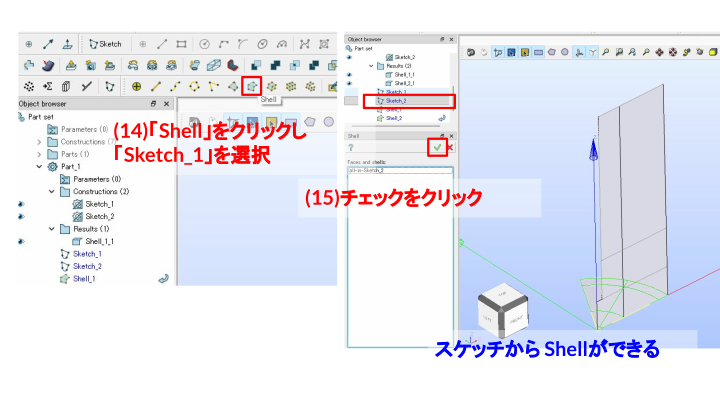

- (14) `Shell` をクリックし、`Sketch_2` を選択する（画像内の説明文は `Sketch_1` になっているが、実際に選択しているのは2つ目のスケッチ `Sketch_2`）。
- (15) チェックをクリックし、スケッチから `Shell_2` を作成する。


---


- (16) `Export to GEOM` をクリックし、Geometryへエクスポートする。


---


- (17) `File > Save As...` で名前を付けて保存する。
- (18) `Save` をクリックする。

---

## Geometryで形状を作る


---

### 1. Geometryへ切り替える


- (1) `Geometry` に変更し、Geometry画面へ切り替える。


---


- (2) 背景上で右クリックし、`Hide All` をクリックする。
- (3) `Shell_1` と `Shell_2` を表示する。


---


- (4) `Create an origin and base Vector` をクリックし、軸を表示する。


---

### 2. 回転と押し出しを行う


- (5) `Revolution` をクリックする。
- (6) `Apply and Close` をクリックする。


---


- (6) `Extrusion` をクリックする。
- (7) `Apply and Close` をクリックする。


---


- 回転押し出しと押し出しで、撹拌機の基本形状を作る。


---

### 3. Partitionで分割する


- (8) `Partition` をクリックする。
- (9) `Apply and Close` をクリックする。


---


- Partition後の形状を確認する。


---


- (10) 分割面を作成する。
- (12) `Apply and Close` をクリックする。


---


- (13) 作成した `Face_1` を平行移動する。
- (14) `Dz = 10` として `Apply` をクリックする。
- (16) `Dz = 20`、(18) `Dz = 30`、(20) `Dz = 40` として分割面を複製する。
- (21) `Apply and Close` をクリックする。


---


- (21) `Partition` をクリックし、Objectsに `Partition_1`、Tool Objectsに平行移動で作った4枚の分割面（`Translation_1`〜`Translation_4`）を指定する（画像内の説明文は `Extrusion` になっているが、実際に開いているのはPartitionのダイアログ）。
- (22) `Apply and Close` をクリックする。`Partition_2` が作成される。


---


- `Partition_2` により、z=10〜40mmの4枚の面の位置で形状が水平方向に分割されたことを確認する。


---


- (23) `Operations > Blocks > Propagate` をクリックする。
- (24) `Apply and Close` をクリックする。


---


- (25) `File > Save As...` で名前を付けて保存する。
- (26) `Save` をクリックする。

---

## グループを整理する

OpenFOAMへ渡す面や線を整理するため、Geometry側でグループを作成する。境界条件に使う面、メッシュ分割に使う線を分かりやすい名前にしておく。

ここでは、Propagateで作られた `Compound_1`〜`Compound_15`（方向ごとの辺の集まり）を `Union Groups` でまとめ、後のサブメッシュ設定で使う線グループを作成する。作成する線グループは以下の11個。

| 線グループ | 方向 |
|-----------|------|
| `z1` / `z2` / `z3` | 軸（z）方向。高さ位置ごとの辺 |
| `z_rotor` | 軸（z）方向のうち回転領域まわりの辺 |
| `theta1` | 周方向の辺 |
| `r1`〜`r6` | 半径方向の辺 |


---


- (1) `New Entity > Group > Union Groups` をクリックする。
- (2) Nameを `z1` とし、対象のCompoundを選んで `Apply` をクリックする。


---


- (3) 同様にNameを `z2` として `Apply` をクリックする。


---


- (4) Nameを `z3` として `Apply` をクリックする。


---


- (5) Nameを `z_rotor` とし、回転領域まわりの4つのCompoundを選んで `Apply` をクリックする。


---


- (6) Nameを `theta1` とし、周方向の2つのCompoundを選んで `Apply` をクリックする。


---


- (8) Nameを `r1` として `Apply` をクリックする。


---


- (9) Nameを `r2` として `Apply` をクリックする。


---


- (10) Nameを `r3` として `Apply` をクリックする。


---


- (11) Nameを `r4` として `Apply` をクリックする。


---


- (12) Nameを `r5` として `Apply` をクリックする。


---


- (13) Nameを `r6` として `Apply` をクリックする。


---


- ツリーに `z1` / `z2` / `z3` / `z_rotor` / `theta1` / `r1`〜`r6` の11個の線グループが並んでいることを確認する。


---


- (14) 不要な線グループは削除する。
- OpenFOAM変換に不要なグループを減らし、境界名の混乱を避ける。


---


- (15) `File > Save As...` で名前を付けて保存する。
- (16) `Save` をクリックする。

---

## ヘキサメッシュ作成


---

### 1. Meshモジュールへ切り替える

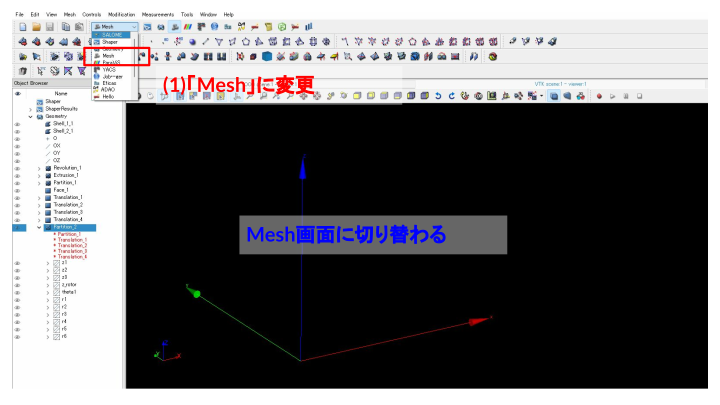

- (1) `Mesh` に変更し、Mesh画面へ切り替える。


---


- (2) `Partition_2` を表示する。
- (3) 拡大し、メッシュ対象の形状を確認する。


---


- (4) `Mesh > Create Mesh` をクリックする。


---


- (5) `Partition_2` が選択されていることを確認する。
- (6) 3Dヘキサメッシュを設定する。
- (7) 分割数を `15` とする。
- (8) `Apply and Close` をクリックする。


---


- (9) `Mesh_1` を選択した状態で `Compute` をクリックし、メッシュを作成する。
- メッシュ情報を確認する。


---


- 作成されたヘキサメッシュを確認する。


---


- 細部のメッシュ品質を確認する。


---


- (10) `File > Save As...` で名前を付けて保存する。
- (11) `Save` をクリックする。


---

### 2. サブメッシュで部分的に分割数を変える


- (12) `Mesh_1` を選択した状態で `Create Sub-mesh` をクリックする。


---


- (12) `Mesh_1` が選択されていることを確認する。
- (13) 線グループ `r1` を選択する。
- (14) `Wire Discretisation` を選択する。
- (15) `Number of Segments` を選択する。
- (16) 分割数を `12` とする。


---


- サブメッシュ条件が対象線グループに設定されていることを確認する。


---


- (17) `Mesh_1` を選択した状態で `Compute` をクリックし、メッシュを再計算する。
- メッシュ情報を確認する。


---


- サブメッシュ指定により、対象部分の分割数が変わったことを確認する。


---


- ここでは `r1` 方向の分割数変更のみ確認したが、実際には他の方向（`r2`〜`r6`、`theta1`、`z3`）の線グループにも同様の手順でサブメッシュを設定する。


---

### 3. 全方向のサブメッシュを設定してメッシュを完成させる


- `r1`〜`r6`、`theta1`、`z3` すべての線グループに対して、同様にサブメッシュ（`Number of Segments`）を設定する。
- `SubMeshes on Compound` の下に、設定した数だけサブメッシュが並んでいることを確認する。


---


- (17) `Mesh_1` を選択した状態で `Compute` をクリックし、全方向のサブメッシュを反映してメッシュを再計算する。
- メッシュ情報を確認する（例: ノード数 238239、ヘキサヘドロン数 223776）。


---


- 羽根の根本や角部を拡大し、メッシュが歪みなく生成されていることを確認する。


---


- (18) `File` > `Save As...` で名前を付けて保存する。
- (19) `Save` をクリックする。


---

### 4. OpenFOAM用にUNV出力する


- (1) `Groups of Edges` を削除する。
- 補足: 線グループ（サブメッシュ分割用）はOpenFOAM変換に不要なため、削除して境界名の混乱を避ける。`Groups of Faces` はOpenFOAMの境界パッチ名として引き継がれるため残す。


---


- (2) `Mesh_1` 上で右クリックし、`Export` > `UNV file` を選ぶ。
- (3) `Save` をクリックし、`Mesh_1.unv` として保存する。

---

## OpenFOAM側での計算

SALOMEから出力した `Mesh_1.unv` は、そのままではOpenFOAMで使えない。UNV形式からOpenFOAM形式へ変換し、スケール変換（mm→m）を行った上で、羽根（wing）と仕切り板（circ）の位置に `topoSet` + `createBaffles` でバッフル（厚みゼロの内部壁）を作成する。

- 作業フォルダ: `data/002_Stirrer/sample/mesh/mesh_of13`


---

### メッシュ変換とバッフル作成

```bash
cd data/002_Stirrer/sample/mesh/mesh_of13
. /opt/openfoam13/etc/bashrc

ideasUnvToFoam Mesh_1.unv > log.ideasUnvToFoam 2>&1
transformPoints "scale=(0.001 0.001 0.001)" > log.transformPoints 2>&1
checkMesh > log.checkMesh.initial 2>&1

topoSet > log.topoSet 2>&1
createBaffles -overwrite > log.createBaffles 2>&1
checkMesh > log.checkMesh.final 2>&1
```

なお、同フォルダには上記一連の処理をまとめた `Allrun` スクリプトがあり、`./Allclean && ./Allrun` で最初から一括再実行できる。

各コマンドの役割は以下の通り。

- `ideasUnvToFoam Mesh_1.unv`: SALOMEから出力したUNVメッシュを、OpenFOAMの `constant/polyMesh` 形式へ変換する。
- `transformPoints "scale=(0.001 0.001 0.001)"`: 全座標を1/1000倍する。SALOMEはmm単位で形状を作っているため、OpenFOAMが使うm単位へスケール変換する。
- `checkMesh`（1回目）: 変換直後のメッシュ品質・セル数・境界面を確認する。
- `topoSet`: `system/topoSetDict`（`topoSetDict.wing` / `topoSetDict.circ` / `topoSetDict.rotor` をinclude）に従い、羽根・仕切り板・回転領域の3種類のゾーンを作成する（内容は次節）。
- `createBaffles -overwrite`: `system/createBafflesDict` に従い、topoSetで作った羽根・仕切り板の面ゾーンを厚みゼロの `wall` バッフルへ変換する。`owner`/`neighbour` それぞれに `_master` / `_slave` のパッチ名を与え、羽根・仕切り板の両面を表現する。
- `checkMesh`（2回目）: バッフル作成後のメッシュ品質を再確認し、`Mesh OK` になっていることを確認する。


---

### topoSetで作成する3種類のゾーン

`topoSet` では、後工程で使う次の3種類のゾーンをメッシュ上に定義する。wing / circ は `createBaffles` でバッフル化するための**面ゾーン（faceZone）**、rotor は回転計算用の**セルゾーン（cellZone）**である。

**1. 羽根（wing）の面ゾーン**

`wingFaceZone` / `wingFaceZone2` は、羽根の位置にある面のゾーン（上下2枚分）。羽根のパーティション面はセクターの二等分線（30°）上にあるため、`rotatedBoxToFace` で30°回転させた薄い直方体を使って面を選び出す。

- 補足: 選択ボックスの境界がメッシュの面中心の座標とちょうど一致すると、端の面が拾われたり拾われなかったりして羽根のエッジがガタつく。これを避けるため、ボックスのz範囲は羽根より半セル分広げ、`normalToFace` で羽根の垂直面だけに絞っている。


---


**2. 仕切り板（circ）の面ゾーン**

`circularFaceZone_z015` / `circularFaceZone_z035` は、仕切り板の位置にある面のゾーン。`cylinderToFace` で薄いz範囲を直接指定して選び出す。

- 補足: シャフト（軸）がz=15mmまで刺さっているため、仕切り板はシャフト周りの環状の板になる。z=15mm平面にはシャフト底面（境界面）も含まれてしまうため、`boundaryToFace` の `action delete` で境界面を取り除き、内部面だけを残している。


---


**3. 回転領域（rotor）のセルゾーン**

`rotor1` / `rotor2` は、羽根の周囲を囲む円柱状の回転領域のセルゾーン（MRFなど回転計算用）。`cylinderToCell` で円柱範囲を指定して作成する。


---


---

### 羽根の可動化テスト（master_curve_of13）

羽根（`wall_wing.*` パッチ）に、コード化された点変位（`codedFixedValue`）でx位置に応じた曲線状の変位を与え、`displacementSBRStress` モーションソルバでメッシュ全体を滑らかに追従変形できるかを確認する。

- 作業フォルダ: `data/002_Stirrer/sample/mesh/master_curve_of13`（`mesh_of13` で作成したバッフル済みメッシュを引き継ぐ）

```bash
cd data/002_Stirrer/sample/mesh/master_curve_of13
. /opt/openfoam13/etc/bashrc

rm -rf 0
cp -r 0.orig 0

moveDynamicMesh > log.moveDynamicMesh 2>&1
checkMesh -latestTime > log.checkMesh 2>&1
```

- `constant/dynamicMeshDict` で `displacementSBRStress` モーションソルバを指定する。
- `0.orig/pointDisplacement` の `wall_wing.*` 境界に `codedFixedValue` を設定し、時刻 `t` に応じて羽根表面の点をy方向へ滑らかに変位させる。
- `system/controlDict` で `application moveDynamicMesh`、`endTime 1`、`deltaT 0.1` として、10ステップに分けてメッシュを追従変形させる。
- 各時刻（`0.1`〜`1`）でメッシュが破綻せず追従できているかを、最終時刻の `checkMesh` で確認する（`Mesh OK`）。


---


- 羽根表面の変位に合わせて、周囲のメッシュも破綻せず滑らかに追従変形していることを確認する。

t=0.1〜1の変形過程をアニメーションにすると以下のようになる（マゼンタ: 羽根パッチ、緑: 仕切り板、黄: 上下の羽根高さの水平断面、淡青: 回転領域セルゾーン rotor1 / rotor2、左: メッシュ線あり、右: スムース表示）。羽根がy方向へ曲線状に変位し、周囲のメッシュが滑らかに追従している。


---


---

# 003 Heatsink: SALOMEでヒートシンクの熱流体・固体連成メッシュを作る

## この演習で目指すこと

ヒートシンクを題材に、流体領域（box）と固体領域（heatSink・heatSource・basis）を分けたマルチリージョン用メッシュを作成する。OpenFOAMのchtMultiRegionFoamで、流体と固体を同時に扱う熱流体・固体連成解析につなげる。

- STEPファイルを読み込み、ソリッド単位に分解して名前を整理する
- Partitionで4つの領域（box・heatSink・heatSource・basis）を分割する
- 各領域の境界面にグループ名を付け、OpenFOAMへ渡すパッチ名を決める
- テトラメッシュを作成し、フィン周りに境界層（Viscous Layers）を追加する
- Sub-meshで流体領域だけメッシュサイズを調整する
- UNV形式でOpenFOAM用に出力する

モデル構成は次の4リージョンからなる。

- `box`: 周囲を流れる空気の流体領域（240 × 102 × 103 mm）
- `heatSink`: フィン部分の固体領域
- `heatSource`: 発熱源となる底板の固体領域
- `basis`: ヒートシンクを載せる土台の固体領域


---


---

### 使用データの場所

この演習で使うファイル・計算結果は、リポジトリの以下のフォルダにある。

| フォルダ | 内容 |
|----------|------|
| `data/003_heatsink/run001_of2512` | SALOMEから出力した `Mesh_1.unv` と、OpenFOAM v2512で `chtMultiRegionFoam` を実行するケース一式（セットアップスクリプト `setup.sh`、計算結果 `2/`〜`60/`） |

この演習のOpenFOAM計算は **OpenFOAM v2512**（www.openfoam.com 版）で行う。`chtMultiRegionFoam` はv2512側のソルバで、OpenFOAM 13（www.openfoam.org 版）には同名のソルバは無いため注意する。

---

## Geometry: STEPファイルを読み込む


---

### 1. Geometryモジュールへ切り替える


- (1) `Geometry` に変更する。


---

### 2. STEPファイルをインポートする


- (2) `File` > `Import` > `STEP` をクリックする。
- (3) `model.step` を選択し `Open` をクリックする。
- (4) 単位をmm前提で読み込むため、警告ダイアログでは `No` をクリックする（`Yes`にするとモデルのスケールが変わってしまう）。


---

### 3. 内部形状を確認する

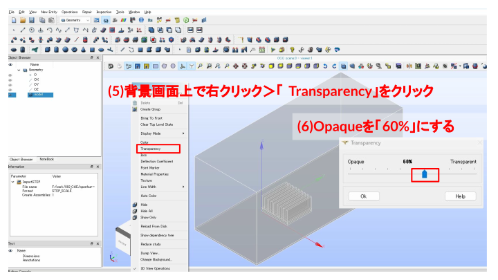

- (5) 背景上で右クリックし `Transparency` をクリックする。
- (6) `Opaque` を `60%` にし、boxの中にあるheatSink・heatSourceの形状を確認する。

---

## Geometry: ソリッドを分解して名前を付ける


---

### 1. Explodeでソリッド単位に分解する


- (7) `Explode（要素に分解）` をクリックする。
- Sub-shapes Type を `Solid` にする。
- (8) `Apply and Close` をクリックする。


---

### 2. 4つのソリッドをリネームする


- (9) 分解された4つのソリッドを右クリック > `Rename` で、それぞれ `heatSource` / `heatSink` / `basis` / `box` に名前を変更する。
- リネームしておくことで、後の境界面グループ作成や、OpenFOAM側のリージョン設定で迷わなくなる。

---

## Geometry: Partitionで領域を分割する


---

### 1. Partitionを実行する


- (10) `Partition（分割）` をクリックする。
- Objects に4つのソリッド（heatSource・heatSink・basis・box）を指定する。
- Resulting Type を `Solid` にする。
- (11) `Apply and Close` をクリックする。


---


- `Partition_1` の下に、4つのソリッドが子要素として作られたことを確認する。これらの共有面が、後でOpenFOAM側の流体-固体連成境界になる。


---

### 2. Partition結果を再度分解してリネームする


- (12) `Explode` をクリックする。Main Objectは `Partition_1`、Sub-shapes Typeは `Solid` にする。
- (13) `Apply and Close` をクリックする。


---


- (14) 分解された4つのソリッドを右クリック > `Rename` で、`heatSource` / `heatSink` / `basis` / `box` にリネームする。


---

### 3. 保存する


- (15) `File` > `Save As...` をクリックする。
- (16) ファイル名 `geometry_heatSink_001.hdf` で `Save` をクリックする。

---

## Geometry: box領域の境界面にグループを作る

OpenFOAMでは境界条件は面の名前に対して設定するため、SALOME側で面グループを作り、後でOpenFOAMのパッチ名として使う。ここではまずbox（流体領域）の8つの境界面グループを作る。


---

### 1. 外壁面のグループを作る（YMin・ZMax・XMax・YMax・XMin）


- (1) `Partition_1` を右クリック > `Create Group` をクリックする。
- Shape Typeを面（Face）にし、Group Nameに `YMin` と入力する。
- (2) 対象の面を選択して `Add` をクリックする。
- (3) `Apply` をクリックする。


---


- (4)(5) 同様に `ZMax` の面を選択して `Add` → `Apply`。


---


- (6)(7) 同様に `XMax` の面を選択して `Add` → `Apply`。


---


- (8)(9) 同様に `YMax` の面を選択して `Add` → `Apply`。


---


- (10)(11) 同様に `XMin` の面を選択して `Add` → `Apply`。


---

### 2. basisとの接触面グループを作る

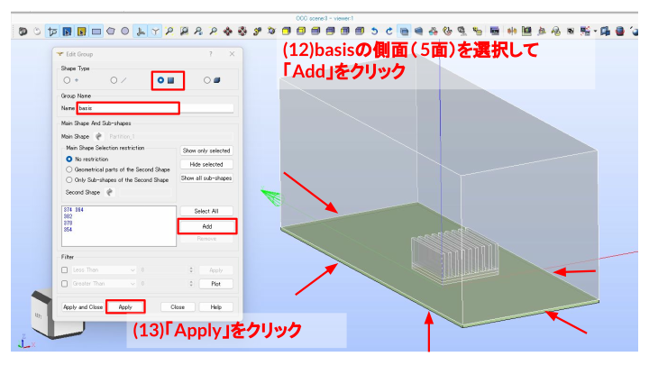

- (12) `basis` の側面5面を選択して `Add` をクリックする。
- (13) `Apply` をクリックする。
- このグループが、box（流体）側から見たbasisとの連成境界になる。


---

### 3. heatSink・heatSourceとの接触面グループを作る


- (14) 内部のheatSink・heatSourceの面を選択しやすくするため、box外側の面（上面・側面など）を選択して `Hide selected` で非表示にする。


---


- (15) `RIGHT view` に切り替え、heatSinkの表面（フィン部分）を選択して `Add` をクリックする。
- (16) `Apply` をクリックする。


---


- (17) 同様にheatSourceの表面を選択して `Add` をクリックする。
- (18) `Apply` をクリックする。


---

### 4. basis側の上面グループを作る


- (19) 今度はbasis自体の視点で、heatSourceと接する上面を選択して `Add` をクリックする。
- (20) `Apply and Close` をクリックする。グループ名は `basis_top` とする。


---

### 5. 完成した境界グループを確認する

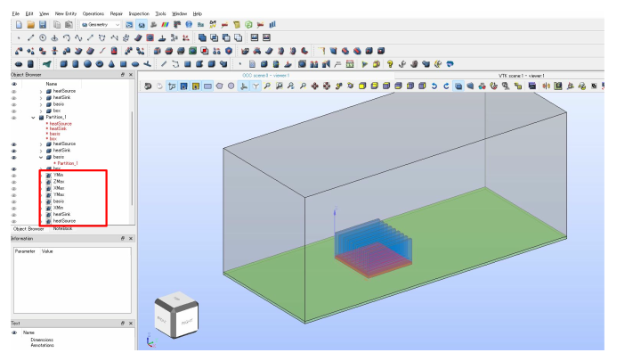

- `Partition_1` の `box` 配下に、`YMin` / `ZMax` / `XMax` / `YMax` / `basis` / `XMin` / `heatSink` / `heatSource` の8グループが揃ったことを確認する。


---

### 6. 保存する


- (21) `File` > `Save As...` をクリックする。
- (22) ファイル名 `geometry_heatSink_002.hdf` で `Save` をクリックする。

---

## Mesh: テトラメッシュを作成する


---

### 1. Meshモジュールへ切り替える

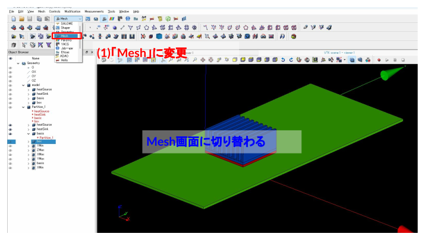

- (1) `Mesh` に変更する。


---

### 2. メッシュを新規作成する


- (2) `Mesh` > `Create Mesh` をクリックする。


---

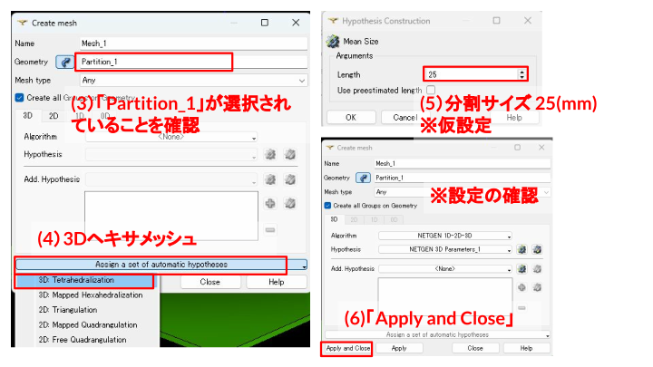

- (3) Geometryに `Partition_1` が選択されていることを確認する。
- (4) 3Dタブで `Assign a set of automatic hypotheses` から `3D: Tetrahedralization` を選ぶ。
- (5) NETGEN 3D ParametersのLengthを `25`（mm）に仮設定する。
- (6) `Apply and Close` をクリックする。


---


- (7) `Mesh_1` を選択した状態で `Compute` をクリックし、メッシュを作成する。
- 計算成功（Nodes 11864、Tetrahedrons 59943）を確認する。


---

### 3. 断面で内部形状を確認する


- Clipping平面（Y-Z面）を使い、boxの中のheatSink形状とメッシュの様子を確認する。


---

### 4. メッシュサイズを調整する


- (8) `Mesh_1` を選択した状態で `Edit Mesh` をクリックする。
- (9) `NETGEN 3D Parameters_1` を編集し、Max sizeを `10`、Min sizeを `0.25` に変更する。

---

## Mesh: 境界層（Viscous Layers）を追加する


---

### 1. heatSink・heatSourceの表面に境界層を追加する


- (10) Add. Hypothesisで `Viscous Layers` を追加する。


---


- Total thicknessを `0.2`、Number of layersを `3`、Stretch factorを `1` にする。
- Extrusion methodは `Face offset` を選ぶ。
- (11) heatSink・heatSourceの面を選択して `Add` をクリックする。


---

### 2. basis側の境界層との接続に注意する


- heatSink・heatSourceだけに境界層を付けると、境界層の外側の輪郭がbasisの表面メッシュとぴったり重ならず、つなぎ目でメッシュ生成エラーになりやすい。
- これを避けるため、basis側にも対応する境界層（Viscous Layers）を追加し、輪郭を合わせる。


---

### 3. basis側にも境界層を追加する


- (12) Viscous Layers_1に続けて、プラスボタンで新たに `Viscous Layers_2` を追加する。
- basis_topの面を選択して `Add` する。
- Total thicknessを `1`、Number of layersを `3` にし、Extrusion methodは `Surface offset + smooth` を選ぶ（heatSink・heatSourceの境界層と滑らかに接続させるため）。


---

### 4. 再計算して確認する


- (13) `Compute` をクリックする。計算成功（Nodes 47701、Tetrahedrons 75244、Prisms 63612）を確認する。


---


---


- 計算は成功するが、フィン間隔が狭いため「Thickness of viscous layers not reached（指定した境界層厚さに届いていない）」という警告が出ることがある。
- 警告が出ていても致命的なエラーでなければ、そのまま次に進めてよい。


---

### 5. boxの外壁にも境界層を追加する


- (14) 新たに `Viscous Layers_3` を追加する。
- Total thicknessを `2`、Number of layersを `3`、Extrusion methodは `Surface offset + smooth` にする。
- (15) boxの外壁（ZMax・XMax・XMin）の面を選択して `Add` をクリックする。


---


- Add. HypothesisにViscous Layers_1〜3がすべて追加されていることを確認し、`Apply and Close` をクリックする。


---

### 6. 最終メッシュを計算する


- (16) `Compute` をクリックする。計算成功（Nodes 52304、Tetrahedrons 76661、Prisms 72804）、エラーなしを確認する。


---


- フィン間の境界層とテトラメッシュの接続部分を拡大し、品質を確認する。

---

## Mesh: Sub-meshで流体領域だけ細分化する


---

### 1. box用のSub-meshを作成する


- (17) `Mesh_1` を選択した状態で `Create Sub-mesh` をクリックする。


---


- (18) Geometryに `box` が選択されていることを確認する。
- (19) 3Dタブで `3D: Tetrahedralization` を選ぶ。
- NETGEN 3D Parameters_2でLengthを `10`（mm）にする。
- (20) Add. HypothesisにViscous Layers_1〜3を追加する。
- (21) `Apply and Close` をクリックする。


---

### 2. Sub-meshを計算する


- box領域内のフィン周りが、全体メッシュより細かくなっていることを確認する。


---


- (26) `Mesh_1` を選択した状態で `Compute` をクリックし、Sub-meshを反映してメッシュを再計算する。


---

### 3. 不要なグループを削除する


- (29) グループ作成時に重複してできた `Group_1`（basisの底面）は不要なため、右クリック > `Delete` で削除する。


---

### 4. 保存する


- (27) `File` > `Save As...` をクリックする。
- (28) ファイル名 `geometry_heatSink_003.hdf` で `Save` をクリックする。

---

## Mesh: OpenFOAM用にUNV出力する


- (29) `Mesh_1` を右クリック > `Export` > `UNV file` をクリックする。
- (30) ファイル名 `Mesh_1.unv` として、OpenFOAMの計算フォルダ（`run001_of2512`。画像では `run001_of13` に保存しているが、実際の計算はv2512のケースフォルダで行った）に `Save` する。
- 作成した面グループ名（YMin・YMax・ZMax・XMax・XMin・basis・heatSink・heatSource・basis_top）がそのままOpenFOAMのパッチ名になる。

---

## OpenFOAM側での計算

- 作業フォルダ: `data/003_heatsink/run001_of2512`


---

### OpenFOAM v2512環境の読み込み

この演習の計算はOpenFOAM v2512で行う。まずv2512の環境を読み込む。

```bash
cd data/003_heatsink/run001_of2512
source /usr/lib/openfoam/openfoam2512/etc/bashrc
```


---

### setup.shによるメッシュ変換とケース設定

ケースフォルダには、UNVメッシュの変換からリージョン分割・境界条件設定までを一括実行する `setup.sh` を用意している。

```bash
bash setup.sh
```

`setup.sh` の中では、以下の処理を順に行っている。

```text
1. 前回実行分のクリーンアップ
2. ideasUnvToFoam Mesh_1.unv     … UNVメッシュをOpenFOAM形式へ変換
3. transformPoints -scale '(0.001 0.001 0.001)'  … mm単位からm単位へスケール変換
4. 0/ にフィールドテンプレート（T・p・p_rgh・U・k・omega・alphat・nut）を作成
5. splitMeshRegions -cellZones -overwrite  … セルゾーン名を使い4リージョンへ分割
6. 固体リージョン（heatSink・heatSource・basis）から流体専用フィールドを削除
7. changeDictionary -region <各リージョン>  … 正式な境界条件へ上書き
```

- `ideasUnvToFoam` でUNVメッシュをOpenFOAM形式に変換する。SALOMEでmm単位のモデルを作っているため、`transformPoints` でOpenFOAMが使うm単位に変換する（v2512では `-scale` オプションで指定する）。
- `splitMeshRegions -cellZones` は、UNVメッシュ作成時に付けたセルゾーン名（box・heatSink・heatSource・basis）を使ってメッシュを4つのリージョンに分割し、`0/` のフィールドを各リージョン（`0/box` 等）へマッピングする。
- 分割直後のフィールドは全パッチ `calculated` の仮設定なので、`changeDictionary` が `system/<region>/changeDictionaryDict` を参照して、流入・壁・リージョン間結合（`compressible::turbulentTemperatureRadCoupledMixed` 等）の正式な境界条件に上書きする。
- 各リージョンの物性値は `constant/<region>`、数値スキーム・行列ソルバ設定は `system/<region>` に用意している。


---


- ParaView等で、box（流体）とheatSink・heatSource・basis（固体）を含むメッシュ全体像を確認する。


---

### chtMultiRegionFoamの実行

セットアップが完了したら、熱流体・固体連成ソルバを実行する。

```bash
chtMultiRegionFoam > log.chtMultiRegionFoam 2>&1
```

- `chtMultiRegionFoam` は非定常の熱流体・固体連成ソルバで、流体側は速度・圧力・乱流量・温度、固体側は温度のみを解く。
- `system/controlDict` の設定により、時刻 `2` から `60` まで一定間隔で結果が書き出される（ケースフォルダの `2/`〜`60/`）。
- 流入条件は `U = (0 -0.5 0) m/s`（y方向へ0.5 m/s）、初期温度は `293.15 K` としている。発熱源の設定は `system/heatSource/fvOptions`、各リージョンの詳細な境界条件は `system/<region>/changeDictionaryDict` を参照。


---

### 計算結果の確認


- 流体領域では速度ベクトル分布、固体領域では温度分布を確認する。
- ヒートシンク周りの流れが発熱部からの熱を受け取り、フィン表面から周囲へ熱を逃がしている様子を確認する。

計算が進むにつれて、発熱源からフィン先端まで温度が上昇し、周囲の空気が対流で熱を運び去っていく過程をアニメーションで確認できる。


---


